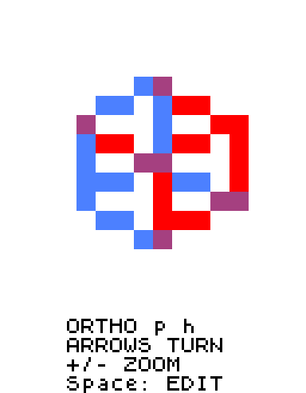
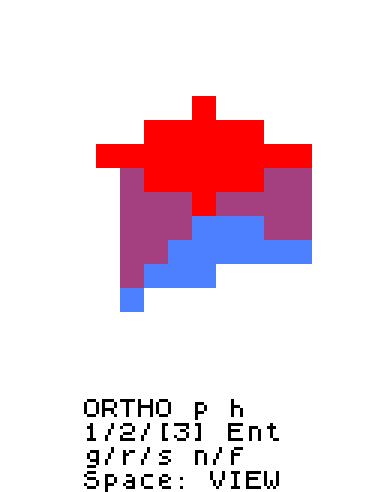
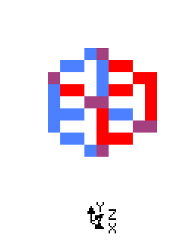

# 3DEditor

## Запуск

1. Установи зависимость [общего эмулятора](../emulator/README.md#запуск).
2. Из корневой папки репозитория запусти:

```sh
python emulator/run.py 3deditor/3deditor.asm
```

Появится куб. **Пробел** переключает просмотр и редактирование. Для компьютера в LogicArrows используй [готовую дискету](3deditor.diskette.txt) и **32 КБ памяти**.

## Управление

### Просмотр

| Клавиша | Действие |
|---|---|
| **← / →** | Поворот вокруг вертикальной оси Y |
| **↑ / ↓** | Наклон вокруг оси X |
| **+** или **=**, **−** | Приблизить / отдалить |
| **p** | Переключить ортографическую и перспективную проекцию |
| **Пробел** | Перейти к редактированию |

По умолчанию проекция **ортографическая**: размер детали не зависит от удалённости. В **перспективной** ближние детали выглядят больше дальних. **p** работает в обоих режимах.

В обычном экране терминала сверху видно **ORTHO** или **PERSP**. В редактировании текущий режим отмечен скобками: **[1]/2/3**, **1/[2]/3** или **1/2/[3]**. **Ent** — Enter.

Зум — **×0,5…×3**, шаг **0,2**. Модель может выходить за экран: края обрезаются. Как в [3DViewer](../3dviewer/README.md), рёбра чередуют красный и синий; пересечения фиолетовые. Поворот и зум меняют только вид.

### Ориентир осей — gizmo

**h** открывает в терминале стрелки положительных направлений **X/Y/Z**. В режиме просмотра **стрелки поворачивают камеру**, и gizmo обновляется вместе с ней. **Esc** закрывает gizmo и возвращает прежнее содержимое терминала.

Когда ось направлена почти в камеру, её проекция становится короткой: **буква скрывается**, чтобы подписи не слипались у центра. Наконечники стрелок заполнены, подписи отделены от линий.

Пока gizmo открыт, **остальные клавиши не действуют**. В режиме редактирования заблокированы и стрелки. Можно открыть gizmo во время ввода g/r/s или координат новой вершины: после Esc введённое число и сообщение об ошибке сохраняются.

### Выбор деталей

Нажми **Пробел**, затем выбери режим:

| Клавиша | Что видно и можно выбрать |
|---|---|
| **1** | Только вершины — точки |
| **2** | Только рёбра — линии |
| **3** | Только грани — заполненные поверхности |

**Стрелки** перемещают курсор. **Tab** перебирает детали, включая совпавшие на экране. **Enter** добавляет текущую деталь в выбранное или убирает её.

- **Фиолетовый** — обычная деталь.
- **Синий** — выбранная: инструменты будут менять её.
- **Мигающий красный** — курсор. Между вспышками виден исходный синий или фиолетовый.

**Подсветка курсором ещё не означает выбор.** На совпавших пикселях красный перекрывает синий, синий — фиолетовый; цвета выбора не смешиваются.

**Esc** очищает выбор, **a** выбирает всё. **1/2/3** сбрасывают выбор и ставят курсор на ближайшую деталь нужного типа. **Пробел** сохраняет выбор и ракурс.

### Перемещение, поворот и размер

**Выбери детали через Enter → нажми g/r/s → введи число, ось и знак → Enter.** При **g** предел виден после **/** в каждой строке X/Y/Z и остаётся при наборе команды:

```text
X=0.0000/22
Y=0.0000/22
Z=-5.0000/22
g>x-5
```

**/22** означает ввод **от −22 до +22**; при создании вершины показано **/11**. Если длинное значение не помещается, терминал сокращает дробную часть; **~ вместо =** означает округлённое отображение. Сами координаты сохраняют точность 1/16.

При **r/s координаты не показываются**: сверху видны предел **r: +/-360** или **s: +/-4**, подсказка оси и Enter / Esc. Нижняя строка — вводимая команда или ошибка.

| Инструмент | Ввод | Результат |
|---|---|---|
| **g** — перемещение | **x2** | Сдвинуть на +2 по X |
| **g** | **y-0.5** | Сдвинуть на −0,5 по Y |
| **r** — поворот | **z90** | Повернуть на 90° вокруг Z |
| **s** — размер | **2** | Увеличить по всем осям вдвое |
| **s** | **x2** | Увеличить только по X вдвое |
| **s** | **x-2** | Отразить по X и увеличить вдвое |

Ось и знак можно нажимать **в любом порядке**: **5-x**, **-x5**, **x-5--** означают **x-5**. **−** делает число отрицательным, **+** — положительным; последнее нажатие задаёт знак. **x/y/z** меняет ось, сохраняя число. Для **g/r** ось обязательна при подтверждении; **s без оси** меняет размер по X/Y/Z сразу.

Клавиши нажимаются **по очереди**, буквы — **латинские, строчные**. Ctrl и Shift не нужны. Дроби — **через точку, без пробелов**. **Backspace** удаляет последний символ числа; без числа сбрасывает ось и знак. **Esc** отменяет ввод, сохраняя выбор. После ошибки исправь команду и повтори Enter. Заверши или отмени ввод перед переключением режима.

Изменяется **текущая форма**: два сдвига x2 дают +4, два масштаба x2 — ×4. Отдельные значения поворота и масштаба не сохраняются.

При **g** X/Y/Z показывают **центр преобразования**: у ребра — середину между его вершинами, у грани — среднее её вершин, у нескольких деталей — среднее всех **уникальных выбранных вершин**. Общая вершина учитывается один раз. **o** переключает центр на (0,0,0) и обратно. Поворот и масштаб одной вершины вокруг неё самой не сдвигают её.

### Новая вершина

Нажми **n**, затем введи числа для **X, Y, Z**, подтверждая каждое через Enter. **Пустое поле + Enter означает 0** для этой координаты. Ось вводить не нужно. Во всех строках X/Y/Z виден предел **/11**; знаки **−/+** работают так же, как в трансформациях.

Пример: **n → 2 → Enter → -1 → Enter → Enter** создаёт вершину **(2, −1, 0)** и выбирает её в режиме 1. **n → Enter → Enter → Enter** создаёт вершину **(0, 0, 0)**. Модель меняется только после Z; **Esc** отменяет создание целиком.

Координаты — **от −11 до +11**, шаг **1/16 = 0,0625**. Подходят **0, 0.0625, 0.125, 0.5, 1.25**. Значение **0.1** не лежит на сетке и вызывает ошибку точности. Допускается до четырёх знаков после точки.

### Новое ребро и грань

**Ребро:** режим **1 → выбрать ровно две вершины через Enter → f**. Перед следующей парой нажми 1 ещё раз, чтобы очистить выбор.

**Грань:** сначала создай замкнутый контур из **трёх или четырёх рёбер**, включая ребро от последней вершины к первой. Затем **2 → выбрать эти рёбра через Enter → f**. В режиме **3** будет видна заливка.

Контур должен замыкаться без ответвлений. Порядок выбора рёбер не важен. Дубликаты рёбер и граней не создаются.

### Удаление и отмена

**Del удаляет выбранное**, а не просто красный элемент курсора:

- **1** — вершины вместе со связанными рёбрами и гранями.
- **2** — рёбра и использующие их грани; вершины остаются.
- **3** — только грани.

**u** отменяет один завершённый шаг и очищает выбор. Повторное u дальше не откатывает. Пустую модель можно наполнить через n.

**Esc** в общем эмуляторе передаётся программе. **F5** сохраняет модель в JSON, **F6** загружает её; подробнее — [в README эмулятора](../emulator/README.md#сохранить-модель-3deditor).

## Ограничения

| Что | Предел |
|---|---|
| Модель | **32 вершины, 64 ребра, 32 грани** |
| Грань | **Треугольник или четырёхугольник** |
| Координата | **−11…+11**, сетка **1/16** |
| Смещение g | **−22…+22** по одной оси |
| Множитель s | **−4…+4**, включая 0 |
| Угол r | **−360…+360°**, шаг **0,1°** |
| Число | До **8 символов** с точкой; до **4 знаков** после точки. Ось и знак задаются отдельно |

Смещения и множители округляются до 1/16; результат тоже лежит на этой сетке. Малое изменение может быть незаметно, повороты накапливают погрешность. Если любая вершина выходит за ±11, **всё изменение отменяется**.

Ошибки: **AXIS** — выбери x/y/z и повтори Enter; **FORMAT** — неверное число или символ; **RANGE** — выход за пределы; **PRECISION** — неподдерживаемая точность; **EMPTY** — ничего не выбрано; **CAPACITY** — нет места; **TOPOLOGY** — неподходящий выбор для f или дубликат. Плоскость и самопересечение четырёхугольника не проверяются.

## Как устроен редактор

Вершина хранит положение, ребро соединяет две вершины, грань связывает три или четыре. Изменение ребра или грани двигает их вершины. Общая вершина меняется один раз; соседние детали с ней тоже меняют форму.

Модель хранится в памяти; после перезапуска снова появляется куб. Отрисовку выполняет [API 3DGraphics](../graphics3d/API.md), описанный отдельно в [README 3DGraphics](../graphics3d/README.md).

## Демонстрация

| Просмотр | Редактирование граней | Gizmo осей |
|---|---|---|
|  |  |  |

**Просмотр:** стрелки вращают модель, +/− меняют зум. **Редактирование:** синий — выбранное, красный — курсор; текущий режим отмечен скобками. **Gizmo:** h открывает оси, Esc возвращает терминал.

**GIF со всеми действиями:**


