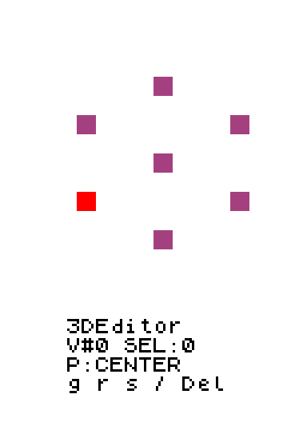

# 3DEditor для Computer v2

**Рабочий редактор вершин, рёбер и граней. Полный образ — 25 529 байт при лимите 32 768 байт**, включая код, куб, математические таблицы, историю и рабочие буферы. Основа управления — [3DViewer](../3dviewer/README.md). **Зависимость: [API 3DGraphics](../graphics3d/API.md)**.

[**Скачать скомпилированную дискету**](3deditor.diskette.txt) · [Машинный образ](3deditor.bin) · [Самодостаточный ASM](3deditor.asm)

LCD **16×16** и терминал **12×4** записаны из эмулятора, исполняющего ASM. Дополнительное обозначение в GIF — только нажатая клавиша. Анимация зациклена и заканчивается удалением модели.

## Запуск

Загрузите [ASM](3deditor.asm) в [эмулятор Computer v2](../graphics3d/vendor/emulator/) с **32 КБ памяти** и включите выполнение. Для схемы компьютера используйте [дискету](3deditor.diskette.txt) и достаточную память. Стандартная версия на 1 КБ этот образ не вмещает.

Настольная оболочка запускает тот же ASM, передаёт Esc и позволяет сохранить модель. Из корня репозитория:

    python -m pip install -r 3deditor/requirements.txt
    python 3deditor/run.py

Оболочка ускоряет эмулятор и ставит клавиши в очередь, пока обрабатывается команда. Время обновления зависит от режима и числа деталей: в исходном эмуляторе задайте высокую скорость. Геометрия, трансформации, подсветка и терминал вычисляются программой на CPU компьютера.

## Выбор и цвета

| Цвет | Состояние |
|---|---|
| **Фиолетовый** | Обычная геометрия |
| **Красный** | Текущий элемент курсора, доступный для выбора |
| **Синий** | Элемент в списке выбранного |

Стрелки перемещают **курсор**. Enter переключает присутствие текущего элемента в **списке выбранного**. Инструменты и Del действуют только на список: одна красная подсветка при пустом списке не запускает изменение.

Режим определяет **всю видимую геометрию**, включая обычные, выбранные и текущий элементы:

| Режим | Что рисуется |
|---|---|
| **1 — вершины** | Только точки вершин |
| **2 — рёбра** | Только линии рёбер; отдельные вершины скрыты |
| **3 — грани** | Только заполненные поверхности граней; отдельные вершины и рёбра скрыты |

При совпадении пикселей приоритет — **красный → синий → фиолетовый**. Красный и синий не смешиваются в фиолетовый. Выбранная деталь под курсором выглядит красной, после ухода курсора — синей. Скрытые типы остаются в модели и участвуют в связях и трансформациях; их отрисовка отключена до переключения режима.

| Клавиша | Действие |
|---|---|
| **1 / 2 / 3** | Вершины / рёбра / грани; очистить весь список, найти ближайший элемент нового типа |
| **← / ↑ / → / ↓** | Ближайшая деталь в направлении стрелки на экране |
| **Tab** | Следующий элемент по номеру, включая совпадающие проекции |
| **Enter** | Добавить текущую деталь в список или убрать её |
| **a** | Выбрать все элементы текущего режима |
| **Esc** | Очистить список; в инструменте — отменить неподтверждённый ввод |
| **Del** | Удалить выбранное |
| **u** | Отменить последнее завершённое изменение геометрии |

Смена режима выбирает ближайшую деталь к прежнему положению курсора. Рёбра используют середину проекции, грани — среднее проекций вершин. Стрелки ищут кандидата в нужной полуплоскости, учитывая расстояние по направлению и поперёк него. Если кандидата нет, курсор остаётся на месте; совпадающие кандидаты различаются номером и доступны через Tab. Терминал показывает тип **V/E/F**, номер курсора и количество выбранного.

Все буквы — **латиница в нижнем регистре**; Ctrl и Shift не нужны. **q свободна**. В финальном ASM сброс закреплён за **Esc, код 27**. Исходный эмулятор сам не передаёт Esc, поэтому его передаёт run.py. В автоматической проверке только тестовый адаптер передаёт тот же код через F2; настоящие события Escape не тестируются.

## Трансформации через терминал

**Выбрать детали → g/r/s → ось → необязательный знак → число → Enter.** Например, последовательно нажать **g, x, 2, Enter**. Клавиши нажимаются по очереди, без Shift. Числовая строка — без пробелов, десятичный разделитель — точка. Backspace исправляет ввод.

| Инструмент | Пример | Результат |
|---|---|---|
| **g** — перемещение | **x2**, **x+2** | Прибавить 2 к X выбранных вершин |
| **g** | **z-0.0625** | Прибавить −1/16 к Z |
| **r** — поворот | **z90**, **y-30.1** | Повернуть текущее состояние на заданное число градусов |
| **s** — масштаб | **x2** | Умножить размер по X на 2 |
| **s** | **x0.5** | Уменьшить размер по X вдвое |
| **s** | **x-2** | Отразить по X и увеличить размер вдвое |
| **s** | **x0** | Свести вершины к центру по X |

Операции изменяют **текущую геометрию**: два перемещения x2 дают +4; два масштаба x2 — ×4, если координаты остаются в допустимом диапазоне. Рёбра преобразуют свои конечные вершины, грани — свои вершины. Общая вершина нескольких выбранных деталей меняется **один раз**; соседние детали, использующие её, тоже меняют форму.

Перед вводом показаны текущие **X/Y/Z центра преобразования**, с четырьмя десятичными знаками. Это среднее координат уникальных выбранных вершин. **p** переключает центр на начало координат и обратно. Поворот и масштаб работают вокруг этого центра; у одной вершины они сохраняют её положение, пока центром служит сама вершина. Для преобразования относительно начала координат нажмите p. Редактор хранит итоговые координаты, поэтому показанные XYZ — координаты центра, а не отдельные углы или коэффициенты размера.

Enter подтверждает операцию и возвращает выбор, сохраняя список. Esc отменяет ввод, сохраняя список; следующее Esc очищает список. После ошибки инструмент остаётся активным: исправьте строку или отмените её.

### Числа и ограничения

| Значение | Предел и точность |
|---|---|
| Координаты вершины | **−11…+11**, сетка **1/16**, подписанные 16-битные значения Q4 |
| Смещение g | **−22…+22** по одной оси |
| Множитель s | **−4…+4** по одной оси, включая 0 |
| Угол r | **−360…+360°**, шаг ввода **0,1°** |
| Дробная часть | До **4 знаков**; для r знаки после десятых должны быть нулями |
| Строка | До **9 символов**, включая ось и знак |

Смещение и множитель округляются до ближайшего 1/16. Коэффициенты поворота имеют точность **1/256**; результат округляется на сетку 1/16. Масштабирование делит промежуточный результат с усечением к нулю. Малое изменение может не сдвинуть вершину на этой сетке; последовательные повороты накапливают погрешность.

Выход **любой** итоговой координаты за пределы отменяет **всю операцию**. Неправильный формат, неподдерживаемая точность, длина и числовые пределы проверяются до изменения модели. Недопустимый символ не добавляется и вызывает **ERR FORMAT**. Остальные ошибки: **ERR RANGE**, **ERR PRECISION**, **ERR EMPTY**, **ERR CAPACITY**, **ERR TOPOLOGY**. Пределы координат обеспечивают безопасную работу проекции и растеризаторов API.

## Создание, удаление и история

Вместимость: **32 вершины, 64 уникальных ребра и 32 грани**. Грань содержит три или четыре разные вершины. Начальный куб содержит 8 вершин, 12 рёбер и 6 четырёхугольников.

| Клавиша | Действие |
|---|---|
| **n** | Создать вершину в (0,0,0), перейти в режим вершин и выбрать её |
| **f** | Из двух выбранных вершин создать ребро; из трёх/четырёх — грань с граничными рёбрами |
| **Del** в вершинах | Удалить выбранные вершины и связанные рёбра/грани |
| **Del** в рёбрах | Удалить выбранные рёбра и использующие их грани; сохранить вершины |
| **Del** в гранях | Удалить выбранные грани, сохранить вершины и рёбра |
| **u** | Вернуть один предыдущий снимок геометрии, очистить выбор |

Порядок добавления вершин через Enter задаёт контур новой грани. Существующие ребро или грань с теми же вершинами не дублируются. Недостаток места не вызывает частичных изменений. Четырёхугольник рисуется двумя треугольниками по диагонали 0–2. Планарность и самопересечение контура не проверяются: порядок задаёт пользователь. Грани нулевой площади не заполняются; отдельные и совпадающие по координатам вершины допустимы.

После удаления список очищается, курсор переходит к ближайшей оставшейся детали. Пустую сцену можно наполнить через n. История содержит **один** завершённый шаг; повторное u не идёт дальше и не выполняет redo. Ошибочный или отменённый ввод не занимает шаг истории.

## Ракурс и зум

**j/l** вращают ракурс вокруг Y, **i/k** — вокруг X. Шаг **11,25°**, 32 положения на оборот. **+/=** приближают, **−** отдаляет: шаг **0,2**, пределы **×0,5…×3**, последний шаг до границы при необходимости — 0,1. **Пробел** возвращает исходный ракурс и ×1, сохраняя геометрию.

Зум изменяет изображение, а s редактирует вершины. Приближение до ×3 продолжается, даже когда модель уже выходит за экран: кадр обрезается по границам 16×16. Проекция параллельная. Tab позволяет выбрать скрытые детали и детали вне дисплея; отсечения невидимой геометрии при выборе нет.

## Сохранение в настольной оболочке

**F5** сохраняет геометрию в **3deditor/saved.model.json**; **F6** загружает её, очищает выбор/историю и возвращает исходный ракурс. Другой путь:

    python 3deditor/run.py --model C:/path/my-model.json

JSON содержит массивы **vertices, edges, faces**; координаты — в единицах модели. Загрузка проверяет вместимость, сетку координат и целостность связей **до записи в RAM**. Сохранение JSON выполняет оболочка: ASM использует RAM и не записывает файл на дискету.

## Сборка и проверка

[editor.py](editor.py) — логика редактора в ограниченном целочисленном синтаксисе. [compiler.py](compiler.py) переводит её в байткод, [runtime.py](runtime.py) выполняет команды на CPU компьютера. [build.py](build.py) компонует образ с нужными подпрограммами из **graphics3d/src/engine.py**.

Python-синтаксис компилируется **при сборке**. Загруженная дискета содержит ASM и байткод; вычисления выполняет компьютер. API проецирует вершины и рисует точки, линии и треугольники. Редактор изменяет выбранную геометрию и собирает три маски с приоритетом цветов. Включённые подпрограммы API сохраняют исходную реализацию; общий проект 3DGraphics не изменён.

    python 3deditor/build.py
    node graphics3d/tools/compile32.mjs 3deditor/3deditor.asm
    python 3deditor/verify.py
    python 3deditor/preview.py
    python 3deditor/verify_host.py
    node 3deditor/verify_diskette.mjs

[Проверка](verify.py) сравнивает машинную арифметику, проекцию и каждый пиксель с независимым расчётом, проверяет общие вершины, атомарность ошибок, три режима удаления, создание деталей, вместимость и границы рабочих областей RAM. [Демонстрация](preview.py) дополнительно сравнивает геометрию и кадры штатного эмулятора с диагностической моделью CPU. Родной и официальный компиляторы дают одинаковые байты.

[Результаты проверки](verification.json) · [Сведения о GIF](preview.json). Оба файла содержат SHA-256 проверенного образа.

Проверено **384 арифметических случая, 299 нажатий клавиш и 80 кадров** в диагностической модели CPU; **57 событий клавиатуры и 115 кадров GIF** в штатном эмуляторе. Отдельная сцена проверяет, что режимы рисуют только свой тип элементов: вершины без рёбер, рёбра без отдельной вершины и заполненную грань без остальных деталей. [Дополнительная проверка](host-verification.json) подтверждает поворот вокруг X, однократное изменение общих вершин рёбер/граней, атомарность ошибок JSON и сохранение/загрузку через F5/F6. [Дискета декодирована обратно](diskette-verification.json): все **25 529 байт** совпадают с машинным образом, дополнение до строки — только нули.
