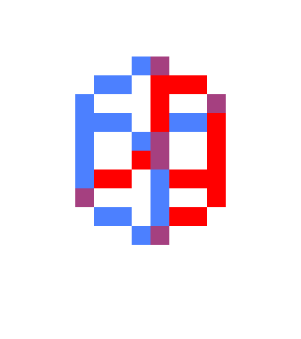

# 3DViewer

## Запуск

1. Скачай [эмулятор Computer v2](https://github.com/farmer2010/Chubrik-processor-emulator) и установи зависимости по его README.
2. Открой в нём [3dviewer.asm](3dviewer.asm) и нажми **F1**.

Для [компьютера в LogicArrows](https://github.com/chubrik/LogicArrows/tree/main/computer-v2) используй [готовую дискету](3dviewer.diskette.txt). Программа занимает **978 из 1024 байт**.

## Управление

| Клавиша | Действие |
|---|---|
| **← / →** | Повернуть куб вокруг вертикальной оси Y |
| **↑ / ↓** | Изменить наклон вокруг оси X |
| **+** или **=** | Приблизить на **0,2** |
| **−** | Отдалить на **0,2** |
| **Пробел** | Вернуть исходный ракурс и масштаб **×1** |

Стрелка поворачивает на **11,25°**. Клавиша **=** позволяет приближать без Shift. Вводи следующую команду после обработки предыдущей.

Масштаб — **×0,5…×3**. От ×1 до максимума нужно **10 нажатий +**, до минимума — **3 нажатия −**. Последний шаг до границы может быть 0,1.

Куб приближается до ×3, даже когда уже не помещается на экране **16×16**: лишние части обрезаются. Красные и синие рёбра на пересечениях дают фиолетовый цвет.

**Del ничего не делает**. Редактирование и удаление доступны в [3DEditor](../3deditor/README.md).

## Демонстрация

Все четыре направления поворота чередуются с зумом до **×3**. В конце пробел возвращает исходный вид, затем цикл повторяется. Индикатор показывает только нажатую клавишу.

