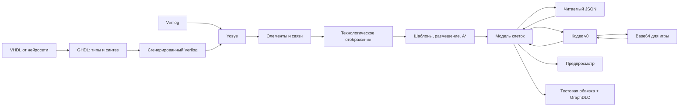

# Архитектура компилятора схем

**Статус: реализован MVP для комбинационного Verilog.** Модель JSON, кодек,
размещение, трассировка, тестовая обвязка и визуализация работают на учебных
сумматорах, включая 8-битный. Компактное размещение работает на общем логическом
графе и включено по умолчанию. Поддержка VHDL и синтез регистров остаются планом;
импортированная схема с памятью уже исполняется в симуляторе.
Ниже сохранён полный проект архитектуры; актуальные команды и ограничения
реализации приведены в [README](README.md).
Основной язык для генерируемого кода — VHDL с проверкой типов; Verilog — второй вход.
Основной результат — модель размещённых клеток.
JSON представляет эту модель в читаемом виде, Base64 — в формате игры.
Отдельный язык инструкций и промежуточный ASM-файл не требуются.

**Технологическое отображение:** `src/technology_mapping.py` создаёт производный
граф с эквивалентными игровыми элементами. Пять булевых элементов полного
сумматора превращаются в XOR трёх входов и порог ≥2. Наблюдаемые промежуточные
сигналы сохраняются; исходный `.logic.json` остаётся неизменным.

**Физический backend:** `src/arrow_layout.py` выбирает режим. Для цепочки
переносов произвольной ширины `src/native_adder_layout.py` предлагает проверенное
размещение по разрядам. Это живой кандидат, а не неиспользованный файл:
`place_compact` сравнивает его с общим упаковщиком и сохраняет результаты
в `build.json/backend_search`. `src/packed_layout.py` сначала
упаковывает связанные цепочки и пары с общими входными контактами. Прямые
связи соседей обходятся без дополнительной стрелки. Оставшиеся связи
`src/compact_layout.py` прокладывает через A*, включая прыжки и разветвления.
Если соединение не помещается, расширяется проблемный блок и повторяется поиск.
Внешние входные контакты подбираются по положениям потребителей после упаковки.
Ручной шаг явно заданной шины фиксируется; автоматический допускает разный
шаг между битами. Незаданные в группах входы не принуждаются к общей линии. Сначала прокладываются внутренние связи, затем они защищаются от
перестройки при подключении внешних проводов. Если защищённые трассы закрывают
доступ к внешнему контакту, запускается запасной проход от исходных узлов,
с совместной перестройкой всех проводов. `io_conflict_fallback` сообщает об этом;
возникшие внутренние обходы полностью входят в оценку ядра.

**Общее физическое уплотнение:** `src/physical_compaction.py` работает с
реальными клетками и их связями, без распознавания сумматора или мультиплексора.
Он удаляет проводник с одним входом, если предыдущая стрелка может точно
повторить все его выходы; OR может одновременно быть прыжком или разветвлением.
Затем пробует сжать координаты по вертикали и горизонтали с сохранением
всех соединений, числа входов вентилей и внешних Source/Target.
Ручной шаг шины сохраняется; автоматический может стать неодинаковым между
разными битами, с сохранением прямой шины и порядка. Обновляются координаты
портов, сетей, вентилей, границы блоков и время установления.
Уплотнение выполняется перед поиском вывода в общем трассировщике и
шаблоне дерева; для готовых шаблонных карт используется тот же проход через
описание сигналов. Вариант, увеличивающий число клеток либо площадь ядра
или полной карты, уступает исходному. Метрики — `physical_compaction`.
Сжатие координат этого прохода ограничено картами до 512 клеток; удаление
промежуточных проводников применяется и к большим картам.

**Поиск общей компоновки:** `src/placement_search.py` работает с группами
связанных операторов и HDL-экземплярами. Сравниваются раздельная упаковка
модулей и совместная упаковка развёрнутого графа. Сохраняется происхождение
каждого оператора и наблюдаемых промежуточных сигналов. Положения входных
контактов групп операций учитываются при упаковке; реальные межмодульные
провода входят в последующую трассировку и оценку размера.

Универсальные группы включают две бинарные ветви с общим объединяющим
оператором; названия модулей и конкретные AND/OR мультиплексора не проверяются.
Общие NOT сравниваются с эквивалентными копиями около потребителей. Начальные
варианты используют пропорции 0,5 / 1 / 1,4 / 2,5 и четыре стороны каждой
явно заданной шины. Неудачные варианты исправляются смещением или поворотом
групп. Далее три лучших размещения развиваются сдвигами и поворотами отдельных
групп и модулей, перемещением объединяющих элементов, сменой стороны шины
и индивидуального автоматического шага. Для каждого варианта заново
подбирается внешний вывод и выполняется физическая трассировка.

Поиск завершается после шести последовательных раундов без улучшения;
общего лимита времени нет. Внутри этого поиска сначала сравниваются все
клетки, полная площадь с портами, площадь ядра, клетки ядра и задержка.
При выборе между backend приоритет имеет ядро, затем полная схема; кандидаты,
увеличивающие клетки или площадь относительно исходного, не выбираются.
В отчёте сохраняются `placement_search`, `optimization` и `backend_search`.
Это эвристический поиск, а не доказательство глобального минимума.

Недостижимые входы отсекаются коротким обратным обходом (до 128 клеток);
если результат неизвестен, запускается обычный A*. Повторная трассировка
одной цепи ограничена шестью попытками на фазу, чтобы конфликтующие провода
не расходовали весь бюджет большого графа. Причины отклонения кандидатов
сохраняются в `optimization.attempts`; CLI `--trace-layout` показывает ход поиска.

**Цель оптимизации — ядро логики.** Из оценки исключены входные трассы до
первого элемента, выходные трассы после последнего и терминальные буферы.
Между backend кандидаты сравниваются по числу внутренних стрелок, площади ядра,
полному числу клеток, площади карты и времени установления. `build.json/logic_core` хранит отдельные размеры и время;
`settle_ticks` по-прежнему учитывает всю карту с тестовыми портами. Длина внешнего
ввода не меняет оценку качества ядра. Шины сохраняют порядок битов; Source/Target
появляются только в отдельной тестовой копии.

Декодирование Base64 восстанавливает клетки; по ним можно восстановить
физические связи и открытые окончания стрелок. Имена портов, объединение битов
в шины и исходный Verilog в формате сохранения не записаны: для собственных
сборок они сохраняются в `.logic.json` и `.build.json`. Автоматическое назначение
входов/выходов произвольной чужой карты требует дополнительных предположений.

Последовательная передача по одному проводнику — отдельный будущий режим:
ему нужны накопление битов, границы слов и контракт тактирования. Сериализатор
и десериализатор добавляют состояние и задержку; текущая комбинационная схема
принимает параллельные шины. [Реконструированный сумматор](examples/reference_adder8/README.md)
уже проверяет существующую последовательную передачу импульсным протоколом;
генерация такой передачи из HDL пока не реализована.

## Критерии качества

- Одна модель клеток используется для сохранения, визуализации и симуляции.
- Размещение и соединения не зависят от исходного HDL.
- Контракт времени задан явно; сравнение только булевых выражений недостаточно.
- Тестовая обвязка отделена от основной схемы.
- Неподдерживаемые конструкции вызывают ошибку вместо приблизительной реализации.
- Существующие кодек v0 и ядро GraphDLC переиспользуются.
- Документация отличает спроектированное от уже работающего.
- Генерируемый HDL проходит проверку типов до синтеза; успешный синтез не заменяет тесты.

## Поток данных



Обязательные данные между стадиями передаются в памяти. Файлы промежуточного
графа и JSON карты нужны для сохранения результата, отладки и ручного редактирования,
но не являются обязательными переходами компилятора.

## Две модели данных

### 1. LogicNetlist: что должна вычислять схема

Граф после адаптера Yosys: логические элементы, их входы/выходы и связи между ними.
Координат стрелок здесь ещё нет.

| Данные | Назначение |
|---|---|
| Элементы | CONST, BUF, NOT, AND, OR, XOR, MUX |
| Связи | Один источник и список потребителей для каждого бита |
| Порты | Имена входов/выходов, ширина, исходные индексы битов |
| Происхождение | Связь с модулем, сигналом и строкой HDL, когда информация доступна |

Шины раскрываются в битовые связи с сохранением соответствия исходным индексам.
Один выход может иметь несколько потребителей. Несколько источников одного бита,
неопределённые биты и незаданные входы отвергаются в первой версии.

Это внутренняя структура данных компилятора. Собственный текстовый язык для неё
не создаётся. JSON Yosys читается адаптером и приводится к этой структуре.
Технологический граф — производная копия этой модели: дополнительно допускаются
XOR трёх входов и MAJ (не менее двух из трёх). Геометрии в нём ещё нет.

Иерархия Verilog разворачивается Yosys в один граф. Его служебные `$scopeinfo`
сохраняются как описания экземпляров в `scopes`, включая имя модуля и места
исходника. Они не имеют электрических портов и не становятся узлами логики.
Снимок иерархии до разворачивания сохраняет интерфейсы экземпляров; по ним
восстанавливаются принадлежащие блокам узлы и именованные провода.
Они используются для физической упаковки модулей. Небольшие связанные модули
могут упаковываться совместно, сохраняя происхождение каждого оператора.

`src/signal_metadata.py` сохраняет электрические цепи, реальные связи клеток
и множества исходных входных битов для каждого выхода. `src/signal_view.py`
строит автономный HTML и PNG из сохранения и этих метаданных. В режиме
«Сигналы» цвета меняются на операторе; в режиме «Разводка» сохраняются цвета
исходных битов, а остальные цветовые маркировки отключаются. Выбор источника
прослеживает зависимости через логические операторы, без имитации значений
или измеренной потактовой анимации.

### 2. ArrowMap: какие клетки получились

В памяти — разреженный словарь:

```text
(x, y) → Cell(type_id, rotation, mirrored)
```

Пустые клетки отсутствуют. Направления — up/right/down/left, внутри модели
соответственно 0/1/2/3. Тип — числовой ID элемента формата карты; отражение — bool.
Эта структура развивает уже существующие `Cell` и словарь в `src/arrowasm.py`.

Связи физической карты выводятся из типов, координат и ориентации клеток по
выбранному профилю игры. Они не записываются вторым независимым графом внутри
ArrowMap, иначе геометрия и связи могли бы противоречить друг другу.

### Читаемое представление ArrowMap

Предлагаемый файл `design.map.json`:

```json
{
  "schema": 1,
  "cells": [
    {"type": "arrow", "dir": "right", "at": [[0, 0], [1, 0], [2, 0]]}
  ]
}
```

Одна группа объединяет клетки с одинаковыми типом, направлением и отражением.
`mirrored` по умолчанию false, `dir` по умолчанию up. Каждая координата — пара
целых чисел; повторная координата, включая повтор между группами, является ошибкой.
Группы раскрываются сразу в ArrowMap и не остаются отдельным состоянием схемы.

Известные типы записываются именами каталога, неизвестные — числовым ID.
Например, `source` обозначает обычный блок типа 2, `level_source` — тип 22;
эти имена не смешиваются. Кодек способен сохранить неизвестный ID, но компилятор
и симулятор принимают только поддерживаемые выбранным профилем элементы.

Группировка — способ записи данных. В первой версии нет инструкций, макросов
и выражений координат. Порядок групп не задаёт работу схемы. Схема JSON имеет
собственную версию, независимую от версии бинарного сохранения v0.

## Результат сборки и границы портов

Компилятор возвращает `BuildResult`: ArrowMap, интерфейс портов, оценку времени,
диагностику и привязку клеток к исходной логике. Только ArrowMap передаётся кодеку.

Для каждого бита порта фиксируются имя, исходный индекс, координата контактной
стрелки, направление и зарезервированное место для внешнего соединения.
Терминальные стрелки — часть основной карты; источник тестового сигнала и
приёмник теста размещаются снаружи на свободных местах.

Дополнительные данные сохраняются в `design.build.json`: порты, контракт времени,
профиль элементов, версии инструментов, seed размещения, хеши входа и карты,
статистика площади и количество клеток. Большая привязка исходников — отдельный
необязательный файл. Проверка хеша исключает применение старого описания портов
к вручную изменённой карте.

Импорт Base64 восстанавливает только клетки. Имена портов, HDL и настройки
сборки из сохранения восстановить нельзя; импортированная карта может
просматриваться и тестироваться по явно указанным координатам.

## Ответственность компонентов

| Компонент | Вход → выход | Ответственность |
|---|---|---|
| HDL-адаптер | VHDL/Verilog → LogicNetlist | Проверить исходник, запустить GHDL для VHDL и Yosys для общего синтеза, нормализовать результат |
| Технологическое отображение | LogicNetlist → производный граф | Заменить булевы подсхемы эквивалентными игровыми элементами, сохранить наблюдаемые сигналы |
| Библиотека элементов | Логический элемент → шаблон | Проверенная схема клеток, контакты, занятая область, ограничения и время установления |
| Размещение и трассировка | LogicNetlist + шаблоны → ArrowMap | Выбрать позиции, соединить потребителей, построить разветвления, исключить посторонние связи |
| Физическая проверка | ArrowMap + исходные связи → диагностика | Восстановить реальные соединения и проверить контакты, маршруты и время |
| JSON-адаптер | ArrowMap ↔ JSON | Читаемая запись, строгая проверка структуры, нормализация |
| Кодек сохранений | ArrowMap ↔ бинарные байты ↔ Base64 | Только геометрия карты, версия формата и ограничения сериализации |
| Тестовый адаптер | BuildResult + сценарий → отчёт | Добавить Source/Target, запустить GraphDLC, сравнить с эталоном |
| Предпросмотр | ArrowMap → изображение | Показать те же клетки, которые будут записаны в сохранение |

Кодек не размещает элементы и не меняет логику. Предпросмотр не восстанавливает
схему из изображения. Отдельный импортёр снимка восстанавливает клетки по
калиброванной сетке и игровым значкам. Симулятор получает ArrowMap напрямую, не через лишний
цикл кодирования/декодирования Base64. Его собственный граф исполнения строится
из клеток и является производным ускоряющим представлением.

## Выбор языка и входные адаптеры

**Для генерируемого кода выбран VHDL-2008 в ограниченном синтезируемом подмножестве.**
Он даёт строгую статическую проверку типов. GHDL — анализатор и компилятор VHDL,
а не другой язык. Типизация обнаруживает часть ошибок генерируемого кода до
построения карты, но не доказывает правильность логики и не исключает всякое
арифметическое переполнение.

Путь VHDL: GHDL проверяет и раскрывает проект, затем `--synth --out=verilog`
выдаёт Verilog для Yosys. Это внутренний результат готового компилятора,
не новый пользовательский язык. Передача через GHDL-плагин Yosys остаётся
альтернативой. Сам синтез GHDL официально экспериментальный: версии инструментов
фиксируются, допустимый набор конструкций подтверждается отдельными тестами.

Путь Verilog-2005: готовый анализатор/линтер проверяет исходник, Yosys читает его
напрямую. После этого оба пути используют одинаковый набор проходов Yosys
и один адаптер JSON → LogicNetlist. Yosys выполняет логический синтез;
разбор HDL самостоятельно не реализуется.

Для VHDL явно задаются разрядности, используются `unsigned`/`signed` из
`numeric_std`, явные преобразования и расширение/усечение значений. Шаблон
генерации запрещает ослабление правил типов; значимые предупреждения останавливают
сборку. Неопределённые значения IEEE-логики не входят в двухзначный контракт MVP.

Начальный контракт обоих языков: комбинационные присваивания, булевы операции,
шины, срезы, конкатенации и выбор значения. После нормализации допустимы только элементы
LogicNetlist. Арифметика добавляется после проверки её разложения в этот базис.
Регистры, защёлки, память, inout, обратные связи, x/z и модели с задержками `#`
или `after` в первой версии не поддерживаются.

Проверки выполняются и до оптимизаций, и на нормализованном графе: нельзя
считать успешную работу Yosys доказательством того, что исходная модель времени
или неопределённые значения сохранены. Неподдерживаемые возможности не должны
молча превращаться в константы или исчезать.

SystemVerilog можно добавить через полноценную проверку типов перед синтезом.
Его встроенный разбор в Yosys поддерживает подмножество языка и, согласно
документации, не обеспечивает строгую типизацию enum. Поэтому одного флага
`read_verilog -sv` недостаточно для заявленного требования надёжности.

Выбор HDL сам по себе не задаёт скорость стрелочной схемы. Основные параметры —
нормализованная логика, шаблоны, длина связей, размещение и контракт времени.
Скорость анализа HDL, скорость симулятора и задержка результата на карте —
три разных показателя; они измеряются раздельно.

## Размещение, соединения и время

**Первый режим — комбинационная схема с проверкой после установления сигналов.**
Тест выставляет входной вектор, удерживает его неизменным заданное число тактов
и затем считывает выход. Это число записывается в результат сборки. Изменять
входы на каждом такте и ожидать точного потока результатов первая версия не обещает.

Маршрутизатор должен обеспечить физические соединения, а не просто свободные
клетки. Он учитывает все направления передачи, дальность, разветвления,
принимаемые сигналы и свободную область вокруг шаблонов. Пересечение проводов
разрешается только через проверенный шаблон, без случайного объединения сигналов.

В общем размещении перебираются шаги сетки 3, 4 и 5 клеток и воспроизводимые
варианты перестановок узлов. На стадии размещения внешние связи имеют нулевой
вес; внутренние связи критических цепочек получают повышенный вес. Для каждого
потребителя A* ищет короткий путь от уже построенного дерева его сигнала.
Стоимость шага учитывает стрелку, прыжок и мешающие трассы. Общие участки
проводов переиспользуются, поэтому стоимость ядра — число уникальных стрелок,
а не сумма длин независимых путей. На выбранной геометрии проверяются все
физические связи и отсутствие циклов. Локально короткие пути не гарантируют
глобального минимума площади всего графа.

Библиотека проверяет каждый шаблон таблицей истинности и переходами входных
значений. Нельзя считать логический AND одной стрелкой только по названию:
игровые элементы реагируют на входящие сигналы, и дублирование одного сигнала
может изменить результат. Разветвление не должно создавать лишние вклады
на одном входе логического элемента.

Физическая схема первой версии должна быть ациклической и использовать только
шаблоны с доказанной конечной задержкой установления. Верхняя граница считается
по реальным маршрутам и ограничениям шаблонов, включая запуск постоянных
источников и добавленную тестовую обвязку. При отсутствии проверенной границы
компиляция завершается ошибкой. Длинная связь увеличивает время ожидания;
дополнительная компенсация каждого пути в этом режиме не обязательна.

Ячейка Delay не используется как универсальная задержка фиксированного размера
без отдельной проверки её поведения. Будущий режим с входом каждый такт потребует
согласования всех ветвей по времени. Синхронный Verilog с регистрами дополнительно
потребует явного контракта тактового сигнала, reset и схем хранения состояния.

## Source/Target и тестирование

В скомпилированной основной карте нет обязательных клеток LevelSource/LevelTarget.
Тестовый адаптер добавляет их на зарезервированных местах интерфейса и привязывает
к именованным портам. Контролируемые Source задают входы; Target измеряют выходы.
Последовательности входов и ожидания остаются отдельным JSON-сценарием.

Тестовая карта строится как копия основной карты плюс обвязка. Поведение портов,
их направление и добавленные такты учитываются в проверке. Обычный экспорт
кодирует исходную основную карту; тестовый экспорт — карту с обвязкой.
Автоматическое удаление всех типов 22/23 из произвольного импортированного
сохранения не является частью кодека: явно сохранённые клетки должны сохраняться.

Два эталона разделяются: булевая модель LogicNetlist задаёт ожидаемый установившийся
результат, GraphDLC проверяет физические клетки по тактам. Для маленьких схем
проверяются все входные комбинации и переходы, для больших — воспроизводимые
сценарии и сопоставление с независимой HDL-симуляцией. Успешные конечные тесты
сами по себе не являются формальным доказательством для произвольной схемы.

Версия движка и каталог поведения фиксируются в профиле сборки. Текущий CLI
использует GraphDLC `01232bd`; отчёты пока содержат
`verified_against_current_game: false`. Сравнение с текущей браузерной игрой —
отдельная проверка совместимости, а не следствие успешного CLI-теста.

## Переход от текущего кода

1. Выделить `Cell`, ArrowMap и проверки геометрии из `arrowasm.py`.
   Выделить кодек v0, добавить JSON-адаптер и перевести небольшие примеры на данные.
2. Перевести CLI-симулятор и генерацию графа на общий вход ArrowMap; добавить
   тестовую обвязку с именами портов. Сохранить чтение Base64 для внешних карт.
3. Подключить Verilog/Yosys и VHDL/GHDL/Yosys → LogicNetlist. Проверять типы,
   отклонять неподдерживаемые клетки; зафиксировать версии и проходы синтеза.
4. Реализовать проверенные шаблоны и простое воспроизводимое размещение/трассировку.
   Первая цель — корректная сборка маленьких схем в пределах явных лимитов.
5. **Компактное размещение и сложение реализованы.** Следующие этапы — потоковый
   режим и регистры по мере появления отдельных проверенных контрактов.

`PLACE`/`Program`/`.l.asm` не входят в новую архитектуру. На время перехода
существующий парсер остаётся совместимым загрузчиком старых примеров; после
перевода примеров и тестов его можно удалить. Действующие файлы этим документом
не переименовываются и не удаляются.

## Приёмочные проверки будущей реализации

- Map → JSON → Map и Map → Base64 → Map сохраняют все клетки, включая неизвестные ID.
- Проверяются отрицательные координаты, ориентация, отражение и ограничения v0.
- Сборка с одинаковыми входами, версиями и seed даёт одинаковую карту и отчёт.
- Шаблоны AND/OR/XOR/NOT/MUX, разветвление и пересечения проходят независимые проверки.
- После трассировки нет недопустимых соединений и лишних вкладов сигналов.
- Длинный маршрут меняет оценку времени; прежний срок считывания не считается достаточным.
- Обвязка не меняет основную карту, не занимает существующие клетки и сохраняет интерфейс.
- Ошибочное согласование типов в VHDL останавливает сборку до Yosys; тесты включают
  явное преобразование типов, разрядности и ожидаемое поведение переполнения.
- Одинаковые по поведению примеры VHDL и Verilog дают одинаковые установившиеся
  результаты, без требования побитово одинакового размещения.
- Компиляция простого провода, инвертора и полусумматора на обоих языках проходит полный цикл:
  LogicNetlist → ArrowMap → экспорт → импорт → симуляция.
- Неподдерживаемый HDL, таймаут и невозможная трассировка завершаются понятной ошибкой.
- Совместимость с браузерной игрой фиксируется отдельным результатом проверки.

## Источники

- [Yosys: встроенное чтение Verilog](https://yosyshq.readthedocs.io/projects/yosys/en/stable/cmd/index_frontends.html).
- [Yosys: синтез и общий процесс](https://yosyshq.net/yosys/).
- [Yosys: JSON netlist](https://yosyshq.readthedocs.io/projects/yosys/en/stable/cmd/index_backends.html#write-json-write-design-to-a-json-file).
- [Yosys: ограничения Verilog](https://yosyshq.readthedocs.io/projects/yosys/en/stable/using_yosys/verilog.html).
- [GHDL/Yosys: адаптер VHDL](https://github.com/ghdl/ghdl-yosys-plugin).
- [AMD: строгая типизация VHDL](https://docs.amd.com/r/en-US/ug901-vivado-synthesis/Advantages-of-VHDL).
- [GHDL: проверка и компиляция VHDL](https://ghdl.github.io/ghdl/about.html).
- [GHDL: синтез и выход Verilog](https://ghdl.github.io/ghdl/using/Synthesis.html).
- [Yosys: ограничения типизации SystemVerilog](https://yosyshq.readthedocs.io/projects/yosys/en/stable/using_yosys/verilog.html#supported-features-from-systemverilog).
- Текущие реализации: `src/arrowasm.py`, `src/logicarrows.py`,
  `tools/compile-graph.ts`, `native/src/main.rs` и [описание симулятора](SIMULATOR.md).
