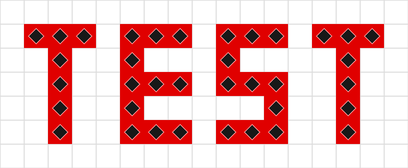

# ArrowsHDL

`ArrowsHDL` — проект компилятора **VHDL/Verilog → схема из стрелок → сохранение**.
Для кода нейросети выбран строго типизированный VHDL; Verilog — второй вход.
**Сейчас реализован комбинационный Verilog:** Yosys → граф логики →
размещение клеток → JSON и Base64. Поддержка VHDL остаётся следующим этапом.
Целевая цепочка: HDL → граф логики → размещение и соединения → модель клеток
→ бинарный формат → Base64. Читаемый JSON представляет модель данных карты;
отдельный язык инструкций и обязательный ASM-файл не требуются.

Подробный проект и план перехода: [**ARCHITECTURE.md**](ARCHITECTURE.md).
Работают Verilog-компилятор, JSON модели карты, кодек v0 и отдельные тестовые
программы с автоматическим добавлением Source/Target. Загрузчик старого
текстового формата сохранён для прежних примеров.
Также доступен [**CLI-симулятор с оптимизациями GraphDLC**](SIMULATOR.md):
сохранение и тестовые сигналы на входе, автоматическая проверка приёмников на выходе.

## Сквозные учебные примеры

- [**Одна цифра из трёх битов**](examples/digit3/README.md) — индикатор 0–7
  из присланной карты, без преобразователя binary → BCD; все 64 перехода проверены.
- [**Мультиплексоры 2→1, 4→1 и 8→1**](examples/hdl/multiplexer/README.md) —
  отдельные шины data/sel с автоматическим, в том числе неодинаковым шагом;
  общий поиск ориентаций и положений операций, внешние контакты с запретом обхода;
  полные карты — **10, 27 и 64**
  стрелок; полный перебор, **4240 проверок выхода**.
- [**Два связанных логических модуля**](examples/hdl/composed_logic/README.md) —
  сравнение раздельной и совместной компоновки: **23 клетки, 9×7 с портами**,
  полный перебор обоих выходов, **64 проверки битов**.
- [**8-битный сумматор**](examples/hdl/adder8/README.md) — `A + B + Cin`,
  выходы `Sum` и `Cout`. **58 клеток, поле 18×4, 20 тактов**, упорядоченные шины,
  полный перебор **131 072 комбинаций** и 2 312 векторов переключений.
  Тот же исходник и граф Yosys раньше давали 623 клетки / 93 такта.
- [**Многомодульный умножитель 4×4 бит**](examples/hdl/candidates/mul4/README.md) —
  частичные произведения и три сумматора. Ядро **184 стрелки / 38×13 / 40 тиков**;
  все 256 пар входов проверены, всего **868 векторов / 6 944 проверки битов**.
- [**Двоичный результат → BCD**](examples/hdl/binary_to_bcd/README.md) —
  универсальный модуль для десятичного индикатора: две или три цифры.
  HDL доказан для всех 16/256 значений; четырёхбитная карта проверена физически.
- [**Схема по пользовательскому снимку**](examples/reference_adder8/README.md) —
  восстановлены **411 стрелок** с памятью и последовательной передачей;
  тест добавляет 21 Source и 9 Target. Все **65 536 пар** прошли, как и отдельное
  арифметическое ядро из **56 стрелок**.
- [**Полусумматор**](examples/hdl/half_adder/README.md) — Verilog из Nandland,
  четыре строки таблицы истинности и все 16 переходов. **36 векторов / 72 проверки**.
- [**Полный сумматор**](examples/hdl/full_adder/README.md) — входящий перенос,
  восемь строк таблицы и все 64 перехода. **136 векторов / 272 проверки**.

У каждого примера есть исходник `.v`, отдельный `testbench.py`, граф логики,
обычная и тестовая карты в JSON/Base64, сценарий, отчёт и визуализация.
Изображения строятся из заново прочитанного сохранения, а таблица — из измерений
GraphDLC. Source/Target добавляются тестом к копии основной карты.


[**Как менялась схема по итерациям компилятора**](examples/hdl/adder8/history/README.md) —
четыре полные карты одного исходника: 30 393 → 473 → 623 → 58 стрелок.

[**Варианты схем из нескольких модулей с готовым кодом**](examples/hdl/candidates/README.md) —
8-битная АЛУ, умножитель 4×4 и сортировщик четырёх 8-битных чисел.
Умножитель собран; функции всех исходников доказаны. Для сортировщика
пока получен [отказ трассировки](examples/hdl/candidates/sort4x8/README.md),
физические сохранения и проверки не выдаются за готовые.

## Установка и запуск компилятора

Нужны Python **3.11+**, Node.js 20+, Rust/Cargo. Yosys запускается нативно, если
доступен, или через пакет YoWASP. Из корня репозитория на Windows:

```powershell
python -m venv ArrowsHDL/.venv
ArrowsHDL/.venv/Scripts/python.exe -m pip install -r ArrowsHDL/requirements.txt
cargo build --release --locked --manifest-path ArrowsHDL/native/Cargo.toml
ArrowsHDL/.venv/Scripts/python.exe ArrowsHDL/examples/hdl/adder8/testbench.py
ArrowsHDL/.venv/Scripts/python.exe ArrowsHDL/examples/hdl/half_adder/testbench.py
ArrowsHDL/.venv/Scripts/python.exe ArrowsHDL/examples/hdl/full_adder/testbench.py
ArrowsHDL/.venv/Scripts/python.exe ArrowsHDL/examples/reference_adder8/recognize.py
ArrowsHDL/.venv/Scripts/python.exe ArrowsHDL/examples/reference_adder8/testbench.py
ArrowsHDL/.venv/Scripts/python.exe -m unittest discover -s ArrowsHDL/tests -v
```

На Linux/macOS используйте `.venv/bin/python` вместо `.venv/Scripts/python.exe`.
Yosys можно указать переменной окружения `YOSYS` — путь к исполняемому файлу.
Первый запуск YoWASP подготавливает WebAssembly-кэш. Установка зависимостей
нужна для компиляции и изображений, не для чтения Base64.

Только компиляция своего модуля, без тестовой обвязки:

```powershell
python ArrowsHDL/src/verilog_compile.py design.v --top design --out build/design
```

**Компактная сборка включена по умолчанию.** Для сравнения на том же
исходнике доступен прежний режим `--layout sparse`. Сохранённый граф Yosys
не меняется; отдельное технологическое отображение заменяет эквивалентные
булевы подсхемы игровыми XOR трёх входов и порогом ≥2. Цепочка сумматора
произвольной ширины размещается по разрядам с короткими связями между соседями.
Это распознавание связей графа, без зависимости от названий HDL-модуля и портов.

Шаблон сумматора больше не исключает общий поиск: результаты обоих
сборщиков сравниваются в `build.json/backend_search`. Общее физическое
уплотнение `src/physical_compaction.py` удаляет лишние проводники и сжимает
ряды/колонки по точным связям, сохраняя вентильные входы, порядок шин,
ручной шаг и внешние порты. Оно применяется ко всем компактным backend,
включая шаблон сумматора. Подробности и ограничения — в
[архитектуре](ARCHITECTURE.md). Новый отдельный плотный генератор mux удалён;
оптимизации общего прохода проверяются на разных логических графах.

**Общий поиск компоновки** в `src/placement_search.py` сравнивает повороты,
перемещения и соседство связанных групп операций, включая неодинаковые
расстояния между каскадами. Он использует физическую трассировку для оценки
каждого кандидата. Для нескольких HDL-модулей сравниваются раздельная
и совместная упаковка, повороты и сдвиги модулей; внутренние интерфейсы
следуют реальным контактам ворот. Общие NOT сравниваются с локальными копиями
у потребителей. Наблюдаемые выходы и принадлежность операций модулям сохраняются.

Начальный зазор между группами — **0**; при конфликте расширяется проблемный
блок. Сравниваются вытянутые и близкие к квадрату пропорции. Шаблоны сумматора
и дерева мультиплексора остаются дополнительными кандидатами. Универсальные
оптимизации работают по структуре графа, независимо от имени схемы.
Поиск продолжает развивать три лучших варианта до шести раундов без улучшения;
общего лимита времени нет. Параметры — `build.json/placement_search`.
Глобальный минимум площади этим эвристическим алгоритмом не гарантируется.

Группы входов задаются повторяемым флагом `--input-bus data,sel`;
отдельные группы — `--input-bus data --input-bus sel`.
`--input-bus-gap 0` размещает источники вплотную; значение задаёт число
пустых клеток между ними. По умолчанию **auto**: после упаковки операций
контакты подбираются по положениям потребителей. Шина остаётся прямой,
порядок битов сохраняется, но расстояния между соседними битами могут различаться.
Без флага группировки общая шина не навязывается.

Ввод/вывод располагается только на внешних сторонах карты. Сравниваются
**все четыре стороны**; трассировка за Source/Target запрещена.
Вывод подбирается после соединения ядра: его внутренние связи сохраняются,
а крайние контакты, выравнивания и внешние трассы сравниваются по полной
площади с портами, числу клеток и задержке. Отчёт — `output_search`.

Между backend приоритет имеет **ядро: число клеток и площадь**, затем полная
схема и задержка. Общий поиск компоновки оценивает также полный размер
с разводкой и портами. Кандидат не выбирается, если увеличивает число клеток
или площадь ядра/всей схемы относительно исходного. Отчёт — `backend_search`.
Шины и внешние границы проверяются перед экспортом и после чтения сохранения.
Запасной трассировщик с фиксированными портами остаётся на случай, когда
адаптивные кандидаты не удаётся соединить. `--trace-layout` показывает
попытки размещения, размеры и причины отказа.

Результат: `design.logic.json`, `design.map.json`, `design.save.txt`,
`design.build.json`, `design.viewer.html` и три цветных PNG.
**JSON — модель данных, Base64 — формат вставки в игру**.
Для симуляции модели напрямую доступен `logicarrows.py --map`.

## Цветной визуализатор

[**Умножитель — открыть HTML**](examples/hdl/candidates/mul4/build/mul4.viewer.html) ·
[сигналы](examples/hdl/candidates/mul4/build/mul4.signals.preview.png) ·
[разводка](examples/hdl/candidates/mul4/build/mul4.routing.preview.png).
HTML содержит карту и спрайты, открывается без сервера и сети.

- **«Сигналы»**: электрическая цепь имеет свой цвет; после оператора начинается новая цепь.
- **«Разводка»**: каждый отдельный входной бит имеет свой цвет, проходящий по
  проводам и через логические операторы. Если сигнал объединяет несколько
  входов, показаны цветные полосы их источников. Цвета типов стрелок и
  фиолетовые маркировки операторов отключены; их форма и направление сохранены.
- Нажатие источника в легенде или выбор шины и бита показывает его зависимости
  через всю схему. Клик по стрелке раскрывает физические входы/выходы;
  клик по оператору — его входные цепи, выход и исходный HDL-модуль.
- Колесо меняет масштаб, перетаскивание сдвигает карту. **«Ядро / Вся схема»**
  переключает область обзора; вся карта включает внешние порты.

Цвета описывают **связи и зависимости**, а не текущие значения и состояния
по тактам. Геометрия и связи получены из повторно прочитанного Base64;
метаданные `signals` в `build.json` привязывают их к исходным входам.
Сохранение не меняется. PNG показывают окно ядра с прилегающими трассами;
отдельный `core.preview.png` содержит только точно выделенное ядро.

Повторно построить виды без компиляции:

```powershell
ArrowsHDL/.venv/Scripts/python.exe ArrowsHDL/src/signal_view.py build/design/design.save.txt build/design/design.build.json --out build/design
node ArrowsHDL/tests/check_signal_view.mjs build/design/design.viewer.html
```

JS-проверка исполняет код готового HTML: выделение источников через операторы,
уникальные цвета битов, нейтральные спрайты разводки, выбор сигналов и масштаб.
Она проверяет обработчики и отрисовку Canvas без запуска браузера.

## Поддержка и ограничения текущей версии

- Комбинационные модули с `assign`, шинами, срезами, конкатенациями,
  параметрами, булевыми операциями, сложением и мультиплексорами. Используется настоящий
  синтез Yosys, затем проверяется допустимый битовый базис.
- Проверяются конфликты клеток, посторонние связи, разрывы, входы элементов
  и циклы. Пересечения проводов выполняются через прыжковые стрелки.
- По реальной карте рассчитывается консервативное число тактов установления.
  Входы удерживаются до проверки; поток новых значений каждый такт не обещается.
- Процессы `always`/`initial`, директивы/include, inout, неопределённые x/z,
  задержки `#`, регистры и память пока отклоняются. Иерархия допускается
  в одном исходном файле; сведения о вложенных экземплярах сохраняются в `scopes`.
  Служебные записи Yosys без электрических портов не входят в логические узлы.
  Неизвестные клетки синтеза не пропускаются.
- Размещение со сгруппированными шинами воспроизводимо: полусумматор —
  **8 клеток / 6 тактов**, полный сумматор — **9 клеток / 6 тактов**,
  8-битный — **58 клеток / 20 тактов**, поле **18×4** на том же исходнике.
- Симулятор поддерживает память импортированных карт и фазовые импульсы
  `frame_ticks`; синтез регистров из HDL пока не реализован.
- JSON сохраняет неизвестные ID без потерь; симулятор и компилятор ограничены
  поддерживаемыми типами. Для VHDL пока нет работающего адаптера.

Прошли **64 автотеста**, включая новый режим разводки и полный перебор 8-битного сумматора,
размер схемы, обычный Verilog `+`, независимые арифметические ожидания,
переходы входов, намеренную порчу AND, неправильное ожидание, маски тактов,
мультиплексор, шины, константы, повторяемость и отказ на неподдерживаемом HDL.
Новые проверки покрывают реконструкцию снимка, память и импульсный протокол,
другую разрядность сумматора и сохранение наблюдаемых промежуточных сигналов.
Проверены кратчайшие маршруты с препятствиями, фиксированные позиции портов
и независимость метрик ядра от длины внешних проводов.
Иерархия проверена сквозным тестом двух вложенных модулей и отказом на
служебной записи с электрическими соединениями.
Отдельно проверены конфликтующие цепи с ограничением повторных перестроений
и недостижимый вход, который не должен запускать полный обход A*.
Запасной проход проверен после принудительного отказа уже изменённой карты:
восстановленная схема проходит независимую таблицу истинности.
Проверены общие контакты XOR3/≥2, прямые связи соседних операторов,
красный разветвитель с тремя выходами и фиксированные порты при расширении ядра.
Профиль — GraphDLC `01232bd`; совместимость с текущей браузерной игрой
отдельно не подтверждена (`verified_against_current_game: false`).

## Текущий этап: кодек и существующие примеры

Ниже описан работающий формат `.l.asm` для старых примеров.
Новый компилятор работает напрямую с моделью карты JSON.

### Проверяемые свойства

- Указывать тип элемента, координаты клетки, одно из четырёх направлений и отражение.
- Поддержать все типы элементов целевой версии игры; соответствие типов формату
  сохранения проверить на реальных картах.
- Разбирать исходник в дерево, проверять ошибки и формировать карту для сериализации.
- Сообщать о неизвестных элементах, неверных направлениях и занятой клетке.
- Проверить сохранение загрузкой в игре и просмотрщиком карты.

## Текстовый формат первого этапа

Файлы описания схем имеют расширение **`.l.asm`**, чтобы редакторы могли
использовать подсветку и форматирование ASM.

```text
; инструкция  тип    x  y  направление
FORMAT 0
PLACE arrow          0  0  right
PLACE arrow          1  0  right
PLACE not            2  0  down
```

`PLACE` размещает один элемент: тип, абсолютные координаты клетки и направление
(`up`, `right`, `down`, `left`). Необязательный флаг `mirrored` отражает элемент.
Координаты задаются по всему полю; ассемблер сам разбивает их на чанки 16×16.
Направления соответствуют поворотам 0–3 по публичной реализации формата v0.
Известные имена типов приведены в `src/arrowasm.py`; любой числовой тип 1–255
можно записать как `type_25`. Неизвестные типы сохраняются без потерь, но это
не означает, что каждый такой тип поддерживается игрой. Пустые клетки не записываются.
Все элементы описываются одним видом инструкции; это не операции процессора.
Порядок строк не задаёт порядок работы схемы. Повторное размещение в занятой
клетке считается ошибкой. Макросы и относительное размещение можно добавить позже.

## Запуск

Python 3.10+; ассемблер и дизассемблер используют только стандартную библиотеку.
Команды выполняются из корня репозитория:

```powershell
python ArrowsHDL/src/arrowasm.py disassemble ArrowsHDL/examples/test.save.txt -o ArrowsHDL/examples/test.l.asm
python ArrowsHDL/src/arrowasm.py assemble ArrowsHDL/examples/test.l.asm -o ArrowsHDL/examples/test.rebuilt.save.txt
python -m unittest discover -s ArrowsHDL/tests -p test_arrowasm.py -v
```

`disassemble` переводит сохранение в текст, `assemble` собирает текст в сохранение.
**LevelSource/LevelTarget — опциональная тестовая обвязка**, а не операции
логики схемы. Обычный `assemble` сохраняет все явно размещённые элементы,
включая тестовые порты, чтобы не нарушать обратимость формата. Для сборки
без тестовых портов используйте `--strip-test-ports`:

```powershell
python ArrowsHDL/src/arrowasm.py assemble ArrowsHDL/examples/identity.l.asm -o ArrowsHDL/examples/identity.production.save.txt --strip-test-ports
```

Этот режим удаляет только клетки типов 22 и 23. Остальные элементы, координаты,
направления и отражения сохраняются. Освободившиеся места становятся пустыми;
соединения автоматически не перестраиваются. Тестовые порты следует размещать
на границах ввода/вывода, а не использовать как внутренние звенья схемы.

Разбор создаёт дерево `Program` с инструкциями `Place`, затем карту клеток.
Повреждённые данные, неподдерживаемая версия и конфликты клеток выдаются как ошибки.
Порядок записей нормализуется: Base64 после пересборки может отличаться,
**координаты, типы, повороты и отражения остаются прежними**.

## Демонстрации и проверки

- `examples/chain.l.asm` — размещение, повороты, отражение и отрицательная координата;
  рядом находятся собранное сохранение и восстановленный текст.
- `examples/identity.l.asm` — тестовая цепочка **Source → стрелка → Target**:
  `level_source` (тип 22) в `(0, 0)`, стрелка в `(1, 0)`,
  `level_target` (тип 23) в `(2, 0)`. Сигнал приходит через два такта.
  Сценарий `identity.test.json` задаёт входные сигналы и ожидаемые выходные;
  эти данные хранятся отдельно от сохранения карты `identity.save.txt`.
- Кодирование Source/Target проверено на фиксированном сохранении внешнего
  JavaScript-сборщика, включая поворот и отражение; также проверена схема `identity`.
- `examples/test.save.txt` — образец пользователя: **TEST**, 36 источников,
  поле 15×5, один чанк. `test.l.asm` — его читаемая запись.
- Проверены все числовые типы 1–255, четыре поворота, оба значения отражения,
  отрицательные координаты, заполненный чанк, пустая карта и ошибочные данные.
- Сохранение из публичного сборщика успешно прошло цикл разбора и пересборки.
- Сгенерированный пример `chain` прочитан независимым JavaScript-декодером.



`examples/preview_test.py` создаёт этот предпросмотр из сохранения; нужен Pillow.
Он рисует только источники образца TEST, **это ещё не полный визуализатор игры**.

## Формат и источники

Поддерживается бинарный формат **версии 0**, записанный в Base64: заголовок,
чанки 16×16, группы типов и позиции с поворотом/отражением. Это формат
геометрии карты; состояние работающей симуляции не моделируется.

Публичные исходники, по которым проверена структура:

- [chubrik/arrows-compiler: js/arrows.js](https://github.com/chubrik/arrows-compiler/blob/main/js/arrows.js).
- [IvanSakaev/BrainfuckArrows: arrows.py](https://github.com/IvanSakaev/BrainfuckArrows/blob/main/brainfuck_to_arrows/arrows.py).

Образец TEST соответствует этой структуре. **Импорт пересобранного сохранения
в текущую игру пока не проверен**; другие версии и форматы отклоняются.

## Дальнейшее развитие

Адаптер VHDL/GHDL, дальнейшее уменьшение схем, потоковый режим и синхронные
схемы с явным контрактом тактирования.

## Статус

Реализованы загрузчик текстовых схем, обратное преобразование и кодек формата v0.
Реализован CLI-симулятор с Rust-ядром и кольцевой оптимизацией GraphDLC.
Реализована цепочка Verilog → граф логики → модель карты → JSON/Base64,
компактное размещение/трассировка, отдельная тестовая обвязка и визуализатор
используемых компилятором типов. Поддержка VHDL и регистры пока не реализованы.
Название проекта — `ArrowsHDL`.
