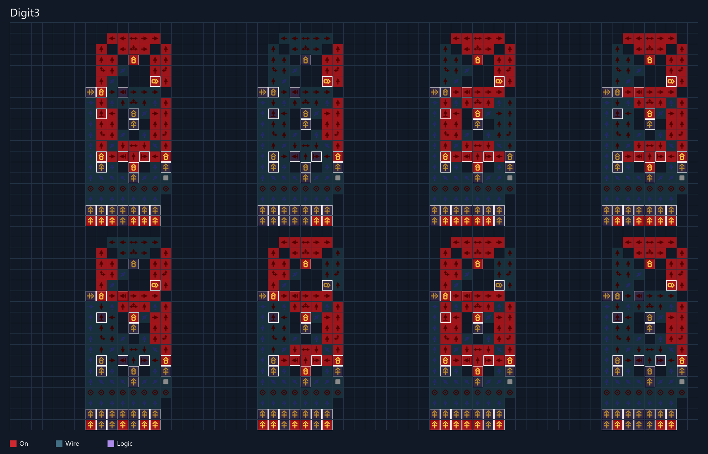

# Digit3

Одна цифра **0–7** для трёхбитного беззнакового числа. Преобразователь
двоичного числа в BCD не используется: для этого диапазона коды совпадают.
Остаётся декодер, включающий семь сегментов индикатора.

Модуль выделен из [BCD Converter](https://logic-arrows.io/map-0TNlFXRQa6Y),
сохранение версии 481. Исходные 8449 клеток сохранены
[без изменения](reference/original.save.txt). Из схемы взяты один индикатор
и реальные зависимости его семи управляющих линий, включая детекторы.
Четвёртый вход зафиксирован в нуле отсутствием внешнего сигнала.
Все три действующих входа выведены на нижнюю границу модуля.
Это адаптация готового игрового модуля, а не результат оптимизации HDL-компилятора.

[**Цифры 0–7**](build/digit3.preview.png) ·
[**сохранение модуля**](build/digit3.save.txt) ·
[описание входов](build/digit3.build.json) · [проверка](build/digit3.report.json).

Порты `n[0]`, `n[1]`, `n[2]` задают веса 1, 2, 4 соответственно.
Точные контакты и свободные координаты внешних источников записаны в JSON;
источники находятся на одной горизонтали. За ними нет клеток модуля.
Source/Target не входят в обычное сохранение. Для проверки к нему добавляются
три управляемых Source; состояния сегментов измеряются без изменения дисплея.

В `build/presets/` находятся восемь самостоятельных сохранений с постоянными
источниками для цифр 0–7 и изображения, построенные по состояниям настоящего
движка GraphDLC. Это фиксированные демонстрации; кнопок переключения в них нет.

Проверены **все 64 перехода**, включая повтор одинакового числа, и возврат
к предыдущему числу: 192 вектора, **67200 проверок сегментов** в двух режимах
оптимизации колец. После 160 тактов проверяется 24 последовательных такта
устойчивого показания. Эти тесты не требуют отсутствия промежуточных вспышек
во время переключения. Все восемь фиксированных сохранений тоже проверены.

```powershell
python ArrowsHDL/examples/digit3/testbench.py
python ArrowsHDL/examples/digit3/render.py
```


