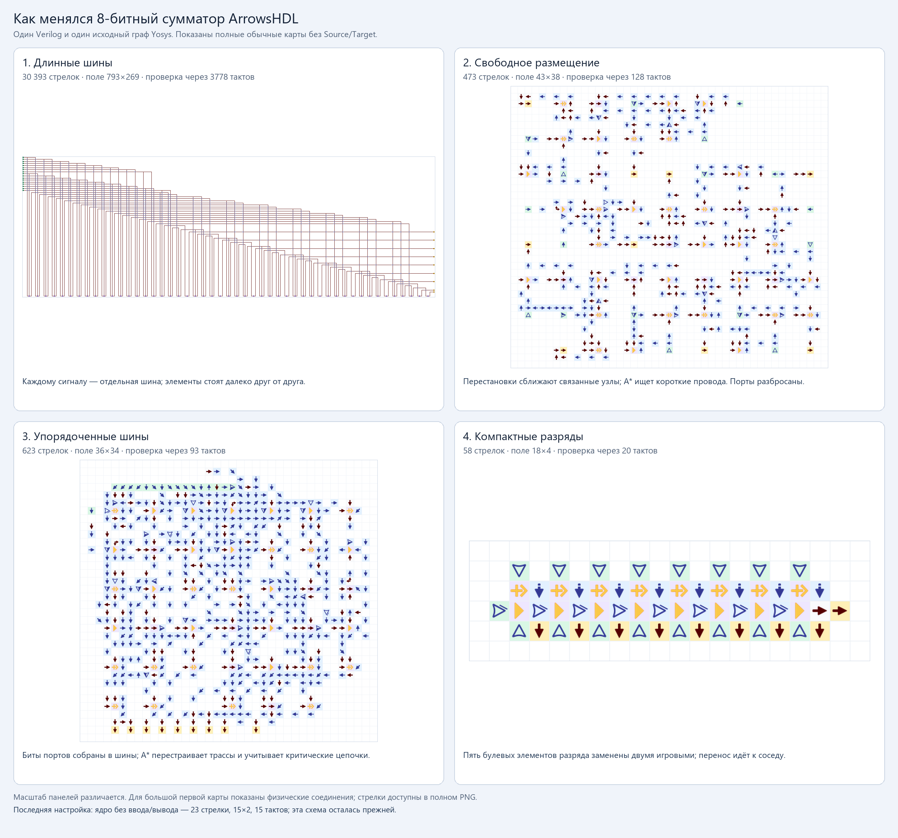

# Итерации компилятора на одном 8-битном сумматоре



Все четыре изображения построены по **реальным картам клеток** одного
[исходника Verilog](adder8.v) и одного [исходного графа Yosys](adder8.logic.json).
Размеры относятся к обычной карте, **без тестовых Source/Target**.
Масштаб панелей различается; отдельные изображения доступны ниже. На общем
листе первая большая карта показана линиями физических соединений, чтобы
они оставались видимыми при уменьшении. [Её полный PNG со стрелками](v1_sparse.preview.png)
сохранён отдельно.

## Как развивался компилятор

Первый прототип ещё не синтезировал HDL: `PLACE` задавал тип, направление и
координаты стрелки, а кодек сохранял клетки в Base64. Затем появились модель
JSON, тестовые Source/Target и подключение Verilog через Yosys.

| Итерация | Стрелок | Поле | Проверка через | Что изменилось |
|---|---:|---:|---:|---|
| [1. Длинные шины](v1_sparse.preview.png) | 30 393 | 793×269 | 3 778 тактов | Каждый сигнал получил свою длинную шину; элементы размещались по отдельности. Это исключало случайные соединения, но создавало огромные трассы. |
| [2. Свободное размещение](v2_free.preview.png) | 473 | 43×38 | 128 тактов | Перестановки сблизили связанные узлы; A* прокладывал короткие деревья проводов с прыжками. Ввод и вывод участвовали в размещении и оказались разбросаны. |
| [3. Упорядоченные шины](v3_buses.preview.png) | 623 | 36×34 | 93 такта | Порты закрепили группами битов. Критическим цепочкам дали больший вес, мешающие трассы перестраивали. Ради упорядоченных портов и меньшей задержки стрелок стало больше. |
| [4. Компактные разряды](v4_native.preview.png) | 58 | 18×4 | 20 тактов | Пять булевых элементов каждого разряда заменили двумя игровыми: XOR трёх входов и порогом ≥2 для переноса. Разряды выстроили рядом. |

**Последняя настройка — приоритет внутренней логики.** В общем маршрутизаторе
сначала строятся внутренние связи A*, потом подключаются фиксированные порты.
Длина внешних проводов исключена из оценки качества ядра. Для этого сумматора
геометрия версии 4 осталась прежней: **58 стрелок всего**, из них **23 стрелки
ядра**, поле ядра **15×2**, задержка ядра **15 тактов**. Полные 20 тактов включают
контакты, выходные буферы и тестовую обвязку.

## Происхождение и проверки

Версии 1 и 4 зафиксированы из сохранённых сборок. Код версий 2 и 3 восстановлен
из изменений в истории этой задачи: [free_v2.py](free_v2.py) и
[buses_v3.py](buses_v3.py). Их повторный запуск воспроизвёл прежние количества
стрелок, размеры и время проверки. Это повторно собранные карты, а не архивные
скриншоты. [recovery.json](recovery.json) содержит последовательность изменений
и хеши снимков кода.

Для каждого варианта проверены JSON/Base64, хеш карты и неизменность исходного
графа, затем **8 граничных векторов / 72 проверки битов** физической симуляцией
GraphDLC `01232bd`. Все проверки прошли. Полный перебор последней сборки из
предыдущего этапа находится в [основном отчёте](../build/adder8.exhaustive.report.json).
Совместимость с текущей браузерной игрой отдельно не проверена.

Время в таблице — консервативный срок проверки с Source/Target, а не измеренная
минимальная задержка. Самих Source/Target на показанных обычных картах нет.

## Файлы и воспроизведение

У каждой версии сохранены `.map.json`, `.save.txt`, `.build.json`, тестовая
копия, сценарий, отчёт, полный рисунок `.preview.png` и поле без подписи
`.board.png`. [iterations.json](iterations.json) связывает размеры, хеши и файлы.
Исходник и граф заморожены в этой папке, чтобы последующие изменения проекта
не меняли историческое сравнение.

```powershell
ArrowsHDL/.venv/Scripts/python.exe ArrowsHDL/examples/hdl/adder8/history/generate.py
```

Команда проверяет сохранённые карты и заново рисует сравнение. `--rebuild`
дополнительно запускает восстановленные компиляторы версий 2 и 3 на сохранённом
графе. Рабочий компилятор проекта при этом не меняется.
