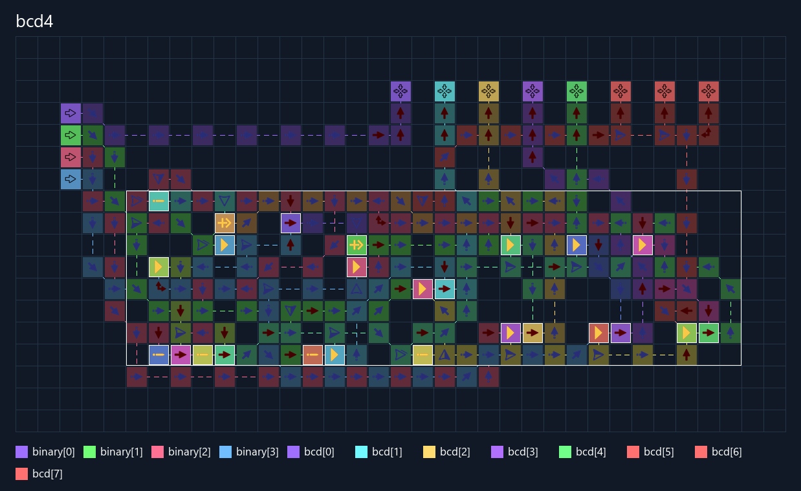

# Binary to BCD

Параметризуемый комбинационный модуль перевода беззнакового двоичного
результата в десятичные цифры. Преобразование выполняется методом сдвига
с коррекцией цифр на 3; деление используется только в независимой SAT-спецификации.

| Верхний модуль | Двоичный вход | Выход BCD | Диапазон |
|---|---|---|---|
| `bcd4` | 4 бита | 2 цифры, 8 бит | 0–15 |
| `bcd8` | 8 бит | 3 цифры, 12 бит | 0–255 |

Младшая четвёрка `bcd[3:0]` — единицы, следующая — десятки,
`bcd[11:8]` у `bcd8` — сотни. Примеры: 14 → `0001 0100`,
225 → `0010 0010 0101`. Каждая четвёрка всегда в диапазоне 0–9.

Подключение к результату четырёхбитной АЛУ:

```verilog
wire [7:0] decimal_result;
binary_to_bcd #(.INPUT_BITS(4), .DIGITS(2)) display_code(result, decimal_result);
```

К выходу `product[7:0]` умножителя подключается вариант `INPUT_BITS=8`,
`DIGITS=3`. Исходники преобразователя и вычислительного модуля должны быть
в одном входном Verilog-файле сборщика. Это интерфейс цифрового индикатора;
сам индикатор и декодер его сегментов в этот проект пока не входят.
АЛУ выдаёт беззнаковый результат с ограничением до четырёх битов:
например, 3−5 даст 14 и установленный флаг заёма.

```powershell
python ArrowsHDL/examples/hdl/binary_to_bcd/testbench.py
python ArrowsHDL/examples/hdl/binary_to_bcd/testbench.py --width 8 --source-only
```

Сначала Yosys SAT доказывает соответствие независимому десятичному эталону
для всех входов. Обычный запуск затем собирает карту, читает её Base64
и проверяет все значения в прямом и обратном порядке без сброса симулятора.
Проверка существующего сохранения: `--reuse`.

## Проверенная сборка

`bcd4`: **229 клеток**, ядро **106 клеток / 26×8 / 45 тиков**,
удержание входа **60 тиков**. Проверены все 16 значений в прямом и обратном
порядке: **32 вектора, 256 проверок выходных битов, ошибок нет**.
Оба варианта доказаны SAT; `bcd8` физически пока не собран.

[Разводка](build/bcd4/bcd4.routing.full.preview.png) ·
[интерактивная схема](build/bcd4/bcd4.viewer.html) ·
[Base64](build/bcd4/bcd4.save.txt) ·
[отчёт физической проверки](build/bcd4/bcd4.exhaustive.report.json).


