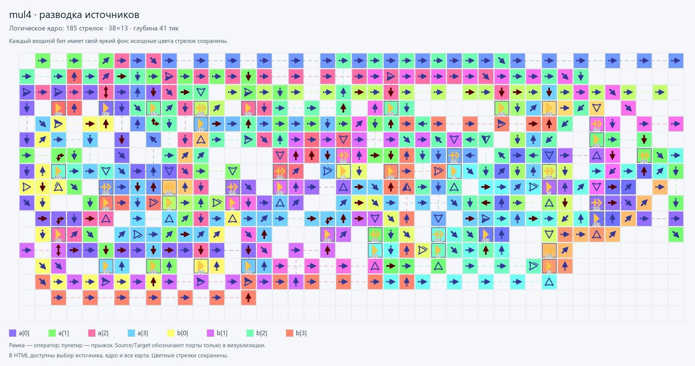

# Умножитель 4×4

[Полный Verilog](mul4.v) содержит блок частичных произведений,
8-битный сумматор и верхний `mul4`. Частичные произведения складываются
**тремя экземплярами сумматора**: два работают параллельно, третий объединяет результаты.

Входы: `a[3:0]`, `b[3:0]`. Выход: `product[7:0]`.
Операция — беззнаковое произведение A×B, диапазон результата 0–225.

| A | B | product |
|---:|---:|---:|
| 0 | 15 | 0 |
| 13 | 11 | 143 |
| 15 | 15 | 225 |

**Что проверяет компилятор:** повторяющиеся арифметические модули, общий ввод
и соединения между двумя уровнями дерева. После Yosys — **72 узла**, включая
8 выходных буферов. Все **256 пар** легко проверить физически; независимый
эталон — целочисленное умножение Python.

[Отчёт проверки HDL](check/mul4.check.json) ·
[проверяемая спецификация](check/specification.v) · [журнал SAT](check/sat.txt).
Функция доказана для всех входов. Затем проверено реальное размещение стрелок:
**868 векторов, 6 944 проверки выходных битов, ошибок нет**. Все 256 пар
подаются в прямом, обратном и случайном порядке; дополнительно переключается
каждый бит входа. Внутри пакета симулятор не сбрасывается между векторами.

## Результат физической сборки

| Метрика | Значение |
|---|---:|
| Граф Yosys / после технологического отображения | 72 / 51 узел |
| Распознано полных сумматоров → XOR3 + порог ≥2 | 7 |
| Обычная карта | **1 051 стрелка**, поле **177×18** |
| Ядро без внешних трасс | **185 стрелок**, поле **38×13**, глубина **41 тик** |
| Внешние трассы и контакты, исключённые из оценки ядра | 866 стрелок |
| Удержание входов для проверки всей карты | **142 тика** |
| Тестовая карта | 1 067 стрелок: добавлены **8 Source + 8 Target** |
| Общие входные контакты, питающие несколько операторов | 33 |

Компилятор сохраняет границы HDL-модулей и заменяет семь подсхем полного
сумматора нативными элементами. Пары XOR/AND и XOR/≥2 упаковываются с общими
контактами входов. Операторы размещаются от выходов к зависимостям; тесно
связанные небольшие модули объединяются в одну область. Остальные связи
соединяются многоточечным A*. Нулевой начальный зазор расширился до одной
клетки между группами; выбрана пропорция 2,5. Это общий алгоритм,
без специального шаблона умножителя.

Порты одинаковы во всех кандидатах. Перед ядром оставлен коридор для ввода;
внешние провода не заставляют перестраивать удачное ядро. Их длина исключена
из цели оптимизации, поэтому полная карта длиннее прежней.

| Сравнение на том же HDL | Прежде | Сейчас |
|---|---:|---:|
| Стрелки ядра | 287 | **185 (−35,5%)** |
| Площадь ядра | 702 | **494 (−29,6%)** |
| Глубина ядра | 54 | **41 (−24,1%)** |
| Полная карта / удержание входов | 753 / 112 | 1 051 / 142 |

[Прежняя сборка](before-packed/mul4.build.json) и [сравнение](build/mul4.comparison.json)
сохраняют исходный результат. SHA-256 HDL совпадает. Структура операторов и
выходных выражений тоже совпадает независимо от переименований узлов Yosys.

41 и 142 — рассчитанные верхние границы установления по физическим связям;
проверки выполняются после 142 тиков удержания. Совместимость с текущей
браузерной игрой отдельно не проверялась; профиль — GraphDLC `01232bd`.

[**Полная тестовая схема**](build/mul4.test.preview.png) ·
[обычная схема](build/mul4.preview.png) · [ядро](build/mul4.core.preview.png) ·
[JSON](build/mul4.map.json) · [Base64](build/mul4.save.txt) ·
[тестовая карта JSON](build/mul4.test.map.json) · [тестовое сохранение](build/mul4.test.save.txt) ·
[отчёт](build/mul4.report.json) · [метрики компиляции](build/mul4.build.json).

[**Цветной интерактивный просмотр**](build/mul4.viewer.html) ·
[сигналы](build/mul4.signals.preview.png) · [разводка источников](build/mul4.routing.preview.png).
В режиме **«Разводка»** каждый из восьми входных битов имеет свой цвет.
Цвета типов стрелок отключены. Выбор источника подсвечивает его путь через
операторы; полосы после оператора показывают участвующие входы. Это зависимости,
а не анимация измеренных значений по тактам. HTML включает всю карту;
цветные PNG показывают окно ядра и прилегающие части внешних трасс.

Изображение ядра скрывает только внешние трассы; позиции оставшихся клеток
сохранены. Это иллюстрация для оценки компактности, не отдельная исполняемая карта.



## Воспроизведение

Из корня репозитория после установки [ArrowsHDL](../../../../README.md):

```powershell
ArrowsHDL/.venv/Scripts/python.exe ArrowsHDL/examples/hdl/candidates/mul4/testbench.py
```

`--reuse` проверяет уже собранную карту с контролем хешей исходника, графа и сохранения.
Отдельный [testbench.py](testbench.py) использует Python `a*b`; он добавляет
Source/Target к копии карты и запускает экспортированное/прочитанное Base64.
Source/Target отсутствуют в обычной карте. Сценарий малых примеров сохранён
в `build/mul4.scenario.json`; полный набор воспроизводится генератором теста.
