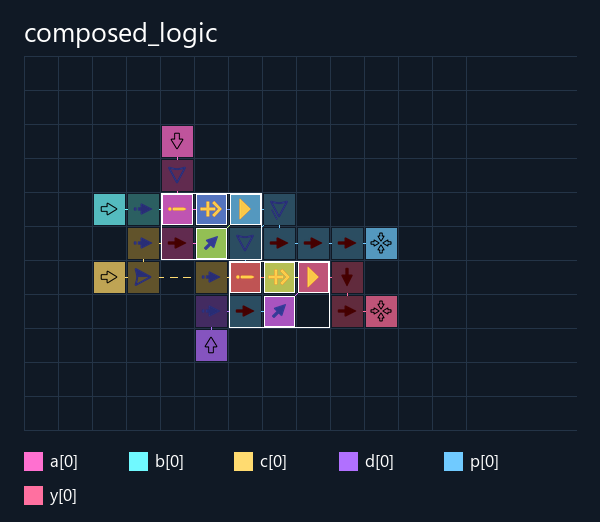

# Composed logic

Два экземпляра одного модуля соединены последовательно. Каждый вычисляет
`((~a) ^ b) & (a | c)`; второй получает выход первого. Промежуточный **p**
и конечный **y** выведены наружу и проверяются независимо.

Сборщик сравнил совместную и раздельную компоновку модулей, перемещения
и повороты их операций. Найдена совместная схема: **23 клетки**, полное поле
**9×7 с Source/Target**. Входы и выходы остаются на внешних границах.
**64 проверки выходных битов прошли**: все 16 входных сочетаний в прямом
и обратном порядке, без сброса между ними.

- [Verilog](composed_logic.v)
- [Сохранение](build/composed_logic.save.txt)
- [Сохранение с портами](build/composed_logic.test.save.txt)
- [Положения портов и поиск компоновки](build/composed_logic.build.json)
- [Проверки](build/composed_logic.report.json)
- [Интерактивная разводка](build/composed_logic.viewer.html)

```powershell
python ArrowsHDL/examples/hdl/composed_logic/testbench.py
```


