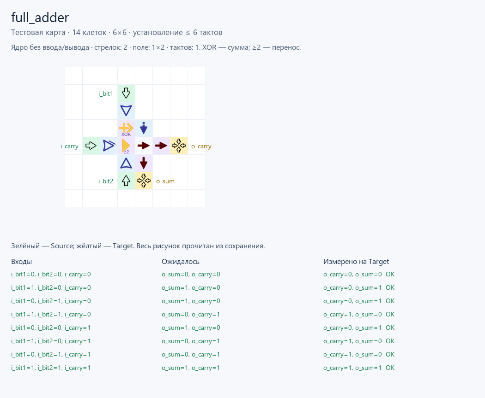

# Полный сумматор: Verilog → стрелочки

Дополнительный пример из [Nandland: Full Adder](https://nandland.com/full-adder/).
`full_adder.v` сохраняет интерфейс, промежуточные связи и уравнения исходного
учебного модуля; запись портов сокращена до ANSI. Автор — Nandland;
[условия использования кода](https://nandland.com/lots-more-vhdl-and-verilog-modules/).

К полусумматору добавлен входящий перенос `i_carry`.

| i_bit1 | i_bit2 | i_carry | o_sum | o_carry |
|---|---|---|---|---|
| 0 | 0 | 0 | 0 | 0 |
| 1 | 0 | 0 | 1 | 0 |
| 0 | 1 | 0 | 1 | 0 |
| 1 | 1 | 0 | 0 | 1 |
| 0 | 0 | 1 | 1 | 0 |
| 1 | 0 | 1 | 0 | 1 |
| 0 | 1 | 1 | 0 | 1 |
| 1 | 1 | 1 | 1 | 1 |

После установки зависимостей по [README проекта](../../../README.md):

```powershell
python ArrowsHDL/examples/hdl/full_adder/testbench.py
```

Отдельный `testbench.py` проверяет восемь строк таблицы и все 64 перехода между
ними: **136 векторов, 272 проверки выходных битов, 816 тактов**, без ошибок.
Ожидания записаны явно по учебной таблице. Векторы удерживаются **6 тактов**.

Каталог `build` содержит те же виды артефактов, что
[пример полусумматора](../half_adder/README.md): граф логики, обычную карту JSON
и Base64 (**9 клеток**), описание портов, тестовую копию (**14 клеток**),
сценарий, отчёт и изображения. Source/Target добавляет тестовая программа.

Проверка выполнена в GraphDLC `01232bd`; импорт и поведение текущей браузерной
версии отдельно не подтверждены. Это комбинационный модуль с открытыми
контактами и компактной трассировкой: прежняя схема занимала 867 клеток при тех
же уравнениях. 8 таких разрядов собраны в [8-битном примере](../adder8/README.md).


