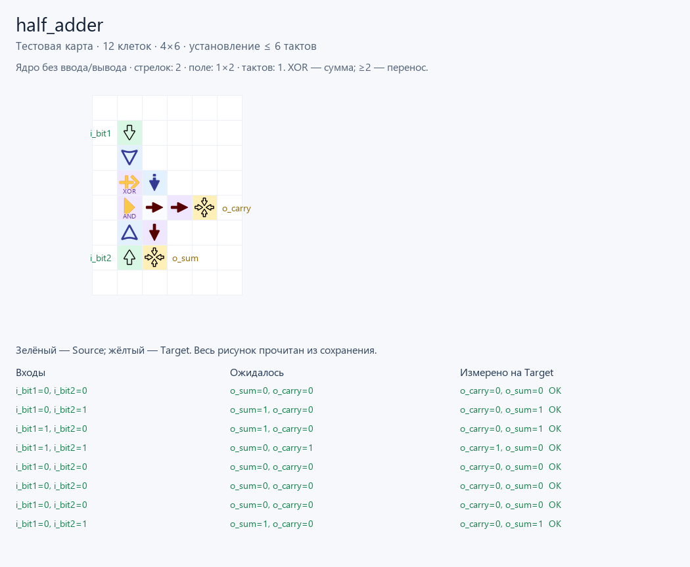

# Полусумматор: Verilog → стрелочки

Базовый учебный пример из [Nandland: Half Adder](https://nandland.com/half-adder/).
`half_adder.v` сохраняет интерфейс и уравнения опубликованного модуля, запись
портов сокращена до ANSI. Автор исходного учебного примера — Nandland.
Автор разрешает скачивать и изменять модули с указанием источника:
[условия использования кода](https://nandland.com/lots-more-vhdl-and-verilog-modules/).

**Два входа:** `i_bit1`, `i_bit2`. **Два выхода:** `o_sum`, `o_carry`.

| i_bit1 | i_bit2 | o_sum | o_carry |
|---|---|---|---|
| 0 | 0 | 0 | 0 |
| 0 | 1 | 1 | 0 |
| 1 | 0 | 1 | 0 |
| 1 | 1 | 0 | 1 |

## Запуск

После установки зависимостей и сборки ядра по [README проекта](../../../README.md),
из корня репозитория:

```powershell
python ArrowsHDL/examples/hdl/half_adder/testbench.py
```

Тестовая программа заново компилирует Verilog настоящим Yosys, проверяет четыре
строки таблицы и все 16 упорядоченных переходов между ними без перезапуска
симуляции. Ожидания записаны явно в `testbench.py` и не выводятся из компилятора.
Получается **36 входных векторов, 72 проверки выходных битов, 216 тактов**.
Все проверки прошли на GraphDLC `01232bd`.

## Результат

| Файл | Что содержит |
|---|---|
| `build/half_adder.logic.json` | Синтезированный граф логики |
| `build/half_adder.map.json` | Обычная карта: 8 клеток, без Source/Target |
| `build/half_adder.save.txt` | Та же обычная карта в Base64 v0, для вставки в игру |
| `build/half_adder.build.json` | Контакты портов, хеш карты, профиль и задержка |
| `build/half_adder.test.map.json` | Тестовая копия: 12 клеток, добавлены два Source и два Target |
| `build/half_adder.test.save.txt` | Тестовая копия в Base64 v0 |
| `build/half_adder.vectors.json` | Именованные входы и ожидаемые выходы |
| `build/half_adder.scenario.json` | Сигналы и проверяемые такты симулятора |
| `build/half_adder.report.json` | Фактические результаты и трассы выходов |

Каждый входной вектор удерживается **6 тактов**; затем проверяются выходы.
Это консервативная верхняя граница по реально проложенным соединениям, не частота
Verilog и не минимальная задержка логического элемента. Компактное размещение
уменьшило схему с 355 до **8 клеток** при тех же уравнениях и входных тестах.

**Обычная карта — модуль с открытыми контактами ввода/вывода.** Для запуска
к ней подключаются внешние источники; в тестовой копии это делает `testbench.py`.
В самой браузерной игре поведение LevelSource задаётся кодом уровня, поэтому
для воспроизведения последовательностей нужно использовать приложенный CLI-тест.
Отчёт честно содержит `verified_against_current_game: false`.


