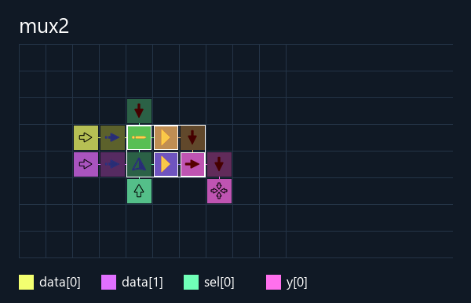
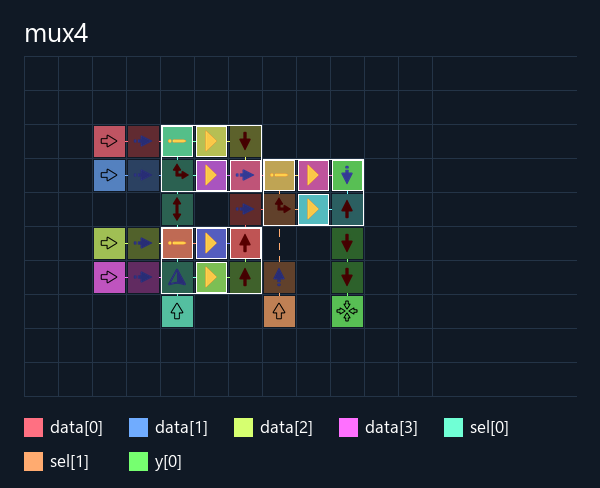

# Multiplexers

Три комбинационные схемы **y = data[sel]**, с нумерацией от нуля.

| Сохранение | Клетки без портов | Поле без портов | Поле с Source/Target | Ядро: клетки / поле | Удержание, тактов |
|---|---:|---|---|---|---:|
| [mux2](mux2/build/mux2.save.txt) | **10** | 5×3 | 6×4 | 5 / 3×2 | 9 |
| [mux4](mux4/build/mux4.save.txt) | **27** | 7×5 | 8×6 | 16 / 6×5 | 13 |
| [mux8](mux8/build/mux8.save.txt) | **64** | 10×11 | 11×12 | 39 / 9×11 | 22 |

**4240 проверок выхода прошли:** полный перебор в прямом и обратном порядке,
без сброса между векторами. Ожидание — `(data >> sel) & 1`; GraphDLC исполняет
физические карты, повторно прочитанные из Base64. [Сравнение](comparison.json).
Для каждого выбранного канала также проверен поток из 240 значений, по одному
биту каждый такт, при неизменном sel. Задержки записаны в `.streaming.json`.
Для mux8 это **14, 14, 13, 14, 11, 10, 13, 12 тактов**.
При одновременном изменении данных и выбора используется время удержания из
таблицы; отсутствие промежуточных импульсов эти проверки не обещают.

## Размещение и шины

Эти демонстрации явно задают **две независимые шины data и sel**.
Общий поиск сначала компонует связанные операции, затем подбирает контакты
по фактическим положениям потребителей. Для каждого кандидата выполняется
трассировка, а размер оценивается вместе с проводами и внешними портами.
Он сравнивает повороты и перемещения групп ворот, положения объединяющих
элементов, общие и локальные NOT, пропорции поля и все четыре стороны шин.
Мультиплексор не получает отдельного плотного генератора: те же проходы
применяются к другим операциям и [связанным HDL-модулям](../composed_logic/README.md).

В mux8 **data слева**, шаг между соседними битами **1, 2, 1, 2, 1, 2, 1**;
**sel снизу**, шаг **3**. Вывод тоже снизу. Биты каждой явно заданной группы
лежат на одной прямой в исходном порядке. Ручной промежуток фиксируется;
при `auto` шаг может различаться между парами битов. Промежуток **0** означает
соседние клетки, то есть координатный шаг **1**. Реальные `pitches` и `gaps`
сохраняются в `.build.json/input_buses`.

Source/Target всегда снаружи, у одной из четырёх границ. Трассировка за ними
запрещена; готовая карта и повторно прочитанное сохранение проходят отдельную
проверку внешних границ. Ввод/вывод не требует квадратного поля.

После соединения ядра положения вывода проверяются справа, снизу, сверху
и слева, с выравниванием по драйверу, центру и свободному краю. Во время этого
прохода внутренние связи сохраняются. Результаты — `.build.json/output_search`.
Общий поиск компоновки — `placement_search` и `optimization`; сравнение
шаблонного и универсального backend — `backend_search`.
Поиск эвристический: найденный минимум среди кандидатов не является
доказательством глобального минимума.

Первоначальная версия занимала **33 / 100 / 286 клеток**; версия с внешними
шинами до общего поиска — **16 / 51 / 130**. Текущая — **10 / 27 / 64**.
Ручная карта пользователя — **68 клеток, 11×13 с портами**; текущий mux8 —
**64 клетки, 11×12 с портами**. Ядро ручной карты всё ещё уже:
**8×11 против 9×11**, глубина обоих — **11 тактов**.
[Подробное сравнение и тайминги ручной карты](manual_mux8/README.md).

## Повторная сборка

Из корня репозитория:

```powershell
python ArrowsHDL/examples/hdl/multiplexer/testbench.py
```

Для своей схемы:

```powershell
python ArrowsHDL/src/verilog_compile.py ArrowsHDL/examples/hdl/multiplexer/mux8/mux8.v --out build/mux8 --input-bus data --input-bus sel --input-bus-gap auto
```

Одна общая шина: `--input-bus data,sel`.
Ручной промежуток: `--input-bus-gap 0` (или 1, 2, …).
Только данные в группе: `--input-bus data`; остальные входы размещаются свободно
на внешних сторонах. Без `--input-bus` общая шина не навязывается.
Порядок портов в группе берётся из флага, битов — из описания портов.
Неизвестные и повторяющиеся входы отклоняются.

Для игры скопируйте целиком `.save.txt`. Для редактирования вместе с портами
используйте [mux8.test.save.txt](mux8/build/mux8.test.save.txt).
Координаты контактов — в `.build.json`; формат сохранения — v0.

## Разводка

В изображениях только английское имя схемы и цветовая легенда.
Стрелки проводов приглушены, логические ворота и блоки выделены тонким белым
контуром. BUF перед Target остаётся обычным проводом; надписей на стрелках нет.





[Интерактивная разводка mux8](mux8/build/mux8.viewer.html).
