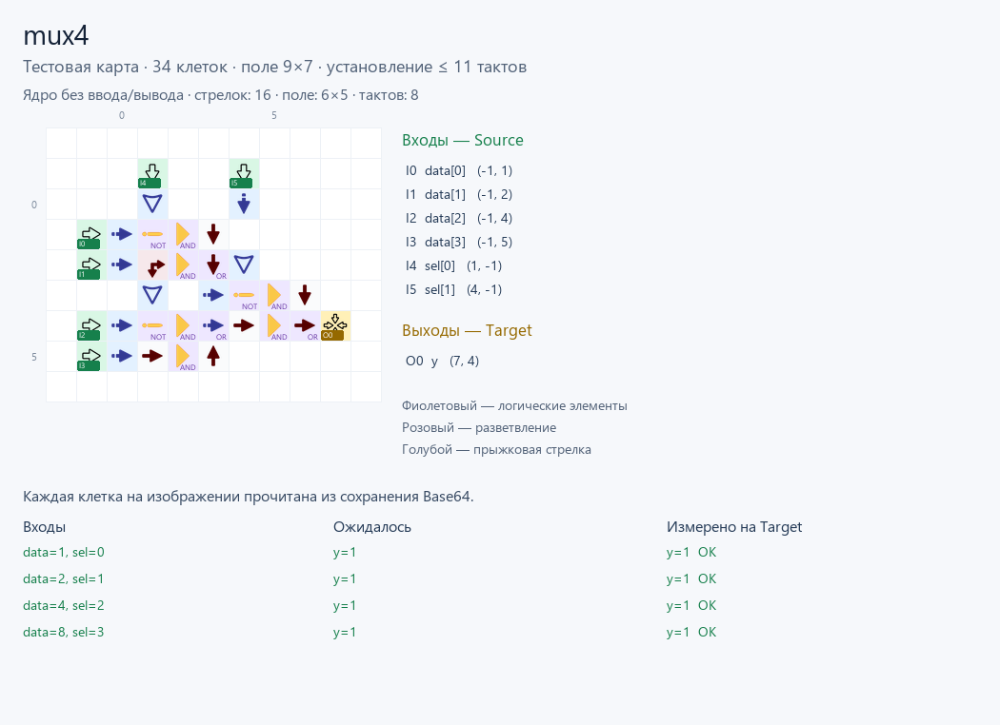
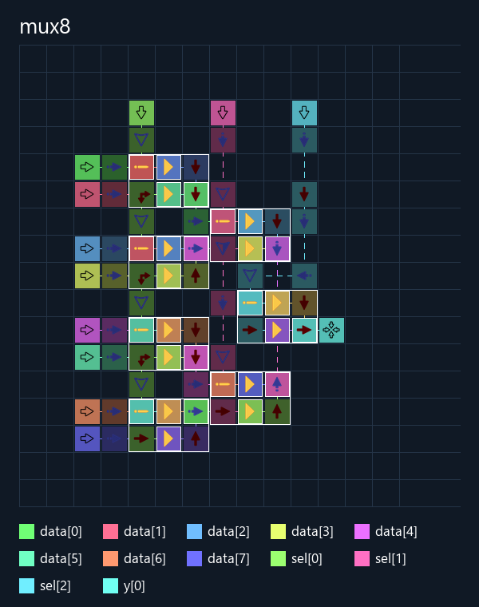

# Мультиплексоры 2→1, 4→1 и 8→1

Три схемы с однобитными входами данных и двоичным выбором: **y = data[sel]**.
Нумерация с нуля: `sel=0` выбирает `data[0]`.

| Схема / Base64 | Входы | Биты выбора | Стрелки ядра | Размер ядра | Все стрелки | Полное поле | Задержка | Комбинации |
|---|---:|---:|---:|---|---:|---|---:|---:|
| [2→1](mux2/build/mux2.save.txt) | 2 | 1 | 5 | 3×2 | **16** | 7×4 | 9 тактов | 8 |
| [4→1](mux4/build/mux4.save.txt) | 4 | 2 | 19 | 6×6 | **51** | 10×8 | 19 тактов | 64 |
| [8→1](mux8/build/mux8.save.txt) | 8 | 3 | 55 | 13×14 | **130** | 18×19 | 39 тактов | 2048 |

Полное поле в таблице — клетки сохранения без Source/Target. С видимыми
портами mux8 занимает **19×20**, вывод расположен **сверху**.

**В демонстрациях заданы две независимые шины:**
`input_buses=['data','sel'], input_bus_gap='auto'`.
В mux8 шина **data расположена слева с промежутком 1**, а **sel сверху
с промежутком 2**. Шаги по координатам — 2 и 3 соответственно. В mux2
промежутки data/sel равны 1/0, в mux4 — 0/0; обе шины этих схем слева.
**Промежуток 0 означает соседние клетки**, то есть разность координат 1.
Группировка не навязывается другим компиляциям. Биты каждой шины идут в
порядке описания портов: `data[0]`…`data[N-1]`, `sel[0]`…`sel[K-1]`.
Группировка и порядок
битов сохраняются; ручной промежуток фиксируется, автоматический выбирается
после трассировки. Фактический шаг записан в `.build.json/input_buses`.

**Ввод/вывод находится на внешней границе карты.** Трассировщик не может
проводить клетки за контактами на стороне источников или приёмников,
включая обходы при повторной трассировке. Незаданные в группах входы
размещаются на внешней стороне с сохранением направления к схеме.
Группы шин сохраняют порядок и промежуток. Допустимая область записана
в `.build.json/routing_limits` как `[left, top, right, bottom]`;
`null` означает отсутствие ограничения с этой стороны.
Перед экспортом и после повторного чтения Base64 независимая проверка
отклоняет любые клетки на стороне источников или приёмников за их границей.
Успех отмечается как `.build.json/io_boundary_verified: true`.

**Компилятор подбирает шины вместе с трассировкой.** В режиме `auto` для
мультиплексоров проверяются промежутки **0–3**, левая, верхняя и нижняя
стороны, начальное и центральное выравнивание. Для двух отдельных групп
проверяются также разные шаги и стороны каждой шины. После выбора геометрии
блоков проводится дополнительный поиск шин, с неизменным порядком битов.
Общий упаковщик сравнивает разные шаги на нескольких вариантах пропорций.
Сначала выбирается меньшее ядро (стрелки, затем площадь), после этого —
меньше внешних проводов, полная площадь с портами и задержка;
никакой вариант не получает права обходить внешние источники.
Он сравнивает ориентацию блоков дерева, расстояние между каскадами,
обычную и зеркальную расстановку, прямую и сложенную полосу AND/NOR.
Компактный блок 2→1 занимает **3×2 клетки и 5 стрелок ядра**: второй AND
направлен прямо в соседний OR, первая ветвь использует одну поворотную стрелку.
Для дерева проверяются расстояния 2–5 клеток между началами блоков,
включая прилегающие и частично пересекающиеся по прямоугольным границам
каскады; реальные конфликты клеток и сигналов отклоняются.
В первом каскаде разные пары данных вычисляются параллельно. Три уровня
выбора 8→1 сохраняют зависимости вычислений, но не требуют пустых полос между ними.
При равном числе клеток предпочтительны
меньшая полная площадь, затем задержка. Параметры и результаты всех допустимых
кандидатов сохраняются в `.build.json/optimization`.

## Подбор выхода после размещения ядра

Выходные терминалы удаляются из начальной задачи трассировки. Сначала
размещаются и соединяются вычислительные ворота; затем их координаты и
внутренние соединения фиксируются. Вывод проверяется **справа, сверху,
снизу и слева**, с привязкой к драйверу, к центру или к свободному краю
внешней стороны. Допускается общая внешняя сторона со входами,
если выход занимает другое свободное место.
Контакт может занять свободную клетку на самой границе разводки либо
следующую клетку снаружи; Target всегда находится ещё на клетку дальше.
При неизменном ядре выходы сравниваются по **площади карты вместе с
Source/Target**, затем числу стрелок и задержке.
Провод вывода может добавить ответвление, но не перемещает ворота и
не перестраивает связи между ними. Старые выходные трассы не сохраняются
как часть ядра. Этот поиск также применяется в общем компактном упаковщике.

Для выбранного ядра 8→1 получено:

| Вывод | Карта с Source/Target | Площадь | Стрелки | Задержка |
|---|---|---:|---:|---:|
| Справа | 20×20 | 400 | 123 | 32 такта |
| **Сверху** | **19×20** | **380** | **130** | **39 тактов** |
| Снизу | 19×21 | 399 | 126 | 35 тактов |

Во всех случаях ядро одинаковое: **55 стрелок, 13×14, 17 тактов**.
Выбран верхний вывод: площадь на **20 клеток (5%)** меньше правого варианта,
ценой семи дополнительных стрелок и семи тактов.
Конфликтующие с внешней шиной позиции отклоняются. Точные варианты,
габариты и причины отказов записаны в
`.build.json/output_search`, включая `core_frozen` и `core_connections_verified`.

Компилятор распознаёт полное дерево мультиплексора по связям AND/OR/NOT,
независимо от имён модуля и портов. Сейчас для всех трёх схем выбрано
каскадное дерево: логические блоки направлены к следующему каскаду,
входы data и sel размещаются независимыми шинами. Зеркальные блоки также
проверяются физическим симулятором.
Полоса высотой две клетки остаётся одним из кандидатов, но её высота
не ограничивает выбранную карту.
Исходник и экспортируемый граф Yosys не изменяются. Наблюдаемые промежуточные
выходы или другой граф не подменяются этим шаблоном. Глобальный минимум
числа клеток не гарантируется.

Первоначальные карты занимали **33 / 100 / 286 стрелок**.
Теперь с автоматическим шагом и внешними границами — **16 / 51 / 130**.
Для 8→1 общая шина с ручным промежутком 0 давала 178 стрелок / 47 тактов.
Общая шина с автоматическим шагом и верхним выводом занимала **146 стрелок,
41 такт, 19×22 с портами**. Разделение data/sel уменьшило это до
**130 стрелок, 39 тактов, 19×20 с портами**. Ядро сократилось с 57 до 55 стрелок.
Версия без запрета обхода внешних контактов занимала 19 / 62 / 157. Версия с разнесёнными
источниками занимала 13 / 43 / 111, но не соблюдала требование общей шины.
Внешних клеток за пределами ядра — **11 / 32 / 75**, включая входные
контакты, распределение сигналов и выходной контакт.
Задержка включает внешние шины и тестовую обвязку.

**Все проверки прошли:** полный перебор в прямом и обратном порядке,
без сброса между векторами. Всего **4240 проверок выхода**.
Независимое ожидание: `(data >> sel) & 1`. GraphDLC исполняет физические
карты, повторно загруженные из Base64. [Сравнение](comparison.json).

## Повторная сборка

В CLI группировка задаётся повторяемым флагом. Две независимые шины,
как в демонстрациях:

```powershell
ArrowsHDL/.venv/Scripts/python.exe ArrowsHDL/src/verilog_compile.py ArrowsHDL/examples/hdl/multiplexer/mux8/mux8.v --out build/mux8 --input-bus data --input-bus sel --input-bus-gap auto
```

Одна общая шина: `--input-bus data,sel --input-bus-gap auto`.
Ручной фиксированный промежуток: `--input-bus-gap 0` (или 1, 2, …).
Только данные в шине: `--input-bus data`; `sel` остаётся вне этой группы.
Без `--input-bus` дополнительной группировки нет. Порядок портов в группе
берётся из флага, порядок битов — из описания портов. Промежуток действует
в ручном режиме на все явно заданные группы, по умолчанию **auto**. Флаги поддерживаются
в режиме `compact`; неизвестные и повторяющиеся входы отклоняются.

Из корня репозитория:

```powershell
ArrowsHDL/.venv/Scripts/python.exe ArrowsHDL/examples/hdl/multiplexer/testbench.py
ArrowsHDL/.venv/Scripts/python.exe -m unittest discover -s ArrowsHDL/tests -p test_native_mux_layout.py -v
```

В папках вариантов находятся Verilog, карты JSON/Base64, граф Yosys,
описания портов `.build.json`, тестовые сценарии, векторы, отчёты и изображения.
Для игры скопируйте целиком обычный `.save.txt`; `.test.save.txt` содержит Source/Target.
Контакты подписаны на изображениях, координаты доступны в `.build.json`.
При одновременном изменении данных и выбора удерживайте оба входа указанное
число тактов перед считыванием результата. Эти тесты проверяют установившиеся
значения, а не отсутствие промежуточных импульсов. Для ручной версии отдельно
проверен поток при фиксированном sel: один бит за такт с задержкой 10–12 тактов;
подробности и ограничения — в [разборе таймингов](manual_mux8/README.md#последовательные-сигналы-и-переключение-выбора).
Формат — v0;
импорт в текущую браузерную игру отдельно не проверен.



**Разводка 8→1 с верхним выводом:**

В изображении оставлены только имя схемы и цветовая легенда. Обычные
стрелки приглушены; ворота и физические блоки выделены тонким белым
контуром. Надписей на стрелках и поясняющих подписей нет.

Для ручного редактирования используйте [сохранение с Source/Target](mux8/build/mux8.test.save.txt).



[Интерактивная разводка 8→1](mux8/build/mux8.viewer.html)

[Ручная компактная версия пользователя](manual_mux8/README.md): **68 клеток,
9×12**, полный перебор входов пройден. В разборе перечислены геометрии
и совмещённые операции, которые текущий поиск компилятора не генерирует.
