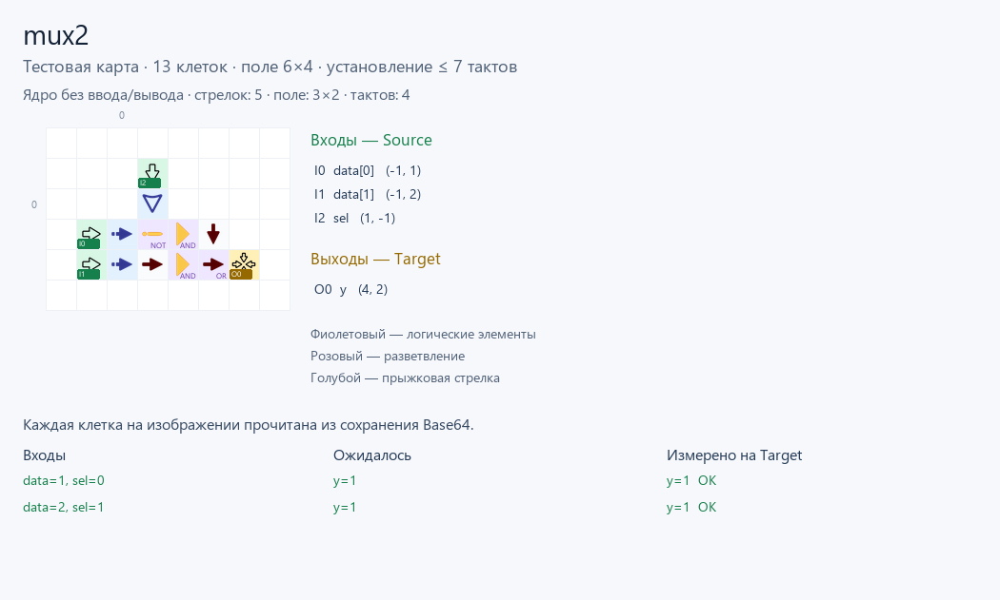

# Мультиплексор 2→1

Выход: `y = data[sel]`. Число входов данных: **2**.

- [Base64 для игры](build/mux2.save.txt)
- [Тестовая карта](build/mux2.test.save.txt)
- [Verilog](mux2.v)
- [Отчёт](build/mux2.report.json)
- [Порты и задержка](build/mux2.build.json)

[Инструкции и сравнение](../README.md).

