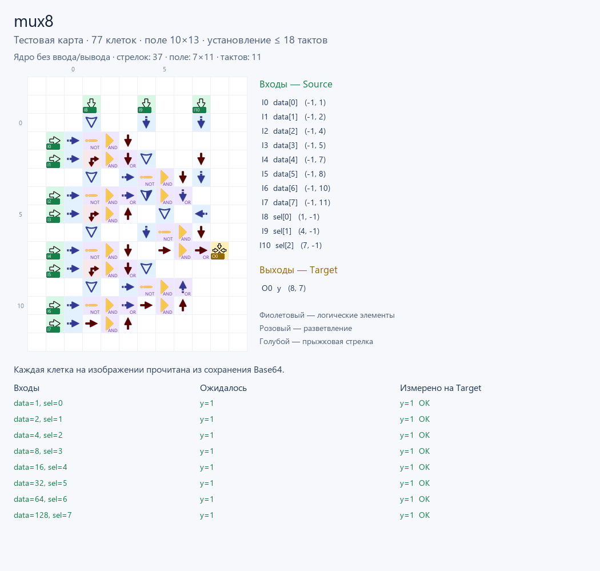

# Мультиплексор 8→1

Выход: `y = data[sel]`. Число входов данных: **8**.

- [Base64 для игры](build/mux8.save.txt)
- [Тестовая карта](build/mux8.test.save.txt)
- [Verilog](mux8.v)
- [Отчёт](build/mux8.report.json)
- [Порты и задержка](build/mux8.build.json)

[Инструкции и сравнение](../README.md).

