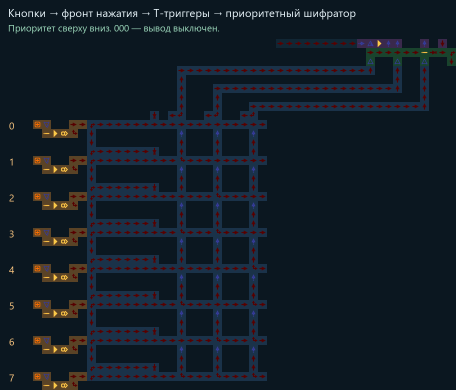
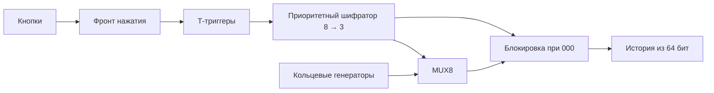

# Зацикленная схема с MUX8 и приоритетным выбором

Восемь колец с NOT создают цифровые сигналы. Семь каналов доступны через
MUX8; **код `000` отключает вывод**, а `001…111` выбирают каналы 1–7.
Дисплей из 64 стрелок показывает историю выбранного сигнала.

- [**Сохранение для игры**](build/loop_mux8.save.txt).
- [**Управление крупным планом**](build/loop_mux8.controls.preview.png).
- [Полная физическая схема](build/loop_mux8.preview.png).
- [Читаемый исходник](loop_mux8.l.asm), [сборщик](build.py), [проверка](testbench.py).
- [Отчёт](build/loop_mux8.report.json), [тестовая карта](build/loop_mux8.test.save.txt).
- [Исходный блок пользователя](reference/zero_gate.original.save.txt).



## Управление

Кнопки находятся в колонке **`x=-32`**, строки `24,28,32,36,40,44,48,52`.
Сверху вниз это входы 0–7. **Каждое нажатие переключает свой Т-триггер**;
отпускание сохраняет его состояние. Детектор перед Т-триггером выделяет
фронт нажатия: длительное удержание не вызывает повторных переключений.

**Приоритет сверху вниз:** ближайший к MUX8 активный вход выигрывает.
Другие включённые Т-триггеры сохраняют состояние, но не добавляют свои биты
к коду. Например, включены входы 2 и 7 — код `010`; выключили вход 2 —
код `111`. Вход 0 имеет высший приоритет и означает выключение.
Если не включён ни один вход, код также `000` и вывод отключён.

Сигнал после блокировки находится в **`(13,16)`**. Полоса индикаторов —
`x=14…77, y=17`, самый новый бит слева. Старые биты уходят с полосы за
64 такта; отключение нового вывода не стирает их мгновенно.
Индикаторы кода в `(-17,23),(-13,23),(-9,23)` показывают младший,
средний и старший бит. Перед сменой выбора дайте схеме установиться:
кнопки, приоритетная цепочка, шифратор и MUX8 имеют физические задержки.
Тесты выдерживают 250 тактов между переключениями.

## Устройство



Блок NOT → блокиратор и полоса дисплея взяты **из присланного сохранения**
без изменения внутренних клеток, только с переносом на `(5,16)`.
Двойные прыжки подают каждый бит выбора одновременно в MUX8 и в общую
проверку нуля. Ранее активные входы блокируют последующие строки шифратора.

Кольца работают независимо от выбора. Периоды каналов 1–7:
**20,24,32,40,48,64,80 тактов**. Кольцо 0 с периодом 16 остаётся в карте,
но режим `000` не пропускает его на дисплей. Никаких записанных кадров
или случайных чисел нет.

Карта: **1381 клетка, 126×118**. Source/Target присутствуют только в тестовой
карте. [Готовые фиксированные режимы](build/presets/) используют постоянный
источник и обходят Т-триггер; основная схема использует кнопки и память.

## Проверка

Проверяются длительное удержание и отпускание кнопки, повторное нажатие,
одновременные нажатия, **все 256 сочетаний состояний Т-триггеров**,
приоритет, отключение при `000`, периоды и каждый пиксель истории.
Экспортированные карты исполняет GraphDLC; независимая клеточная модель
сравнивает каждый такт, с разрешённой и отключённой оптимизацией колец.
Точные результаты и число сравнений хранятся в отчёте.
**Импорт в текущую игру не проверен**; формат v0, профиль GraphDLC-01232bd.

Из корня репозитория:

```powershell
ArrowsHDL/.venv/Scripts/python.exe ArrowsHDL/examples/loop_mux8/testbench.py
ArrowsHDL/.venv/Scripts/python.exe ArrowsHDL/examples/loop_mux8/render.py
```
