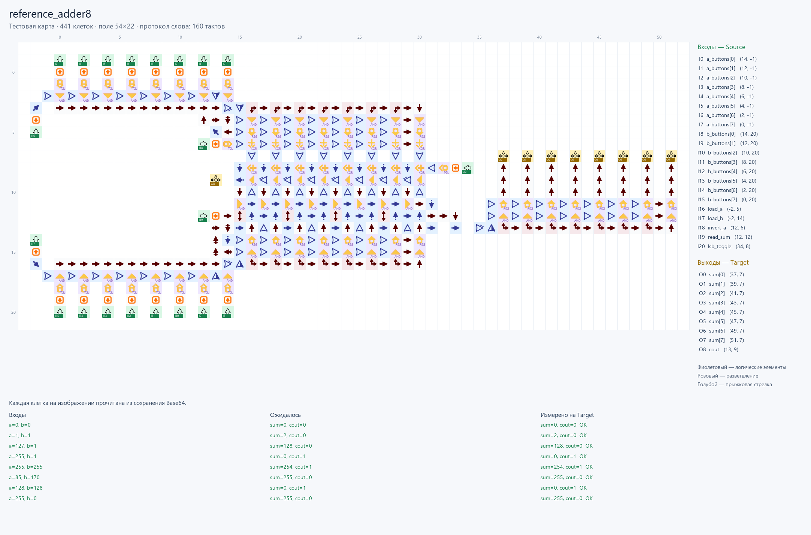
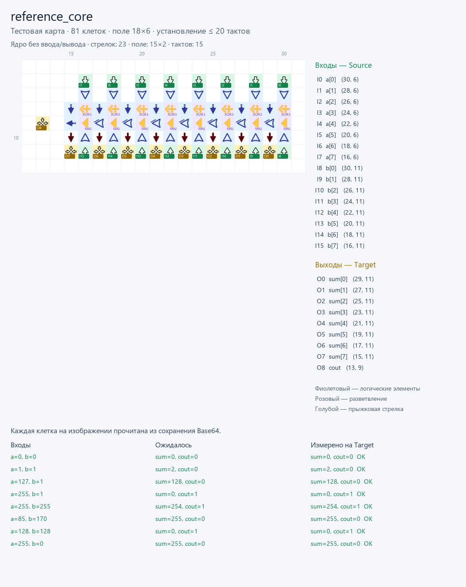

# Сумматор, восстановленный по изображению

**Восстановлены 411 стрелок со снимка**, включая кнопки, память и последовательную
передачу слов. [Обычная карта JSON](build/reference.map.json) и
[сохранение Base64](build/reference.save.txt) описывают одни и те же клетки.
Отдельная [тестовая карта](build/reference.test.map.json) добавляет **21 Source
и 9 Target**, сохраняя все исходные стрелки: всего **441 клетка**.

Исходное изображение пользователя: [source.jpg](source.jpg).
Увеличенный фрагмент всей схемы: [source-detail.png](source-detail.png).

## Критерии проверки

- Сетка, типы и направления восстанавливаются по изображению, независимо от арифметического эталона.
- JSON и Base64 после чтения дают одинаковую карту.
- Тестовая обвязка добавляет клетки, не заменяя кнопки и внутреннюю логику.
- Исполняются реальные стрелки и память в GraphDLC; ожидания вычисляет отдельное целочисленное сложение Python.
- Проверяются все пары 8-битных чисел и переходы между значениями.
- Количество стрелок сравнивается отдельно для арифметического ядра и полной схемы с памятью.

**Все проверки прошли** в профиле GraphDLC `01232bd`.

## Восстановление карты

[recognize.py](recognize.py) определяет клетки по сетке снимка и сравнивает их
с игровыми значками типов 1–25 в четырёх направлениях с отражением.
Шаг сетки — примерно **17,812×17,825 пикселя**; её начало соответствует кнопке
`(0,0)` в пикселе `(254,6; 171,15)`. Маска исключает элементы браузера и меню.
Калибровка, хеш изображения, альтернативы распознавания и оценки сохранены в
[recognition.audit.json](build/recognition.audit.json).

Одна неоднозначность JPEG исправлена по увеличенному изображению:
нижняя левая кнопка `(-2,15)` направлена вниз. Поправка с причиной записана в
[overrides.json](overrides.json). У симметричных значков отражение может быть
неразличимо; такие варианты передают сигнал одинаково. Поэтому это
**функциональная реконструкция видимой схемы**, а побайтовое совпадение с
непредоставленным исходным сохранением установить нельзя.

Поле основной карты — **54×20**. В ней 21 направленная кнопка, 24 защёлки,
18 переключателей памяти и 8 задержек. [reference.graph.json](build/reference.graph.json)
содержит восстановленные физические связи и открытые окончания. Привязка
именованных портов задаётся отдельно в [protocol.py](protocol.py) и
[reference.build.json](build/reference.build.json): изображение не хранит имена шин.

## Ввод, вывод и протокол теста

Кнопки A находятся сверху, B — снизу: **слева старший бит, справа младший**.
Выходная шина справа имеет обратный порядок: **слева младший бит**.
Source подаёт импульсы в существующие кнопки; Target измеряет 8 бит результата
и перенос из арифметического ядра. Все координаты есть в описании сборки.

Кнопки изменяют сохранённые биты. Поэтому при переходе от предыдущего слова
к следующему тест нажимает только биты `previous XOR next`, затем запускает
загрузку и считывание. Операция занимает **160 настоящих тактов**:

| Такты | Действие |
|---|---|
| 1 | Однотактное нажатие изменяемых битов A и B |
| 2–10 | Отпускание кнопок и установление входных регистров |
| 11 | Импульс загрузки A и B одновременно |
| 12–99 | Передача и вычисление |
| 100 | Импульс считывания суммы |
| 101–160 | Приём результата; проверка в конце такта 160 |

Сценарий хранит длительности фаз через `frame_ticks` и не разворачивает их
в массивы на каждый такт. Ядро симулятора исполняет каждый такт.
Дополнительные кнопки `(13,6)` и `(33,8)` удерживаются в нуле: проверен
**режим A+B**, остальные режимы этой пользовательской схемы не исследованы.
Состояние сохраняется между операциями внутри пакета; новый пакет начинается с нуля.

## Результаты и сравнение

**Полная карта:** все **65 536 пар** A/B, **589 824 проверки выходных битов**,
**10 485 760 тактов**, **0 ошибок**. Дополнительно прошли **552 сценария**
с отдельными битами, границами и воспроизводимыми случайными переходами:
4 968 проверок, 88 320 тактов. Ожидания: `sum=(a+b)&255`, `cout=(a+b)>>8`.

Центральное арифметическое ядро выделено как **точное подмножество** клеток
снимка, без генерации новых стрелок. Оно тоже прошло все **65 536 пар**,
589 824 проверки и 1 310 720 тактов. Его тестовая карта содержит 56 исходных
стрелок, 16 Source и 9 Target — **81 клетку**.

| Схема | Обычных стрелок | Поле | Время теста | Интерфейс |
|---|---:|---:|---:|---|
| Полная карта снимка | 411 | 54×20 | 160 тактов на слово | A+B, память и последовательная передача |
| Ядро из снимка | **56** | **16×4** | **20 тактов** | Параллельный A+B, начальный перенос 0 |
| Новый результат компилятора | **58** | **18×4** | **20 тактов** | Параллельный A+B+Cin |

У полной карты 160 тактов — длительность проверенного протокола, у ядер 20 —
консервативный предел установления с тестовыми портами. Полная карта и ядро
имеют разные функции хранения и передачи, поэтому их размеры нельзя считать
сравнением одной реализации.

Две дополнительные стрелки компилятора — контакт `Cin` и отдельный терминал
`Cout`. Каждый разряд использует **XOR трёх входов** для суммы и игровой
пороговый элемент **«не менее двух сигналов»** для переноса. Это тот же
принцип компактности, который используется в ядре снимка. Компилятор
распознаёт цепочку по связям графа для произвольной разрядности.
[Тот же исходник Verilog](../hdl/adder8/adder8.v) теперь даёт 58 стрелок вместо
623; [все 131 072 комбинации с Cin](../hdl/adder8/build/adder8.exhaustive.report.json)
прошли. [Сравнение в JSON](build/comparison.json) содержит хеши, размеры и контракты времени.

После исключения внешних трасс и контактов **оба ядра имеют 23 стрелки,
поле 15×2 и задержку 15 тактов**: 16 логических элементов и 7 стрелок между
разрядами. Эта оценка хранится в `logic_core` и используется для оптимизации.
Входной путь до первого логического элемента и выходной путь после последнего
в неё не входят. Полное время теста остаётся 20 тактов.

## Запуск

После [установки зависимостей](../../README.md), из корня репозитория:

```powershell
ArrowsHDL/.venv/Scripts/python.exe ArrowsHDL/examples/reference_adder8/recognize.py
ArrowsHDL/.venv/Scripts/python.exe ArrowsHDL/examples/reference_adder8/testbench.py
```

Первая команда воспроизводит распознавание карты, вторая создаёт тестовые
версии, запускает переключения и полный перебор обеих схем. `--quick` пропускает
полный перебор. Для обновления сравнения с компилятором сначала запустите
[его тестовую программу](../hdl/adder8/testbench.py).

## Артефакты

| Файл | Содержимое |
|---|---|
| [reference.map.json](build/reference.map.json) | Вся восстановленная схема, 411 стрелок |
| [reference.save.txt](build/reference.save.txt) | Обычное сохранение для вставки |
| [reference.test.map.json](build/reference.test.map.json) | Копия с Source/Target, 441 клетка |
| [reference.test.save.txt](build/reference.test.save.txt) | Тестовая копия в Base64 |
| [reference.build.json](build/reference.build.json) | Контакты, размеры и протокол |
| [reference.scenario.json](build/reference.scenario.json) | Импульсы по фазам и ожидаемые выходы |
| [reference.cases.json](build/reference.cases.json) | Входные числа для переходных тестов |
| [reference.report.json](build/reference.report.json) | Измерения и результаты всей карты |
| [reference.exhaustive.report.json](build/reference.exhaustive.report.json) | Итог полного перебора всей карты |
| [reference.core.map.json](build/reference.core.map.json) | Точное подмножество снимка: ядро из 56 стрелок |
| [reference.core.save.txt](build/reference.core.save.txt) | Сохранение ядра |
| [reference.core.test.map.json](build/reference.core.test.map.json) | Ядро с тестовым вводом/выводом |
| [reference.core.exhaustive.report.json](build/reference.core.exhaustive.report.json) | Полный перебор арифметического ядра |
| [comparison.json](build/comparison.json) | Сравнение с результатом компилятора |

Совместимость с текущей браузерной игрой отдельно не подтверждена:
в отчётах `verified_against_current_game: false`.




