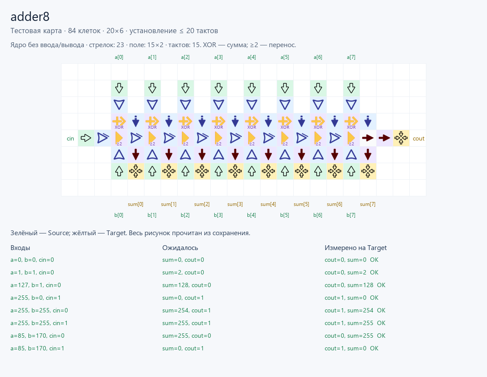
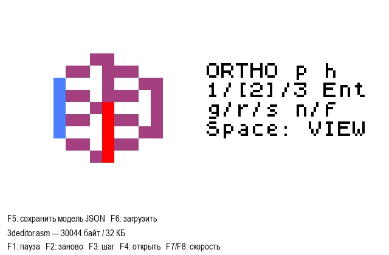
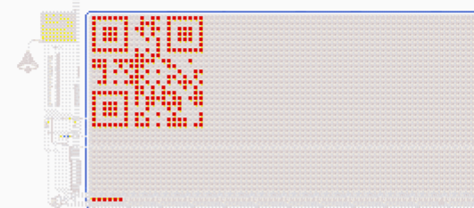
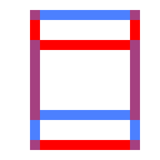
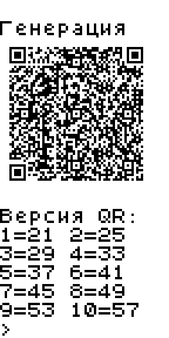
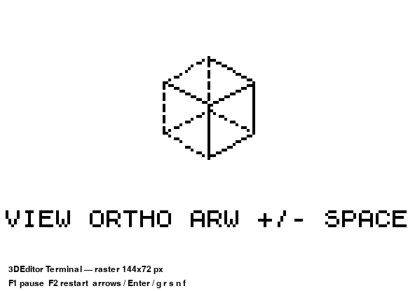
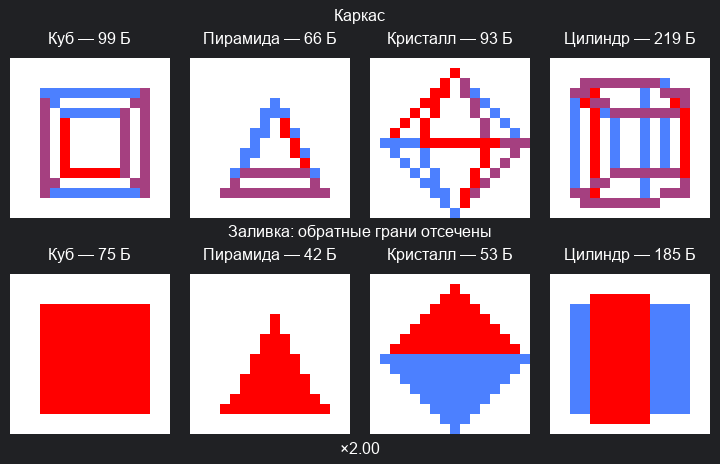

# LogicArrows

Программы на ассемблере для компьютеров из логических стрелок Аркадия Чубрика.

## Компилятор схем

[**ArrowsHDL**](ArrowsHDL/README.md) — Verilog → карты «Стрелочек»:
модель JSON, сохранения Base64, 8-битный сумматор из **58 стрелок** и CLI-автотесты с GraphDLC.
Есть [восстановление пользовательской схемы по снимку](ArrowsHDL/examples/reference_adder8/README.md).
Есть [**мультиплексоры 2→1, 4→1 и 8→1**](ArrowsHDL/examples/hdl/multiplexer/README.md) с полным перебором входов.
Есть [**умножитель 4×4 бит из нескольких модулей**](ArrowsHDL/examples/hdl/candidates/mul4/README.md) с проверкой всех 256 пар входов.
Есть [**цветной просмотр сигналов и разводки**](ArrowsHDL/examples/hdl/candidates/mul4/build/mul4.viewer.html).

## Компьютеры

Оригинальные схемы, документация и примеры программ находятся в
[репозитории chubrik/LogicArrows](https://github.com/chubrik/LogicArrows):

- [Computer v1 — первая версия компьютера](https://github.com/chubrik/LogicArrows/tree/main/computer-v1).
- [Computer v2 — вторая версия компьютера](https://github.com/chubrik/LogicArrows/tree/main/computer-v2).

## Эмулятор

[**Общий эмулятор Computer v2**](emulator/README.md) — запуск ASM, дисплей 16×16 и терминал настраиваемого размера. Память — **32 КБ**.

## Программы

### 1 КБ

| Программа | Краткое описание | Скриншот |
|---|---|---|
| [**QR Terminal**](qr-terminal/README.md) | Генератор QR **21×21** для Computer v2: ввод до **16 байт CP1251**, вывод в терминал. **864 байта**. |  |
| [**3DViewer**](3dviewer/README.md) | Куб с управлением стрелками: вращение вокруг двух осей, масштаб **×0,5…×3** с обрезкой по границам экрана, сброс ракурса и масштаба пробелом. **978 байт**. |  |
| [**3DGraphics: компактный движок**](graphics3d/README.md#компактный-каркасный-движок) | Общий 3D-движок Computer v2: **896 байт + до 128 байт модели**, цветные линии, кадр в LCD RAM, вращение и пульсация. |  |

### 32 КБ

| Программа | Краткое описание | Скриншот |
|---|---|---|
| [**QR Terminal v2**](qr-terminal-v2/README.md) | QR **версий 1–10**, коррекция **L/M/Q/H** и три режима ввода: цифры, QR-алфавит, CP1251. После вывода — новый выбор параметров. **18 485 байт / 32 КБ**. |  |
| [**3DEditor**](3deditor/README.md) | Просмотр и редактирование вершин, рёбер и граней: выбор, **g/r/s**, создание и удаление. **Зависит от [API 3DGraphics](graphics3d/API.md)**. **30 044 байт / 32 КБ**. |  |
| [**3DEditor Terminal**](3deditor-terminal/README.md) | ASM-версия 3D-редактора: процессор программы рисует сцену в терминале размером **144×72 пикселя** из символов 6×8; строка ввода отдельно. **31 563 байта / 32 КБ**. |  |
| [**3DGraphics: полный API**](graphics3d/README.md#каркас-и-заливка-полного-api) | Перспектива, управление объектами и заливка граней. Демонстрационные программы занимают **5–6 КБ**. |  |
