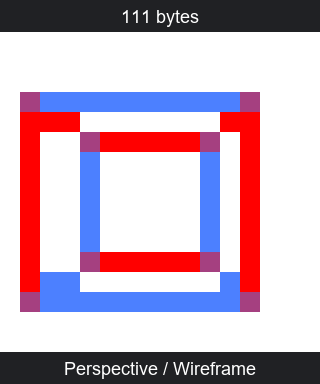
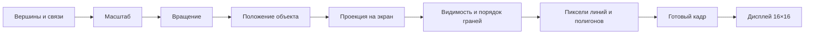
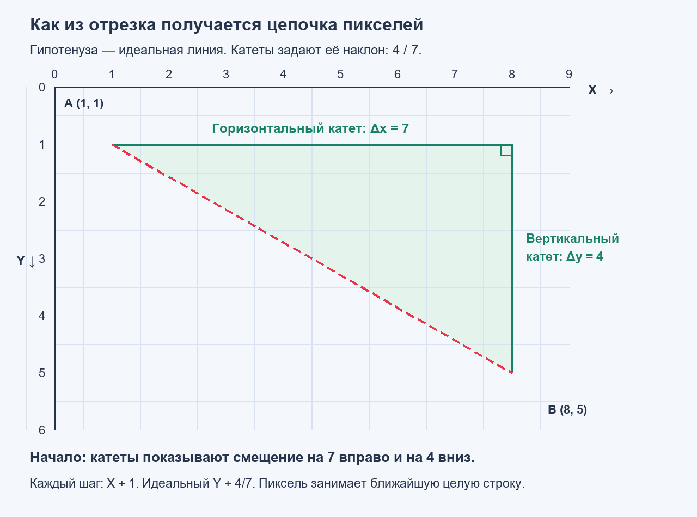
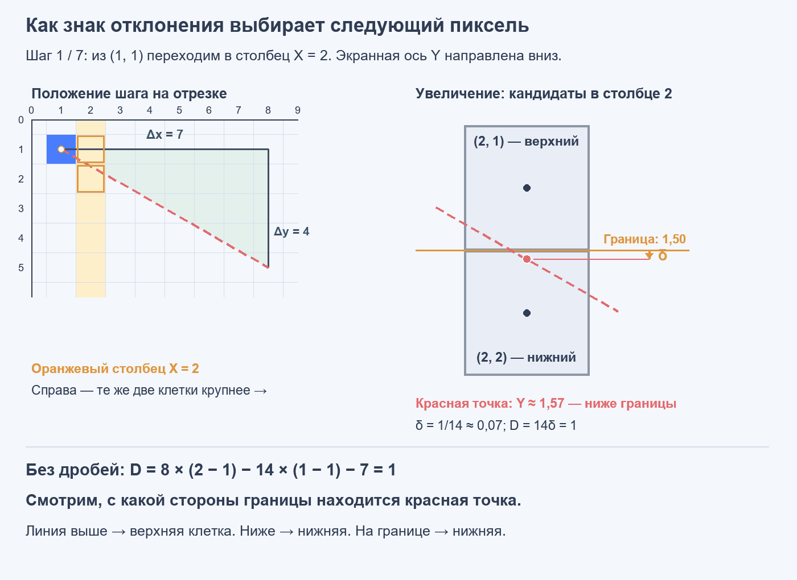
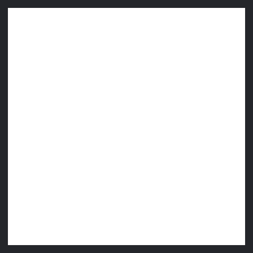
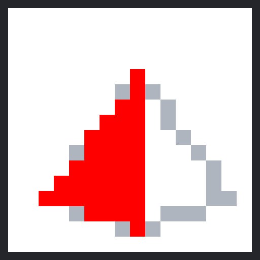
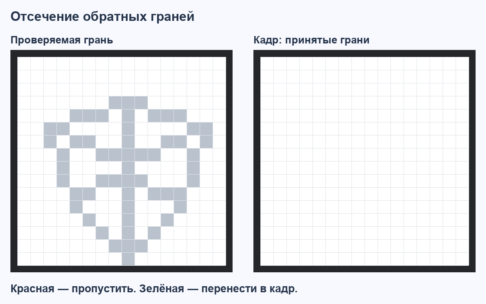

# 3DGraphics: от координат к изображению на экране 16×16

**3DGraphics** — библиотека трёхмерной графики для Computer v2. Общий движок преобразует геометрию модели и рисует цветные рёбра или заполненные полигоны. Куб, пирамида, кристалл и цилиндр показывают работу этого движка с разными данными.

## Демонстрации

Визуализации получены при выполнении демонстрационных ASM-программ в [эмуляторе Computer v2 от farmer2010](https://github.com/farmer2010/Chubrik-processor-emulator).

Память программы указана для полного образа: код, данные, буферы и выравнивание банков. **1 КБ = 1024 байта.**

### Каркас и заливка полного API

Верхний ряд GIF показывает цветные контуры, нижний — заполненные поверхности. В обоих рядах используются одинаковые углы и масштаб. Полигональные программы включают отсечение обратных граней и рисуют передние полигоны от дальних к ближним.

Одна модель полного API содержит вершины, уникальные цветные рёбра и полигоны. Приложение выбирает каркас или заливку командами движка. Каркасные демонстрации включают чередование **синий → красный**; красные и синие пиксели на пересечениях складываются в **фиолетовый**. Полигональные демонстрации используют цвета граней из модели.


| Модель | Каркас | Заливка |
|---|---|---|
| Куб | [Исходник](build/cube/graphics3d.asm) · [Дискета](build/cube/graphics3d.diskette.txt)<br>**5 234 байт (>1 КБ)** | [Исходник](build/cube_polygons/graphics3d.asm) · [Дискета](build/cube_polygons/graphics3d.diskette.txt)<br>**5 234 байт (>1 КБ)** |
| Пирамида | [Исходник](build/pyramid/graphics3d.asm) · [Дискета](build/pyramid/graphics3d.diskette.txt)<br>**5 106 байт (>1 КБ)** | [Исходник](build/pyramid_polygons/graphics3d.asm) · [Дискета](build/pyramid_polygons/graphics3d.diskette.txt)<br>**5 106 байт (>1 КБ)** |
| Кристалл | [Исходник](build/crystal/graphics3d.asm) · [Дискета](build/crystal/graphics3d.diskette.txt)<br>**5 234 байт (>1 КБ)** | [Исходник](build/crystal_polygons/graphics3d.asm) · [Дискета](build/crystal_polygons/graphics3d.diskette.txt)<br>**5 234 байт (>1 КБ)** |
| Цилиндр | [Исходник](build/cylinder/graphics3d.asm) · [Дискета](build/cylinder/graphics3d.diskette.txt)<br>**5 490 байт (>1 КБ)** | [Исходник](build/cylinder_polygons/graphics3d.asm) · [Дискета](build/cylinder_polygons/graphics3d.diskette.txt)<br>**5 490 байт (>1 КБ)** |

Дискеты содержат готовые образы программ в формате Computer v2.

### Управление одним объектом

Демонстрация переключает параметры общего API во время анимации. Куб вращается вокруг Y/X/Z, пульсирует от ×2 до ×1 и обратно и перемещается по X между −2 и +2 единицами.

| Кадры | Проекция | Примитивы и цвета |
|---|---|---|
| 0…63 | Перспективная | Каркас, чередование синего и красного |
| 64…127 | Перспективная | Заполненные грани, цвета модели |
| 128…191 | Параллельная | Заполненные грани, цвета модели |
| 192…255 | Параллельная | Красный каркас |

[Исходник ASM](build/controls/graphics3d.asm) · [Дискета](build/controls/graphics3d.diskette.txt). Память программы — **5 503 байта (>1 КБ)**.



### Компактные каркасные программы

Все модели используют общий движок, одинаково крутятся и меняются в размере.


| Модель | Исходный код | Дискета | Память программы |
|---|---|---|---:|
| Куб | [ASM](compact/models/cube/graphics3d.asm) | [Дискета](compact/models/cube/graphics3d.diskette.txt) | 946 байт |
| Пирамида | [ASM](compact/models/pyramid/graphics3d.asm) | [Дискета](compact/models/pyramid/graphics3d.diskette.txt) | 929 байт |
| Кристалл | [ASM](compact/models/crystal/graphics3d.asm) | [Дискета](compact/models/crystal/graphics3d.diskette.txt) | 940 байт |
| Цилиндр | [ASM](compact/models/cylinder/graphics3d.asm) | [Дискета](compact/models/cylinder/graphics3d.diskette.txt) | 1006 байт |

### Базовый куб

[Куб](compact/cube16.asm) показывает монохромный каркас с вращением вокруг Y и постоянным масштабом. Один оборот занимает **3,2 секунды**.

[Дискета Cube16](compact/cube16.diskette.txt). Память программы — **1022 байта**.


### Пирамида из OBJ

Демонстрация [модели OBJ](models/pyramid.obj): цветной каркас, вращение вокруг Y/X/Z и пульсация масштаба.

[Исходник ASM](build/pyramid_obj/graphics3d.asm) · [Дискета](build/pyramid_obj/graphics3d.diskette.txt). Память программы — **5 106 байт (>1 КБ)**.


## Файлы и документация

| Файл | Содержание |
|---|---|
| [README.md](README.md) | Демонстрации, теория построения изображения и подробная документация ASM API |
| [API.md](API.md) | Краткий справочник подпрограмм, аргументов и последовательности кадра |
| [MODIFY.md](MODIFY.md) | Пошаговые примеры замены модели, цветов, вращения и масштаба |
| [Общий компактный движок](compact/engine.asm) | Вычислительная часть, используемая всеми компактными моделями |
| [Общий модуль полного API](engine.asm) | Подпрограммы, параметры одного объекта, математические данные и рабочее состояние треугольников |
| [Готовое приложение полного API](build/cube_polygons/graphics3d.asm) | Общий модуль, геометрия куба и цикл анимации |
| [Модели JSON и OBJ](models/) | Координаты вершин, связи, грани и цвета исходной геометрии |

## Содержание

- [Предисловие](#предисловие)
- [Из чего состоит трёхмерная модель](#из-чего-состоит-трёхмерная-модель)
- [Математика движения](#математика-движения)
- [Из пространства на экран](#из-пространства-на-экран)
- [Алгоритм Брезенхэма](#алгоритм-брезенхэма)
- [Как заполняется полигон](#как-заполняется-полигон)
- [Какие поверхности видны](#какие-поверхности-видны)
- [Цвет и готовый кадр](#цвет-и-готовый-кадр)
- [Анимация](#анимация)
- [Документация API](#документация-api)
- [Компактная и полная версии](#компактная-и-полная-версии)
- [Экран и цвет](#экран-и-цвет)
- [Модель в памяти](#модель-в-памяти)
- [Вызовы из ASM](#вызовы-из-asm)
- [Описание моделей в JSON и OBJ](#описание-моделей-в-json-и-obj)
- [Компактный каркасный движок](#компактный-каркасный-движок)
- [Как изменить программу](#как-изменить-программу)

## Предисловие

На экране 16×16 всего **256 пикселей**. Каждый из них показывает белый фон, красный, синий или фиолетовый цвет. Из этих точек складывается вращающаяся фигура: одна сторона постепенно разворачивается к зрителю, другая уходит назад, рёбра меняют наклон, а силуэт становится шире или уже. Объём возникает благодаря согласованному движению всех точек изображения.

В памяти фигура начинается со списка чисел. Для куба достаточно восьми положений в пространстве и списка соединений между ними. Когда куб поворачивается, программа вычисляет новые положения этих восьми вершин. Затем она определяет, куда каждая вершина попадёт на плоском экране, и соединяет полученные точки. Если нужны сплошные поверхности, добавляется список полигонов и правило их заполнения.

Так устроена **растеризация**: геометрическое описание превращается в набор пикселей. Здесь её удобно наблюдать целиком. У каждого пикселя можно проследить происхождение: к какой грани он относится, какой поворот был применён, как глубина изменила проекцию и почему алгоритм линии выбрал именно эту клетку.

Вычисления выполняет 8-битный процессор Computer v2. Координаты и промежуточные результаты приходится укладывать в небольшие целые числа. Сложение, вычитание, битовые сдвиги и таблицы числовых коэффициентов позволяют пройти весь путь от модели до изображения. Значительная часть работы опирается на **приращения**: вычислить начальное состояние один раз, а следующий шаг получить небольшой поправкой.

Этот принцип связывает разные части движка. Брезенхэм переносит целочисленное отклонение от одного пикселя линии к следующему. Заполнение полигона обновляет значения трёх определителей при переходе к соседней точке. Анимация увеличивает счётчик фазы и получает из него новые углы и масштаб. Простые операции, повторённые в правильном порядке, дают движение сложной фигуры.



Далее этот путь разобран по шагам: сначала геометрия и математика, затем выбор пикселей и построение кадра. Практическая часть в конце связывает эти понятия с данными модели и вызовами ASM API.

## Из чего состоит трёхмерная модель

### Вершины, рёбра и грани

**Вершина** — точка в пространстве. Её положение задаётся тремя координатами:

$$
P=(X,Y,Z).
$$

В координатах модели X описывает положение по горизонтали, Y — по вертикали, Z — вдоль третьей оси. Начало координат удобно расположить в центре фигуры: тогда повороты вокруг осей проходят через её центр. Например, точка $(4,2,0)$ расположена на четыре единицы по X и на две единицы по Y от начала координат.

**Ребро** — отрезок между двумя вершинами. Если координаты уже находятся в общем списке, ребру достаточно хранить индексы его концов. Запись $(0,1)$ соединяет вершины с номерами 0 и 1. Это позволяет использовать одну вершину сразу в нескольких рёбрах и гранях.

**Грань** описывает участок поверхности. Её контур задаётся последовательностью индексов вершин по периметру. У куба грань квадратная, у пирамиды боковая грань треугольная. Порядок индексов задаёт направление обхода и помогает определить, какой стороной поверхность обращена к наблюдателю.

**Полигон** — плоский многоугольник, описывающий часть поверхности модели. Движок использует полигоны из трёх вершин. Три не лежащие на одной прямой точки однозначно задают плоскость. Поэтому большие плоские грани удобно разбивать на полигоны, после чего весь объект можно рисовать одним общим алгоритмом заполнения.

### Куб из восьми точек

Пусть расстояние от центра куба до каждой его стороны равно $a$. Координаты его вершин — все восемь комбинаций $(\pm a,\pm a,\pm a)$. При $a=1$ список выглядит так:

| Индекс | X | Y | Z |
|---:|---:|---:|---:|
| 0 | −1 | −1 | −1 |
| 1 | 1 | −1 | −1 |
| 2 | 1 | 1 | −1 |
| 3 | −1 | 1 | −1 |
| 4 | −1 | −1 | 1 |
| 5 | 1 | −1 | 1 |
| 6 | 1 | 1 | 1 |
| 7 | −1 | 1 | 1 |

Первые четыре вершины образуют один квадрат: рёбра $(0,1)$, $(1,2)$, $(2,3)$, $(3,0)$. Следующие четыре образуют второй. Ещё четыре ребра соединяют соответствующие углы квадратов: $(0,4)$, $(1,5)$, $(2,6)$, $(3,7)$. Получаются **8 вершин и 12 рёбер**.

Квадратную грань $(0,1,2,3)$ можно заполнить двумя полигонами: $(0,1,2)$ и $(0,2,3)$. У них общая диагональ, а вместе они покрывают всю площадь квадрата. У куба шесть таких граней, поэтому его полигональная модель содержит **12 полигонов**.

В [модели куба](models/cube.json) цвета связаны с направлениями граней. Грани, перпендикулярные Z, красные; перпендикулярные Y — синие; перпендикулярные X — фиолетовые. При вращении цвет помогает следить за одной и той же стороной.

### Пирамида, кристалл и цилиндр

**Пирамида** получается из квадратного основания и одной вершины над его центром. Четыре ребра очерчивают основание, ещё четыре соединяют его углы с вершиной. Для заливки основание разбивается на два полигона, а четыре боковые грани уже имеют нужную форму. В [демонстрации пирамиды](models/pyramid.json) основание фиолетовое, боковые поверхности чередуют красный и синий.

**Кристалл** состоит из двух квадратных пирамид, соединённых основаниями. Четыре вершины образуют средний пояс, одна расположена сверху, одна снизу. Все восемь внешних граней треугольные. В [модели кристалла](models/crystal.json) цвета верхних граней по кругу — 1, 2, 3, 1; нижних — 2, 3, 1, 2.

**Цилиндр** приближается двумя многоугольными кольцами. Для кольца из $m$ вершин радиуса $r$ и высоты фигуры $h$ координаты можно получить по окружности:

$$
\theta_i=\frac{2\pi i}{m},\qquad
P_i^{\pm}=\left(r\cos\theta_i,\ \pm\frac h2,\ r\sin\theta_i\right),
\qquad i=0,\ldots,m-1.
$$

Соответствующие вершины колец соединяются вертикальными рёбрами. Между соседними парами возникает боковой четырёхугольник. В [демонстрации цилиндра](models/cylinder.json) используются девятиугольные кольца: $m=9$. Боковые поверхности чередуют красный и синий, основания фиолетовые.

| Фигура | Вершины | Геометрические рёбра | Внешние грани | Полигоны для заливки |
|---|---:|---:|---:|---:|
| Куб | 8 | 12 | 6 | 12 |
| Пирамида | 5 | 8 | 5 | 6 |
| Кристалл | 6 | 12 | 8 | 8 |
| Цилиндр с девятью сторонами | 18 | 27 | 11 | 32 |

Для цилиндра число полигонов получается непосредственно из конструкции: $2m$ на боковой поверхности и по $m-2$ на каждом основании. Всего $2m+2(m-2)=4m-4=32$.

Вычислительная часть получает одинаковые виды записей для всех этих фигур. Форма объекта определяется координатами и соединениями. Это же позволяет описать собственную модель: добавить её вершины, указать рёбра или полигоны и передать полученные данные движку.

## Математика движения

### Масштаб относительно центра

Изменение размера начинается с умножения всех координат на один коэффициент $k$:

$$
P_s=kP=(kX,kY,kZ).
$$

При $k=1$ точка $(4,2,0)$ сохраняет положение. При $k=2$ она переходит в $(8,4,0)$. Все расстояния между вершинами тоже удваиваются, поэтому фигура сохраняет пропорции. Для каждого кадра движок применяет масштаб к исходным координатам модели и округляет полученный результат.

Если центр модели находится в точке $C$, масштабирование вокруг него записывается как $C+k(P-C)$. Демонстрационные данные заранее центрированы, поэтому в вычислениях достаточно формы $kP$.

### Вращение пары координат

Поворот вокруг Y преобразует координаты X и Z. Координата Y сохраняется. Для угла $\theta$ движок использует преобразование:

$$
X'=X\cos\theta+Z\sin\theta,\qquad
Z'=Z\cos\theta-X\sin\theta,\qquad
Y'=Y.
$$

Коэффициенты синуса и косинуса перераспределяют положение точки между двумя осями. Например, при $\theta=90^{\circ}$ получаются $\cos\theta=0$ и $\sin\theta=1$. Точка $(4,2,0)$ переходит в $(0,2,-4)$: её высота сохраняется, смещение по X становится смещением по Z.

В матричной записи тот же поворот выглядит так:

```math
\begin{pmatrix}X'\\Y'\\Z'\end{pmatrix}
=
\begin{pmatrix}
\cos\theta&0&\sin\theta\\
0&1&0\\
-\sin\theta&0&\cos\theta
\end{pmatrix}
\begin{pmatrix}X\\Y\\Z\end{pmatrix}.
```

Остальные повороты используют ту же операцию над парой координат:

$$
u'=u\cos\theta+v\sin\theta,\qquad
v'=v\cos\theta-u\sin\theta.
$$

Для Y это пара X/Z, для X — Y/Z, для Z — X/Y. Знаки в формулах соответствуют соглашению 3DGraphics. Полный движок применяет повороты последовательно **Y → X → Z**:

$$
P_r=R_Z(\rho)\,R_X(\varphi)\,R_Y(\psi)\,(kP).
$$

Порядок влияет на результат: после первого поворота второй уже получает новые координаты. Например, для точки $(1,0,0)$ повороты на $90^{\circ}$ сначала вокруг Y, затем вокруг X дают $(0,-1,0)$. Обратная последовательность даёт $(0,0,-1)$.

В математической модели вращение сохраняет расстояние до центра. В программе произведения округляются до целых, поэтому координаты получают небольшие дискретные поправки. Для очередного кадра преобразования снова начинаются с исходных вершин модели.

### Перемещение объекта

Положение центра объекта задаёт вектор $T=(t_x,t_y,t_z)$. Он добавляется к вершине после масштабирования и вращения:

$$
P_w=R_Z(\rho)\,R_X(\varphi)\,R_Y(\psi)\,(kP)+T.
$$

Все вершины получают одинаковое смещение. Поэтому расстояния между ними и форма фигуры сохраняются. Поворот проходит относительно начала координат модели, которое при размещении оказывается в точке $T$.

Например, точка $(4,2,0)$ после поворота на 90° вокруг Y имеет координаты $(0,2,-4)$. Добавление $T=(3,-1,5)$ даёт $(3,1,1)$. Изменение $t_x$ перемещает объект вправо и влево, $t_y$ — вверх и вниз, $t_z$ меняет его расстояние до камеры.

Команда абсолютного положения задаёт $T$ целиком. Команда относительного перемещения добавляет приращение $\Delta T$: $T_{\mathrm{new}}=T+\Delta T$. Относительный поворот аналогично обновляет три сохранённых угла. Для построения кадра движок читает исходную геометрию и применяет текущее состояние объекта.

## Из пространства на экран

### Перспектива и глубина

После преобразований вершина имеет пространственные координаты $(X_w,Y_w,Z_w)$. **Проекция** определяет её положение $(x,y)$ на плоскости дисплея.

При перспективной проекции более далёкий объект занимает меньшую часть изображения. Это следует из подобия полигонов: смещение на плоскости изображения пропорционально координате точки и обратно пропорционально расстоянию до камеры.

В полном движке камера смотрит вдоль положительного направления Z. Начало пространственных координат находится перед ней на расстоянии 32 единицы. Глубина преобразованной вершины равна

$$
Z_c=Z_w+32.
$$

Плоскость изображения задаётся коэффициентом $f=16$, а центр экранных координат — точкой $(8,8)$:

$$
x=8+\frac{16X_w}{Z_c},\qquad
y=8-\frac{16Y_w}{Z_c}.
$$

Минус во второй формуле связан с направлением экранной оси Y: номера строк увеличиваются вниз. Вершина с положительным Y модели должна попадать выше центра изображения.

Например, при $X_w=4$, $Y_w=2$ и $Z_c=32$ получаются $(x,y)=(10,7)$. Если глубину уменьшить до 16 при тех же X и Y, получится $(12,6)$. Смещение от центра станет вдвое больше. Глубина участвует в размере проекции каждой вершины.

Движок округляет экранные координаты до целых пикселей. Поэтому поворот и масштаб меняют математическое положение непрерывнее, чем это способен показать экран: несколько близких положений точки могут попасть в одну клетку.

### Параллельная проекция полного API

Полный API также предоставляет параллельную проекцию. Масштаб по обеим экранным осям постоянен: одна единица изображения соответствует двум единицам пространства. Целочисленная запись:

$$
x=8+\left\lfloor\frac{X_w}{2}\right\rfloor,\qquad
y=8+\left\lfloor\frac{-Y_w}{2}\right\rfloor.
$$

Например, вершина $(4,2,Z_w)$ проецируется в $(10,7)$. Положение по Z определяет глубину и порядок поверхности. Экранный размер задают координаты X/Y, масштаб и ракурс. Команда `gfx_set_projection` выбирает эту проекцию или перспективу для следующего кадра.

### Параллельная проекция компактного движка

Параллельная проекция использует постоянные коэффициенты при X, Y и Z. Её ортографический вариант проецирует точки вдоль перпендикуляра к плоскости изображения. Размер объекта определяется масштабом и выбранным ракурсом.

В компактных демонстрациях после вращения вокруг Y применяется параллельная проекция с постоянным наклоном. Если временно опустить целочисленные округления, её действие можно записать так:

$$
x\approx8+\frac{kX_r}{2},\qquad
y\approx8-\frac{kY}{2}+\frac{kZ_r}{8}.
$$

Последнее слагаемое немного сдвигает переднюю и заднюю части фигуры по вертикали. Благодаря этому видны верхняя и нижняя стороны куба. Полные формулы с коэффициентами таблицы синуса и округлением приведены в [описании компактного движка](#компактный-каркасный-движок).

### Координаты целыми числами

На маленьком процессоре дробь удобно представлять целым числом вместе с заранее известным делителем. Например, полный API хранит коэффициент размера как $q=32k$: значения 32, 48 и 64 означают ×1, ×1,5 и ×2. Умножение координаты выполняется по правилу

$$
X_s=\left\lfloor\frac{Xq}{32}\right\rfloor.
$$

Это **фиксированная точка**: положение дробной части определено форматом числа. Деление на 32 сводится к пяти битовым сдвигам. Знак сохраняется, а дробная часть отбрасывается вниз: например, $\lfloor-1{,}5\rfloor=-2$.

Вычисление выполняется в два шага: **умножить координату на целое число, затем разделить результат на 32**. Например, чтобы увеличить координату 10 в полтора раза, движок берёт $q=48$: сначала получает $10\times48=480$, затем $480/32=15$. Целое число $q$ представляет масштаб с точностью до $1/32$.

Почему деление получается простым? В привычной десятичной записи сдвиг запятой на один разряд влево делит число на 10. Процессор хранит числа в двоичной записи, где соседние разряды отличаются **в два раза**. Поэтому сдвиг числа на один бит вправо даёт целую часть от деления на 2, а пять таких сдвигов — от деления на $2^5=32$. Для отрицательных чисел используется сдвиг с сохранением знака: он даёт именно округление вниз, указанное в формуле.

Полный API вычисляет перспективу целочисленным делением. Для вращения он использует симметрию синуса и **28 байт битовых масок**. Компактный движок хранит 32 значения синуса и выполняет малые произведения программно. Преобразованная геометрия вычисляется при построении каждого кадра.

При перспективной проекции глубина вершины служит делителем. Движок выполняет деление **повторным вычитанием**: например, из 17 можно вычесть 5 три раза, после чего останется 2. Целое частное равно 3, остаток — 2. Частное и остаток определяют результат округления экранной координаты.

### Синус через приращения

Для одной фазы обозначим округлённое произведение на синус как

$$
P_a(m)=\mathrm{round}\left(m\sin\frac{2\pi a}{32}\right),\qquad m=0\ldots32.
$$

В первой четверти коэффициент лежит между 0 и 1. При увеличении целой координаты на единицу округлённое произведение возрастает на **ноль или единицу**. Это приращение помещается в один бит:

$$
b_{a,m}=P_a(m)-P_a(m-1)\in\{0,1\},\qquad
P_a(m)=\sum_{i=1}^{m}b_{a,i}.
$$

Движок хранит по 32 таких бита для семи фаз **1…7**. Получается $7\times32=224$ бита, или **28 байт**. Каждый ряд — четыре байта, младший бит каждого байта соответствует первому приращению этой группы. Подсчёт первых $|X|$ битов восстанавливает округлённое произведение.

Для фаз 0 и 8 результат равен соответственно нулю и самой координате. Остальные четверти получаются отражением фазы и изменением знака. Косинус вычисляется через сдвиг фазы синуса на восемь шагов: $\cos\theta=\sin(\theta+\pi/2)$. Знак координаты восстанавливается после подсчёта. Так один набор масок обслуживает все три оси вращения.

### Деление для перспективы

Числитель $16|X|$ хранится в двух байтах. Из него вычитается глубина $Z_c$, пока остаток не станет меньше делителя. Число вычитаний даёт целую часть, а остаток определяет округление: при $2r<Z_c$ частное сохраняется, при $2r>Z_c$ увеличивается. При точной половине выбирается **чётное частное**. Затем возвращаются знак координаты и смещение центра экрана на 8.

Вычисление использует циклы сложения, вычитания и проверки битов. Длина цикла зависит от модуля координаты и частного. Маски занимают 28 байт, число операций преобразования определяется координатами вершины.

## Алгоритм Брезенхэма

### Как выбрать клетку для линии

После проекции ребро превращается в отрезок между двумя экранными точками. При растеризации непрерывный геометрический отрезок представляется цепочкой пикселей с целыми координатами. Алгоритм выбирает клетки вдоль линии, формируя тонкий контур.

Для отрезка от $(x_0,y_0)$ до $(x_1,y_1)$ обозначим $\Delta x=x_1-x_0$ и $\Delta y=y_1-y_0$. Пока рассмотрим движение вправо с $0\le\Delta y\le\Delta x$ и $\Delta x>0$: главной осью будет X. Уравнение идеальной линии имеет вид

$$
y(x)=y_0+\frac{\Delta y}{\Delta x}(x-x_0).
$$

Эту формулу можно прочитать через **прямоугольный треугольник**. Проведём от начала отрезка горизонтальный катет, а затем вертикальный катет до конца отрезка. Их длины равны $\Delta x$ и $\Delta y$, а сам отрезок — гипотенуза. Отношение $\Delta y/\Delta x$ задаёт наклон: сколько единиц по Y приходится на одну единицу по X. Для нашего примера катеты равны 7 и 4, поэтому каждый шаг вправо на единицу смещает идеальную линию вниз на $4/7$ единицы.

Если остановиться в любой промежуточной точке линии, получится меньший треугольник с тем же наклоном. Его горизонтальный катет равен $x-x_0$, поэтому вертикальный равен $\frac{\Delta y}{\Delta x}(x-x_0)$. Прибавляем начальную высоту $y_0$ — получаем формулу выше. На экране Y растёт вниз, поэтому положительное приращение Y означает движение вниз.

**Пиксели добавляются последовательно:** сначала $(1,1)$, затем переходим к $x=2$. Идеальная линия здесь проходит на высоте $1+4/7\approx1{,}57$, поэтому выбираем строку 2. При $x=3$ высота равна $1+8/7\approx2{,}14$ — остаёмся на строке 2. Так на каждом шаге выбирается ближайшая целая строка. Формула объясняет геометрию этого выбора; Брезенхэм получает ту же цепочку клеток, обновляя целочисленное отклонение вместо вычисления дробной высоты на каждом шаге.

**Алгоритм Брезенхэма** выбирает следующий пиксель по знаку целочисленного отклонения. Его первоначальное описание опубликовано Джеком Брезенхэмом в статье [Algorithm for computer control of a digital plotter, 1965](https://janmr.com/files/papers/bresenham65.pdf).

На каждом шаге X увеличивается на единицу. Для Y рассматриваются текущая строка $y$ и следующая строка $y+1$. В анимации показан отрезок от $(1,1)$ до $(8,5)$: красный пунктир — гипотенуза и идеальная линия, зелёные стороны — катеты, синие клетки — выбранные пиксели. Оранжевая рамка отмечает добавляемый пиксель. Экранная ось Y направлена вниз.



Получается последовательность:

$$
(1,1),\ (2,2),\ (3,2),\ (4,3),\ (5,3),\ (6,4),\ (7,4),\ (8,5).
$$

### Целочисленное отклонение: какую клетку выбрать

**Задача на каждом шаге — выбрать одну из двух клеток.** Мы уже нарисовали пиксель $(x,y)$ и переходим в следующий столбец $x+1$. При рассматриваемом наклоне линия за один шаг опускается не больше чем на одну строку, поэтому кандидатами будут $(x+1,y)$ и $(x+1,y+1)$. Какая клетка ближе к идеальной линии?

Граница выбора проходит **посередине между центрами клеток**, на высоте $y+\tfrac12$. Если идеальная линия в новом столбце проходит выше этой границы, ближе верхний пиксель. Если ниже — нижний. При точном попадании на границу обе клетки равноудалены; здесь алгоритм выбирает нижнюю. Напомним: экранная ось Y направлена вниз.

Назовём **отклонением от границы выбора** разность

$$
\delta=y_{\text{линии}}(x+1)-\left(y+\tfrac12\right).
$$

Вот что именно нужно узнать: **знак $\delta$**, а не точную дробную высоту. Отрицательное отклонение означает, что линия выше границы; положительное — ниже. В описаниях Брезенхэма вспомогательную величину часто называют «ошибкой». Здесь речь не о сбое программы и не о расстоянии от центра уже выбранного пикселя до линии: мы проверяем положение линии относительно границы следующего выбора.

**Как убрать дроби, сохранив ответ?** Подставим уравнение линии в $\delta$ и умножим на $2\Delta x$. Этот коэффициент положителен, поэтому знак не изменится. Делитель $\Delta x$ и половина сократятся:

$$
D=2\Delta x\,\delta
=2\Delta y(x+1-x_0)-2\Delta x(y-y_0)-\Delta x.
$$

Таким образом, **$D$ — то же отклонение, выраженное в целочисленном масштабе**. Его величина не равна расстоянию в пикселях, но знак даёт ровно тот же выбор. Для нашего отрезка $2\Delta x=14$: отклонение $1/14$ пикселя превращается в $D=1$, а $-5/14$ пикселя — в $D=-5$.

Сохранить связь с уравнением прямой позволяет выражение

$$
F(x,y)=\Delta y(x-x_0)-\Delta x(y-y_0).
$$

Для любой проверяемой точки $(x,y)$ оно равно $\Delta x\,[y_{\text{линии}}(x)-y]$: это вертикальное отклонение линии от точки, умноженное на $\Delta x$. На самой линии $F=0$. Проверяем середину между кандидатами — получаем то же $D$:

$$
D=2F\left(x+1,y+\tfrac12\right)
=2\Delta y(x+1-x_0)-2\Delta x(y-y_0)-\Delta x.
$$

В начальной точке $x=x_0$, $y=y_0$, поэтому $D_0=2\Delta y-\Delta x$. Дальше решение читается прямо по знаку:

- При $D<0$ линия **выше середины**: выбирается верхний пиксель $(x+1,y)$ — шаг вдоль X. Следующее отклонение равно $D+2\Delta y$.
- При $D\ge0$ линия **на середине или ниже**: выбирается нижний пиксель $(x+1,y+1)$ — диагональный шаг. Следующее отклонение равно $D+2\Delta y-2\Delta x$.

**Почему достаточно прибавления?** При переходе ещё на один столбец идеальная линия опускается на $\Delta y/\Delta x$. В масштабе $D$ это прибавляет $2\Delta y$. Если выбран нижний пиксель, новая граница между кандидатами тоже опускается на целую строку: из отклонения дополнительно вычитается $2\Delta x$. Поэтому формулу не приходится вычислять заново. Начальное значение и оба приращения вычисляются один раз; внутри цикла остаются сравнение с нулём, прибавление константы и изменение координат.

**Первые два выбора для $(1,1)$ → $(8,5)$.** Здесь $\Delta x=7$, $\Delta y=4$:

1. Из $(1,1)$ переходим в столбец 2. Кандидаты — $(2,1)$ и $(2,2)$, граница — $1{,}5$. Идеальная высота $1+4/7\approx1{,}57$ **ниже границы**, поэтому выбираем $(2,2)$. Без дробей тот же ответ даёт $D_0=2\times4-7=1>0$.
2. После диагонального шага обновляем $D$: $1+8-14=-5$. Теперь из $(2,2)$ проверяем столбец 3: граница уже $2{,}5$, а идеальная высота $1+8/7\approx2{,}14$ **выше границы**. Знак $D<0$ выбирает $(3,2)$ — остаёмся на той же строке.

В анимации слева показано положение шага на общем отрезке, справа — увеличенный столбец с двумя кандидатами. Красная точка лежит на идеальной линии, оранжевый пунктир отмечает границу выбора, стрелка показывает отклонение между ними. Сначала видны оба кандидата, затем заполняется выбранная клетка и показывается обновление $D$ для следующего шага. Дробные высоты приведены для объяснения; алгоритм обходится целыми числами.



| Текущий X | Отклонение D перед выбором | Следующий пиксель |
|---:|---:|---|
| 1 | 1 | (2,2) |
| 2 | −5 | (3,2) |
| 3 | 3 | (4,3) |
| 4 | −3 | (5,3) |
| 5 | 5 | (6,4) |
| 6 | −1 | (7,4) |
| 7 | 7 | (8,5) |

После второго выбора прибавляем 8: $D=-5+8=3$. Положительный знак снова выбирает нижнего кандидата — $(4,3)$. Так **одно целое число переносит информацию о наклоне к следующему выбору**, без деления в цикле.

### Все направления и толщина контура

Для крутой линии главной осью становится Y: алгоритм проходит по строкам и решает, когда изменить X. Для движения влево или вверх используются шаги со знаком −1. Горизонтальный, вертикальный и вырожденный отрезки обрабатываются тем же принципом.

Число выбранных точек отрезка с включёнными концами равно

$$
N=\max\left(|x_1-x_0|,|y_1-y_0|\right)+1.
$$

**Один шаг главной оси даёт один пиксель линии.** Ширина контура определяется выбором этой цепочки. Пересекающиеся рёбра используют общие пиксели; близкие проекции рёбер могут занимать соседние клетки.

В компактной модели общие рёбра объединены. Перед рисованием концы отрезка упорядочиваются по X, поэтому записи A→B и B→A получают одинаковое направление обхода и одинаковый выбор пикселей. Это особенно полезно при пограничных случаях округления, когда идеальная линия проходит точно между двумя клетками.

**Одно общее ребро достаточно нарисовать один раз.** Если перечислять края каждой грани отдельно, соседние грани повторят одну и ту же линию. В GIF один куб в фиксированном ортографическом ракурсе строится по рёбрам: синие линии добавляются в кадр, а уже встречавшаяся линия **мигает красным и пропускается**. Красный цвет — только поясняющая подсветка; содержимое кадра при повторе не меняется.



Объединение рёбер выполняется при подготовке модели, поэтому движок получает готовый список без повторов. Анимация показывает смысл этой подготовки; ортографическая проекция помогает рассмотреть форму куба. Это сокращает число рисуемых линий; приращения определителей, описанные ниже, сокращают вычисления при проверке пикселей заливки.

Полный и компактный движки используют целочисленные варианты Брезенхэма. В полном API `gfx_line` передаёт выбранные точки в `gfx_line_pixel`, который проверяет экранные координаты и добавляет биты цвета. В компактной версии точки записываются в текущий цветовой слой. Размер готовых моделей подобран для всех положений их вращения.

## Как заполняется полигон

**Заливка добавляет цвет внутри грани.** На GIF пирамида уже частично нарисована: одна передняя сторона заполнена, другая ещё показана контуром. Её пиксели закрашиваются по одному, слева направо и сверху вниз.



Контур помогает видеть форму незаполненной грани - в обычной демонстрации промежуточная заливка остаётся в рабочем буфере.

Заполнение полигона начинается с проверки положения экранной точки относительно его трёх рёбер. Знак определителя показывает, с какой стороны каждого ребра находится точка.

Для направленного ребра $A=(a_x,a_y)$, $B=(b_x,b_y)$ и проверяемой точки $P=(x,y)$ определим

$$
E_{AB}(P)=(b_x-a_x)(y-a_y)-(b_y-a_y)(x-a_x).
$$

Это определитель двух векторов $B-A$ и $P-A$. Его знак показывает, с какой стороны ребра находится точка, а нулевое значение соответствует самой границе. Геометрически величина связана с ориентированной площадью полигона ABP.

У полигона ABC три направленных ребра: AB, BC и CA. Если три значения $E_{AB}(P)$, $E_{BC}(P)$ и $E_{CA}(P)$ имеют один знак с возможными нулями, точка находится внутри или на границе. Если одновременно появились положительное и отрицательное значения, точка лежит снаружи.

Возьмём $A=(2,2)$, $B=(12,2)$ и $C=(2,12)$. Для точки $P=(4,4)$ получаются значения 20, 60 и 20 — она внутри. Для $P=(12,12)$ получаются 100, −100 и 100 — эта точка за наклонным ребром BC.

### Приращения для соседних пикселей

**Это оптимизация вычислений: изображение остаётся тем же.** Заливка означает выбор и закрашивание пикселей внутри полигона. Проверяя очередную клетку, движок должен узнать, с какой стороны каждого из трёх краёв лежит её центр. Если пересчитывать три выражения $E$ по полной формуле для всех 256 клеток, одни и те же умножения будут повторяться много раз.

**Определитель здесь — число для проверки стороны края.** Его вычисление состоит из двух произведений и их разности, как в формуле выше. Ноль означает, что точка лежит на прямой края; плюс и минус различают две стороны этой прямой. Проверка всех трёх краёв вместе решает, находится ли пиксель внутри полигона. Эти числа не задают цвет или яркость.

Представим движение по одной строке сетки: из $(4,4)$ в $(5,4)$, затем в $(6,4)$ и дальше вправо. Сам полигон неподвижен; **меняется только проверяемый пиксель**. На каждом одинаковом шаге число для каждого края меняется на одну и ту же величину. Поэтому вместо повторного умножения можно взять предыдущее число и прибавить заранее вычисленную поправку.

Для полигона $A=(2,2)$, $B=(12,2)$, $C=(2,12)$ это особенно хорошо видно по наклонному краю BC. Он пересекает нашу строку $y=4$ в точке $x=10$. При движении вправо приближаемся к этому краю, и $E_{BC}$ каждый раз уменьшается на 10:

| Проверяемый пиксель | Число для края BC | Где точка относительно края |
|---|---:|---|
| $(4,4)$ | 60 | Внутри полигона |
| $(5,4)$ | $60-10=50$ | На один шаг ближе к краю |
| $\ldots$ | Каждый шаг ещё −10 | Продолжаем приближаться |
| $(10,4)$ | 0 | На краю |
| $(11,4)$ | −10 | Перешли за край — не закрашиваем |

При первом шаге все три числа меняются так: **$(20,60,20)\rightarrow(20,50,30)$**. Число для горизонтального края AB не меняется: мы идём параллельно ему. Число для BC уменьшается на 10, а для вертикального края CA увеличивается на 10: от него удаляемся. Все три значения ещё положительны, поэтому соседний пиксель тоже закрашивается.

Откуда берётся постоянная поправка? В выражении $E_{AB}(x,y)$ координата X умножается на $-(b_y-a_y)$. Если X увеличилась ровно на единицу, результат изменился ровно на этот коэффициент. Для движения вниз на единицу аналогично используется коэффициент при Y — $(b_x-a_x)$. Так получаются формулы перехода:

$$
E_{AB}(x+1,y)=E_{AB}(x,y)-(b_y-a_y),
$$

$$
E_{AB}(x,y+1)=E_{AB}(x,y)+(b_x-a_x).
$$

«Простое сложение» означает **обновление трёх проверочных чисел**, а не закрашивание соседней клетки без проверки. Прибавление отрицательной поправки — это обычное вычитание. После обновления движок снова проверяет знаки и решает, писать ли цвет. При переходе к следующей строке учитываются и возврат X к началу, и увеличение Y; это также делается через приращения.

Значения трёх рёбер в начальной точке вычисляются один раз. Затем `gfx_triangle` обходит **все 16×16 экранных точек**, обновляет определители и записывает цвет для подходящих пикселей. Определители используют 16-битные промежуточные значения. Цвет задаётся одним числом для всех пикселей полигона.

Граница включается в заполнение. Поэтому два полигона одного цвета, образующие квадратную грань куба, соединяются вдоль общей диагонали. Полигон с нулевой площадью пропускается: после проекции он может превратиться в отрезок, например когда поверхность повернулась строго ребром к наблюдателю.

## Какие поверхности видны

### Направление обхода и обратные грани

**Обратные грани закрыты самой непрозрачной моделью — их можно пропустить.** В GIF слева показан обход полигонов куба: отсекаемые подсвечиваются **красным**, прошедшие проверку — **зелёным**. Принятый полигон переносится в кадр справа и получает цвет модели. Куб показан в простом ракурсе с тремя видимыми сторонами. Оба экрана — **16×16**, без обозначений координат.



Каркас и красно-зелёная подсветка слева служат пояснением, справа показаны цветовые биты буфера. Итоговый кадр сверён с исполнением ASM. Отсечение проверяет обращение грани к камере; перекрытие оставшихся поверхностей обрабатывается порядком рисования от дальних к ближним.

У поверхности есть ориентация. В пространстве её можно описать нормалью — вектором, перпендикулярным плоскости:

$$
\mathbf n=(B-A)\times(C-A).
$$

Перестановка B и C меняет знак нормали. Поэтому порядок вершин хранит информацию о лицевой стороне. Для замкнутых демонстрационных фигур полигоны ориентированы наружу от центра.

Полный движок определяет обращение поверхности по знаку экранной площади:

$$
A_s=(x_1-x_0)(y_2-y_0)-(y_1-y_0)(x_2-x_0).
$$

С экранной осью Y, направленной вниз, положительное значение соответствует обходу по часовой стрелке. При включённом отсечении обрабатываются полигоны с **$A_s>0$**. Обратные и вырожденные поверхности пропускаются. Поворот сохраняет ориентацию исходной грани в пространстве. Знак площади её проекции определяет обращение к камере.

### Дальние поверхности рисуются первыми

При перекрытии поверхностей последний нарисованный полигон задаёт цвет общих пикселей. Отрисовка от дальних поверхностей к ближним позволяет ближним граням закрыть расположенные за ними участки.

Полный API использует **алгоритм художника**: сначала рисует дальние полигоны, затем ближние. Ключом служит сумма глубин трёх вершин:

$$
d=Z_{c0}+Z_{c1}+Z_{c2}.
$$

Сумма $d$ пропорциональна средней глубине $d/3$ и служит целочисленным ключом сортировки. На каждом шаге выбирается оставшийся полигон с максимальным $d$, рисуется и помечается как обработанный. При одинаковой глубине сохраняется исходный порядок модели.

При пересечении поверхностей порядок их глубин может зависеть от положения пикселя. **Z-буфер** хранит глубину видимой поверхности отдельно для каждой точки экрана. При таком способе новый пиксель записывается, когда его глубина меньше сохранённой. Сортировка 3DGraphics использует один ключ глубины на полигон.

Цвет полигона задаётся данными модели и применяется ко всей его площади. В демонстрационных моделях цвета выбраны по направлениям и номерам граней, поэтому при вращении можно следить за отдельными сторонами фигуры.

## Цвет и готовый кадр

Красный и синий компоненты дисплея хранятся отдельно, по одному биту на пиксель. Вместе два бита задают четыре состояния:

| Красный бит | Синий бит | Цвет |
|---:|---:|---|
| 0 | 0 | Белый фон |
| 1 | 0 | Красный |
| 0 | 1 | Синий |
| 1 | 1 | Фиолетовый |

На один слой требуется $16\times16/8=32$ байта. Цветной кадр занимает **64 байта**. Выбрать пиксель означает найти его байт и нужный бит внутри этого байта.

Обе версии строят новый кадр прямо в **LCD RAM `0x40…0x7F`** при отключённом обновлении дисплея. Сам дисплей сохраняет предыдущую картинку, пока процессор преобразует вершины и рисует примитивы. В полном API `gfx_begin` записывает 0 в порт `0x3E` и очищает оба слоя. Когда кадр готов, `gfx_present` включает цветной режим значением `0x30`, затем перечитывает и повторно записывает все 64 байта **по тем же адресам**: `ld a, b` → `st a, b`.

Включение режима само по себе сохраняет старый рисунок; новый появляется при записях в экранную память. Поэтому повторная запись готовых байтов необходима. Вывод идёт последовательно, по одному байту.

Каркасные линии объединяют биты своего цвета с содержимым буфера операцией OR. Красная и синяя линии дают фиолетовый на пересечении при любом порядке рисования. `gfx_pixel` и `gfx_triangle` записывают заданный цвет в оба слоя.

Компактный движок использует LCD RAM как рабочий буфер. В начале кадра он отключает обновление изображения, очищает оба слоя и строит новые рёбра. Затем включает цветной режим и повторно записывает готовые байты, чтобы дисплей получил обновление. Красный и синий слои строятся последовательно; пересечение их установленных битов даёт фиолетовый цвет.

Передача готового кадра в обеих версиях проходит последовательными записями байтов. Буфер отделяет длительное построение геометрии от короткого этапа вывода. Он сохраняет предыдущую картинку на время вычислений следующей.

## Анимация

### Угол из номера кадра

В программе хранится номер кадра $n$ от 0 до 255. После 255 счётчик возвращается к нулю. Угол задаётся индексом от 0 до 31: один шаг равен $360^{\circ}/32=11{,}25^{\circ}$.

Полные каркасные и полигональные демонстрации получают углы из одной фазы:

$$
\mathrm{yaw}=\left\lfloor\frac n4\right\rfloor\bmod32,\qquad
\mathrm{pitch}=\left\lfloor\frac n2\right\rfloor\bmod32,\qquad
\mathrm{roll}=\left\lfloor\frac{3n}4\right\rfloor\bmod32.
$$

У каждой оси своя скорость. За 256 кадров фигура совершает **два оборота вокруг Y, четыре вокруг X и шесть вокруг Z**. Все три угла меняются в течение общего цикла, поэтому видна смена сторон и наклонов.

Компактный движок увеличивает угол вокруг Y на один шаг каждый кадр: $\mathrm{phase}=n\bmod32$. За тот же цикл происходит **восемь оборотов**. Постоянный наклон проекции помогает различать верх и низ.

### Медленная пульсация размера

Масштаб меняется по треугольному циклу: первая половина уменьшает фигуру, вторая увеличивает. До округления коэффициент можно представить как

$$
k(n)=1+\frac{|n-128|}{128},\qquad 0\le n\le256.
$$

Полный API хранит коэффициент с шагом $1/32$, компактный — с шагом $1/64$:

$$
q(n)=32+\left\lfloor\frac{|n-128|}{4}\right\rfloor,\qquad k_{\mathrm{full}}=\frac q{32},
$$

$$
p(n)=64+\left\lfloor\frac{|n-128|}{2}\right\rfloor,\qquad k_{\mathrm{compact}}=\frac p{64}.
$$

| Кадр | Масштаб |
|---:|---:|
| 0 | ×2 |
| 64 | ×1,5 |
| 128 | ×1 |
| 192 | ×1,5 |
| 256, начало следующего цикла | ×2 |

Увеличение применяется ко всем XYZ до проекции. В перспективе видимый размер также зависит от текущей глубины каждой вершины, поэтому удвоение координат модели может менять экранный силуэт сильнее или слабее двукратного увеличения.

Общие GIF полного и компактного движков используют **100 мс на кадр**: весь цикл длится **25,6 секунды**. Соседние одинаковые изображения могут объединяться с сохранением суммарной длительности. Эти значения задают воспроизведение демонстраций; время выполнения кадра на процессоре определяется его вычислениями.

### Монохромный куб Cube16

Cube16 использует собственный компактный код с постоянным масштабом. Восемь вершин вычисляются по битам их индексов, таблица хранит двенадцать пар соединений. Вращение проходит 32 угловых положения вокруг Y с постоянным наклоном; GIF показывает один оборот за **3,2 секунды**.

## Документация API

### Компактная и полная версии

Компактный движок выполняет встроенный цикл цветного каркаса. Полный API предоставляет подпрограммы для управления одним активным объектом и построения кадра.

| Свойство | Компактный движок | Полный API |
|---|---|---|
| Примитивы | Цветные рёбра | Пиксели, линии и заполненные полигоны |
| Вращение | Вокруг Y | Углы Y/X/Z; абсолютные значения и приращения |
| Масштаб | Встроенный цикл ×2 → ×1 → ×2 | Коэффициент Q5; демонстрации обновляют его по фазе |
| Положение | Центр проекции встроен в цикл | Вектор X/Y/Z; установка положения и смещение |
| Проекция | Параллельная с постоянным наклоном | Перспективная и параллельная, выбор командой |
| Цвет | Чередование синего и красного | Цвета модели, чередование, единый цвет |
| Поверхности | Каркас описывает рёбра | Режим рёбер и заливки, отсечение, порядок по глубине |
| Геометрия | `V,E`, координаты в половинах единицы, рёбра `a,b` | `V,E,T`, целые XYZ, рёбра `a,b,color`, полигоны `a,b,c,color` |
| Рабочие данные | Концы ребра вычисляются перед рисованием | `4V` байт вершин и `5T` байт полигонов |
| Математика | Таблица синуса 32 байта и программное умножение | Маски синуса 28 байт, целочисленное умножение и деление |
| Кадр | LCD RAM с отключённым обновлением дисплея | LCD RAM с отключённым обновлением дисплея |
| Готовые программы | **929…1006 байт** | **5106…5503 байта (>1 КБ)** |

Общий компактный код занимает **896 байт**, под модель отведён один 128-байтовый банк.

[Полный модуль](engine.asm) занимает **4480 байт** вместе с общей областью CPU, состоянием объекта, математическими данными и рабочим состоянием треугольников. Отдельной 64-байтовой области изображения нет. Все полные демонстрации включают одинаковые подпрограммы. Приложение выбирает режимы вызовами API и размещает собственные данные за модулем.

Рабочие массивы полного API имеют длину `4V + 5T`. После них в готовых программах размещаются модель, выравнивание до банка и приложение. Для куба рабочая область занимает 92 байта, геометрия — 111 байт, готовая программа — **5234 байта (>1 КБ)**.

Полный модуль хранит указатель и параметры одного объекта. Привязка модели выбирает геометрию, команды преобразований обновляют углы, масштаб и положение. Для каждого кадра объект строится из исходных координат.

### Начать с готовой программы

Выберите исходник из [каталога демонстраций](#демонстрации). Каждый ASM готовой программы содержит вычислительную часть, приложение и данные фигуры. Его можно загрузить в [эмулятор Computer v2](https://github.com/farmer2010/Chubrik-processor-emulator); **F1** запускает или приостанавливает выполнение.

Для собственной модели сначала замените геометрию, сохраняя её формат. Затем задайте параметры движения и вызовы рисования. [API.md](API.md) служит кратким справочником, [MODIFY.md](MODIFY.md) разбирает изменения пошагово.

### Экран и цвет

Начало экранных координат находится в левом верхнем углу: **X растёт вправо, Y — вниз**. Координаты пикселей — 0…15 по каждой оси. Центр проекции — `(8, 8)`.

| `color` | Цвет | Красный слой | Синий слой |
|---:|---|---:|---:|
| 0 | Белый | 0 | 0 |
| 1 | Красный | 1 | 0 |
| 2 | Синий | 0 | 1 |
| 3 | Фиолетовый | 1 | 1 |

Цветной кадр состоит из **двух битовых слоёв по 32 байта**. Каждая строка слоя занимает два байта; старший бит соответствует левому пикселю группы из восьми пикселей.

- `0x40…0x5F` — красный слой дисплея.
- `0x60…0x7F` — синий слой дисплея.
- `0x3E` — порт режима дисплея; значение `0x30` включает цветной режим.
- `0x3F` — порт выбора банка памяти.

Подробное описание работы дисплея и его режимов — в [спецификации Computer v2, раздел «Дисплей»](https://github.com/chubrik/LogicArrows/blob/main/computer-v2/specification.md#display).

Полный API использует **LCD RAM как рабочий буфер кадра**. `gfx_begin` отключает обновление дисплея и очищает 64 байта; `gfx_pixel` меняет биты обоих слоёв напрямую, без переключения банка. `gfx_present` включает цветной режим и повторно записывает готовые байты на те же адреса. Старый рисунок остаётся на дисплее до публикации нового.

Рабочие определители треугольника занимают отдельные **12 байт `TRI_STATE_BANK:TRI_STATE0`**. Они нужны для заливки и сохраняются независимо от экранной памяти.

### Модель в памяти

`gfx_load_model` получает указатель на геометрию через `ptr_bank/ptr_addr`. Команда сохраняет его как указатель единственного активного объекта. `gfx_draw_object` читает эту модель при каждом кадре. В готовых программах начало геометрии обозначено `MODEL_BASE:MODEL_ADDR` и меткой `model_data`.

#### Заголовок и записи

| Часть | Запись | Размер |
|---|---|---:|
| Заголовок | `V,E,T`: число вершин, рёбер и полигонов | 3 байта |
| Вершины | `X,Y,Z` | `3 × V` байт |
| Рёбра | `a,b,color` | `3 × E` байт |
| Полигоны | `a,b,c,color` | `4 × T` байт |

Порядок: **заголовок → вершины → рёбра → полигоны**. Индексы начинаются с нуля. Координаты хранятся знаковыми байтами; `252` означает −4. Индексы, счётчики и номера цвета — беззнаковые байты.

Объём геометрии:

```text
S = 3 + 3V + 3E + 4T
```

Записи рёбер и полигонов могут находиться в одной модели. Параметр `STATE_RENDER` выбирает каркас, заливку или оба вида примитивов.

#### Пример данных в ASM

Три вершины, три цветных ребра и один красный полигон:

```asm
model_data  db 3,3,1
model_v0    db 252,252,0     ; (-4,-4,0)
model_v1    db 4,252,0       ; ( 4,-4,0)
model_v2    db 0,4,0         ; ( 0, 4,0)
model_edge0 db 0,1,1         ; Красное ребро
model_edge1 db 1,2,2         ; Синее ребро
model_edge2 db 2,0,3         ; Фиолетовое ребро
model_tri0  db 0,2,1,1       ; Красный полигон
```

Записи размещаются подряд и могут переходить через границы банков. Каждая строка данных начинается с метки и `db`.

#### Рабочая область

Рабочие данные начинаются с **`VERTEX_BASE:128`**. На экранные вершины выделяется `4V` байт: `x,y,visible,depth`. Затем следуют `5T` байт записей полигонов: `сумма глубин,color,a,b,c`.

Перед привязкой передайте конец выделенной области в `out_bank/out_addr` и вызовите `gfx_set_workspace`. Конец обозначает первый адрес за областью. В демонстрациях он совпадает с началом модели `MODEL_BASE:MODEL_ADDR`.

`gfx_load_model` проверяет вместимость `4V + 5T`. При успешной привязке A=1, при ошибке A=0. Положение начала кэша полигонов определяется числом вершин и сохраняется в `STATE_TRI_BASE_BANK/ADDR`. Маски синуса лежат в модуле по адресу **`LUT_BASE:LUT_ADDR`**.

Пересчёт размещения данных описан в [MODIFY.md](MODIFY.md#разместить-выросшие-данные).

### Вызовы из ASM

Готовые исходники содержат библиотеку, общие переменные, данные модели и приложение под метками `main`, `frame_start`, `frame_scale`, `frame_draw`, `frame_advance`. В качестве основы можно использовать программы куба с каркасом или заливкой из списка демонстраций.

При сборке собственного приложения объявите `APP_BANK`, поместите содержимое [engine.asm](engine.asm) в начало исходника, затем разместите рабочую область, геометрию и код с меткой `main`. Начальный переход модуля передаёт управление в `APP_BANK:main`.

Счётчик кадров и формулы анимации принадлежат приложению: `frame_start` вычисляет углы, `frame_scale` — масштаб, а `frame_controls` демонстрации команд задаёт положение и режимы. Движок хранит полученные параметры объекта до следующей команды. Постоянный ракурс, управление клавишами или любой другой ход анимации задаются вызовами тех же подпрограмм.

Аргументы передаются через общие переменные и регистр **A**. Регистры **C/D** используются для перехода между банками. Вызов сохраняет банк и адрес продолжения в паре `retN_bank / retN_addr`, где N — слот возврата подпрограммы.

#### Справочник подпрограмм

| Подпрограмма | Аргументы | Результат | Слот N | Константа банка |
|---|---|---|---:|---|
| `gfx_set_workspace` | `out_bank/out_addr`: конец рабочего буфера | Сохранена граница, активность сброшена | 1 | `GFX_SET_WORKSPACE_BANK` |
| `gfx_load_model` | `ptr_bank/ptr_addr`: начало модели | Привязан один объект; A=1 — готов, A=0 — ошибка | 0 | `GFX_LOAD_MODEL_BANK` |
| `gfx_set_rotation` | `wx/wy/wz`: углы Y/X/Z | Установлены абсолютные углы | 1 | `GFX_SET_ROTATION_BANK` |
| `gfx_rotate` | `wx/wy/wz`: знаковые приращения углов Y/X/Z | Обновлены углы по модулю 32 | 1 | `GFX_ROTATE_BANK` |
| `gfx_set_scale` | A: масштаб Q5 | Обновлён `STATE_SCALE` | 1 | `GFX_SET_SCALE_BANK` |
| `gfx_set_position` | `wx/wy/wz`: положение X/Y/Z | Установлено положение объекта | 1 | `GFX_SET_POSITION_BANK` |
| `gfx_move` | `wx/wy/wz`: знаковые смещения X/Y/Z | Обновлено положение объекта | 1 | `GFX_MOVE_BANK` |
| `gfx_set_projection` | A: 0 — перспектива, 1 — параллельная | Обновлён режим проекции | 1 | `GFX_SET_PROJECTION_BANK` |
| `gfx_set_render_mode` | A: 1 — рёбра, 2 — заливка, 3 — оба | Обновлён набор рисуемых примитивов | 1 | `GFX_SET_RENDER_MODE_BANK` |
| `gfx_set_color_mode` | A: 0 — модель, 1 — чередование, 2 — единый цвет | Обновлён способ выбора цвета | 1 | `GFX_SET_COLOR_MODE_BANK` |
| `gfx_set_color` | A: номер цвета 0…3 | Задан цвет режима `COLOR_SOLID` | 1 | `GFX_SET_COLOR_BANK` |
| `gfx_set_cull` | A: 0 — обе стороны, 1 — передние грани | Обновлён режим отсечения | 1 | `GFX_SET_CULL_BANK` |
| `gfx_begin` | — | Вывод отключён, оба слоя LCD RAM очищены | 0 | `GFX_BEGIN_BANK` |
| `gfx_draw_object` | Сохранённая модель и параметры объекта | Объект нарисован в LCD RAM | 0 | `GFX_DRAW_OBJECT_BANK` |
| `gfx_draw_mesh` | Сохранённая модель и параметры объекта | Второе имя `gfx_draw_object` | 0 | `GFX_DRAW_MESH_BANK` |
| `gfx_present` | — | Вывод включён, 64 байта LCD RAM повторно записаны | 0 | `GFX_PRESENT_BANK` |
| `gfx_scale_vertex` | `wx/wy/wz`: XYZ, `STATE_SCALE` | Масштабированные XYZ | 1 | `GFX_SCALE_VERTEX_BANK` |
| `gfx_rotate_pair` | `ru/rv`, `angle` | Повернутая пара `ru/rv` | 2 | `GFX_ROTATE_PAIR_BANK` |
| `gfx_project_vertex` | `wx/wy/wz`: масштабированные XYZ | `wx/wy`: экран; `wz`: видимость; `depth`: глубина | 1 | `GFX_PROJECT_VERTEX_BANK` |
| `gfx_get_vertex` | A: индекс экранной вершины | `wx/wy/wz/depth` из буфера | 1 | `GFX_GET_VERTEX_BANK` |
| `gfx_pixel` | `wx/wy`, `color` | Записан пиксель | 2 | `GFX_PIXEL_BANK` |
| `gfx_line` | `x0/y0`, `x1/y1`, `color` | Нарисован отрезок | 1 | `GFX_LINE_BANK` |
| `gfx_triangle` | `x0/y0`, `x1/y1`, `dx/dy`: третья точка, `color` | Заполнен полигон | 1 | `GFX_TRIANGLE_BANK` |

Константы `GFX_*_BANK` и метки входа принадлежат общему модулю. Адреса геометрии и приложения задаются при их размещении за модулем.

Рабочие переменные и регистры изменяются при вызове. Аргументы следующей команды устанавливаются заново. `depth` и `angle` используют один рабочий байт; глубина считывается сразу после получения вершины.

#### Привязать объект

В готовой программе рабочая область заканчивается перед `model_data`. Её настройка и привязка:

```asm
ldi a, MODEL_BASE
st a, out_bank
ldi a, MODEL_ADDR
st a, out_addr
ld c, 0x3F
st c, ret1_bank
ldi d, workspace_ready
st d, ret1_addr
ldi c, GFX_SET_WORKSPACE_BANK
ldi d, gfx_set_workspace
jmp set_bank

workspace_ready:
ldi a, MODEL_BASE
st a, ptr_bank
ldi a, MODEL_ADDR
st a, ptr_addr
ld c, 0x3F
st c, ret0_bank
ldi d, object_ready
st d, ret0_addr
ldi c, GFX_LOAD_MODEL_BANK
ldi d, gfx_load_model
jmp set_bank

object_ready:
test a                     ; A=1 — объект готов
jnz frame_start
hlt
```

#### Углы, масштаб и положение

`gfx_set_rotation` получает углы Y/X/Z через `wx/wy/wz`. Один шаг — **11,25°**. `gfx_rotate` прибавляет знаковые приращения этих углов по модулю 32.

`gfx_set_scale` получает коэффициент Q5 через A: **32 — ×1, 48 — ×1,5, 64 — ×2**.

`gfx_set_position` получает положение X/Y/Z через `wx/wy/wz`. `gfx_move` прибавляет знаковые смещения. Положительный X направлен вправо, Y — вверх, Z — от камеры. Смещение применяется после масштабирования и вращения.

Пример перемещения на одну единицу вправо:

```asm
ldi a, 1
st a, wx
clr a
st a, wy
st a, wz
ld c, 0x3F
st c, ret1_bank
ldi d, position_ready
st d, ret1_addr
ldi c, GFX_MOVE_BANK
ldi d, gfx_move
jmp set_bank

position_ready:
                           ; Объект получил новое положение
```

Для остальных команд используется та же схема сохранения банка и адреса продолжения. `set_bank` записывает C в порт `0x3F` и переходит по D.

#### Режимы проекции и отрисовки

| Команда | Значения A |
|---|---|
| `gfx_set_projection` | `PROJECTION_PERSPECTIVE=0`, `PROJECTION_PARALLEL=1` |
| `gfx_set_render_mode` | `RENDER_WIREFRAME=1`, `RENDER_POLYGONS=2`, `RENDER_BOTH=3`; 0 пропускает оба вида |
| `gfx_set_color_mode` | `COLOR_MODEL=0`, `COLOR_ALTERNATING=1`, `COLOR_SOLID=2` |
| `gfx_set_color` | Цвет 0…3 для режима `COLOR_SOLID` |
| `gfx_set_cull` | 0 — обе стороны, 1 — передние полигоны |

Настройки сохраняются между кадрами. Каждая команда доступна в любом полном исходнике.

В режиме `COLOR_MODEL` цвет берётся из записи ребра или полигона. `COLOR_ALTERNATING` задаёт 2, 1, 2, 1… по порядку рёбер, затем полигонов. Начальный цвет каждого вызова рисования — синий. `COLOR_SOLID` использует значение, установленное `gfx_set_color`.

Пример переключения на заполненные поверхности:

```asm
ldi a, RENDER_POLYGONS
ld c, 0x3F
st c, ret1_bank
ldi d, render_ready
st d, ret1_addr
ldi c, GFX_SET_RENDER_MODE_BANK
ldi d, gfx_set_render_mode
jmp set_bank

render_ready:
                           ; Следующий кадр использует заливку
```

#### Построение кадра

Состояние активного объекта задаётся перед рисованием. Каждый кадр строится последовательностью **`gfx_begin` → `gfx_draw_object` → `gfx_present`**. Вызовы `gfx_pixel`, `gfx_line` и `gfx_triangle` для добавления примитивов также размещаются между `gfx_begin` и `gfx_present`.

```asm
frame_draw:
ld c, 0x3F
st c, ret0_bank
ldi d, draw_after_begin
st d, ret0_addr
ldi c, GFX_BEGIN_BANK
ldi d, gfx_begin
jmp set_bank

draw_after_begin:
ld c, 0x3F
st c, ret0_bank
ldi d, draw_after_object
st d, ret0_addr
ldi c, GFX_DRAW_OBJECT_BANK
ldi d, gfx_draw_object
jmp set_bank

draw_after_object:
ld c, 0x3F
st c, ret0_bank
ldi d, draw_after_present
st d, ret0_addr
ldi c, GFX_PRESENT_BANK
ldi d, gfx_present
jmp set_bank

draw_after_present:
ldi c, FRAME_ADVANCE_BANK
ldi d, frame_advance
jmp set_bank
```

`gfx_draw_mesh` — второе имя `gfx_draw_object`. Оба входа используют сохранённый указатель единственного активного объекта.

#### Рисование примитивов

`gfx_pixel`, `gfx_line` и `gfx_triangle` принимают **экранные координаты**. Они позволяют дополнять кадр отдельными точками, отрезками и полигонами.

Пример синего полигона с вершинами `(2,2)`, `(13,3)`, `(7,14)`:

```asm
ldi a, 2
st a, color
st a, x0
st a, y0
ldi a, 13
st a, x1
ldi a, 3
st a, y1
ldi a, 7
st a, dx
ldi a, 14
st a, dy

ld c, 0x3F
st c, ret1_bank
ldi d, triangle_ready
st d, ret1_addr
ldi c, GFX_TRIANGLE_BANK
ldi d, gfx_triangle
jmp set_bank

triangle_ready:
                           ; Следующие инструкции приложения
```

#### Отсечение обратных граней

В банке `STATE_BANK` по адресу `STATE_CULL` хранится режим:

- **0** — обработка обеих сторон полигонов.
- **1** — обработка передних полигонов.

Для включения отсечения вызовите `gfx_set_cull` с A=1:

```asm
ldi a, 1
ld c, 0x3F
st c, ret1_bank
ldi d, cull_ready
st d, ret1_addr
ldi c, GFX_SET_CULL_BANK
ldi d, gfx_set_cull
jmp set_bank

cull_ready:
                           ; Следующие инструкции приложения
```

Этот режим применяется в `gfx_draw_object`. Прямой вызов `gfx_triangle` заполняет треугольник при обоих порядках обхода вершин.

### Преобразование и отрисовка

`gfx_draw_mesh` выполняет последовательность, описанную в теоретической части, с целочисленными координатами:

1. Читает заголовок и XYZ модели.
2. Масштабирует каждую координату: `floor(coordinate × STATE_SCALE / 32)`.
3. Поворачивает вершину вокруг Y, X и Z и добавляет положение объекта.
4. Вычисляет глубину и экранные координаты выбранной проекции.
5. Сохраняет вершины в формате `x,y,visible,depth`.
6. Читает рёбра, выбирает их цвета и рисует при включённом каркасе.
7. При включённой заливке формирует рабочие полигоны, выбирает их цвета и рисует по глубине.

`gfx_rotate_pair` использует отдельное округление каждого произведения:

$$
u'=\mathrm{round}(u\cos\theta)+\mathrm{round}(v\sin\theta),\qquad
v'=\mathrm{round}(v\cos\theta)-\mathrm{round}(u\sin\theta).
$$

Целочисленное вращение обрабатывает координаты **−32…31**. Размер модели и масштаб выбираются так, чтобы преобразуемые координаты оставались в этом диапазоне. Готовые демонстрации полного API подготовлены с базовым радиусом 7 до округления и максимальным радиусом 14 при масштабе ×2.

После вращения и смещения `depth=Z+32`. Глубина **8…63** получает признак `visible=1`; прочие значения дают `visible=0`. Проверка глубины выполняется для вершин: ребро или полигон с невидимой вершиной пропускается целиком.

`gfx_pixel` записывает точки в диапазоне **0…15** по обеим экранным осям. `gfx_line_pixel` проверяет тот же диапазон для точек отрезка. `gfx_triangle` обходит точки дисплея и включает в заливку границу полигона.

Подробный смысл операций разобран в разделах [проекции](#из-пространства-на-экран), [Брезенхэма](#алгоритм-брезенхэма), [заполнения полигона](#как-заполняется-полигон) и [видимости](#какие-поверхности-видны).

### Описание моделей в JSON и OBJ

JSON и OBJ в `models/` — **исходники для человека и этапа подготовки ASM**, а не форматы, которые читает библиотека. Подготовленная геометрия уже включена в ASM как байтовая запись `model_data`; она входит в образ программы на дискете. При запуске движок читает эту запись из памяти программы, поэтому отдельные файлы JSON/OBJ ему не нужны. Менять исходную модель имеет смысл, когда вы заново формируете данные программы; для ручной правки готового ASM см. [инструкции](MODIFY.md).

В исходниках вершины задаются в координатах объекта. Центрирование, равномерное масштабирование и округление до целых выполняются при подготовке байтовой записи.

#### JSON

```json
{
  "name": "panel",
  "radius": 14,
  "render": "wireframe",
  "vertices": [[-1,-1,0], [1,-1,0], [1,1,0], [-1,1,0]],
  "faces": [[0,1,2,3,2]]
}
```

| Поле | Значение |
|---|---|
| `name` | Имя модели |
| `vertices` | Массив троек `[X,Y,Z]` |
| `edges` | Массив `[a,b,color]`; запись `[a,b]` получает цвет 3 |
| `triangles` | Массив `[a,b,c,color]` |
| `faces` | Массив контуров `[v0,v1,…,vn,color]` |
| `render` | Начальный режим демонстрации: `wireframe` — контуры, `polygons` — заливка |
| `radius` | Целевой радиус модели при масштабе ×2 |

В `faces` последнее число задаёт цвет, остальные — индексы вершин по периметру. Пример описывает синий четырёхугольник.

Рёбра описываются по периметрам `faces` или явными записями `edges`. Геометрически совпадающие отрезки объединяются, цвет берётся из первой записи. Каждое ребро записывается как `a,b,color`.

Полигоны задаются явно через `triangles` или получаются веерной триангуляцией выпуклой грани:

```text
(v0,v1,v2), (v0,v2,v3), …, (v0,vn−1,vn)
```

Каждый полученный полигон получает цвет своей грани. Полные демонстрации одной фигуры используют одинаковые списки рёбер и полигонов. Параметр `render` задаёт начальный выбор примитивов в приложении; команды API позволяют менять его во время работы.

Центр модели — середина её габаритов по каждой оси. Координаты смещаются относительно этого центра, равномерно масштабируются и округляются до целых. В полном API базовый радиус до округления равен `radius/2`. Демонстрации используют целевой радиус **14**: масштаб ×1 соответствует базовой геометрии, ×2 удваивает её XYZ.

#### OBJ

OBJ задаёт геометрию строками:

- `v X Y Z` — вершина.
- `l a b …` — последовательность соединённых рёбер.
- `f a b c …` — замкнутый контур грани.

Положительные индексы OBJ начинаются с 1; отрицательные отсчитываются от последней объявленной вершины. В записи `v/vt/vn` используется индекс позиции вершины. Граням по порядку присваиваются цвета **1, 2, 3**, затем последовательность повторяется.

`models/pyramid.obj` — исходное описание квадратного основания и четырёх боковых граней. Геометрия пирамиды уже преобразована и включена в `build/pyramid_obj/graphics3d.asm`; эта программа использует общий API и цикл анимации полного API.

### Компактный каркасный движок

`compact/engine.asm` содержит общий движок цветных рёбер. Программы куба, пирамиды, кристалла и цилиндра используют одинаковую вычислительную часть; геометрия находится в секции `model`.

#### Формат данных

| Часть | Запись | Размер |
|---|---|---:|
| Заголовок | `V, E` | 2 байта |
| Вершины | `X₂, Y₂, Z₂` | `3 × V` байт |
| Рёбра | Пара индексов `a, b` | `2 × E` байт |

Координаты записываются **в половинах единицы**: `X₂=10` означает `X=5`, `X₂=255` означает `X=−0,5`. Каждый байт ребра содержит один индекс вершины целиком.

Ребро 0→1 кодируется как `0,1`. Движок чередует синий и красный по порядку рёбер. При построении каждого цветового слоя последовательность начинается с синего; пересечения дают фиолетовый.

Пример треугольного каркаса:

```asm
model       db 3,3
model_v0    db 248,248,0     ; (-4,-4,0) в половинах единицы
model_v1    db 8,248,0       ; ( 4,-4,0)
model_v2    db 0,8,0         ; ( 0, 4,0)
model_edge0 db 0,1           ; Ребро 0 → 1, движок выберет синий
model_edge1 db 1,2           ; Ребро 1 → 2, движок выберет красный
model_edge2 db 2,0           ; Ребро 2 → 0, движок выберет синий
```

Для замены фигуры измените данные после метки `model` в готовой программе. Блок геометрии начинается по физическому смещению **896**; вычислительная часть расположена перед ним.

Объём компактной записи модели, которая размещается в одном 128-байтовом банке:

```text
S = 2 + 3V + 2E
```

При подготовке модели геометрически совпадающие рёбра объединяются и записываются парами индексов. После округления координат выполняется повторное объединение совпавших рёбер. Цвета **синий → красный** чередует движок по окончательному списку. Единый размер фигуры выбирается для всех углов вращения при масштабе ×2. В готовых моделях координаты `X₂,Y₂,Z₂` лежат в диапазоне −15…15, проекции помещаются внутри дисплея.

Для собственной модели при каждом из 32 углов проверьте, что `X₂ × C + Z₂ × S` и `Z₂ × C − X₂ × S` остаются в диапазоне −127…127, а экранные координаты при максимальном масштабе находятся в пределах 0…15. Эти произведения хранятся в знаковом байте; сочетание нескольких больших координат учитывается при выборе общего размера фигуры.

#### Проекция и кадр

Движок вращает модель вокруг **Y** и использует параллельную проекцию с постоянным наклоном. Концы каждого ребра преобразуются перед рисованием.

Обозначения: `C=round(8 cos θ)`, `S=round(8 sin θ)`, `P=scale`, коэффициент размера `k=P/64`.

```text
screenX = 8 + floor((X₂ × C + Z₂ × S) × P / 2048)
screenY = 8 + floor((floor((Z₂ × C − X₂ × S) / 32) − Y₂) × P / 256)
```

Рёбра рисуются Брезенхэмом толщиной один пиксель. Сначала строится красный слой, затем синий; пересечения слоёв дают фиолетовый цвет.

Кадр проходит четыре стадии:

1. `frame_start` записывает 0 в `0x3E`, очищает 64 байта LCD RAM и начинает построение кадра.
2. CPU рисует рёбра обоих слоёв, пока дисплей сохраняет предыдущий рисунок.
3. `frame_ready` записывает `0x30` в `0x3E`; `frame_publish` перечитывает и повторно записывает все 64 готовых байта.
4. `frame_presented` завершает вывод и обновляет угол и фазу масштаба.

### Объём данных демонстрационных моделей

Над фигурами в GIF указан объём геометрии: заголовок, координаты, индексы и цвета.

| Модель | Компактный каркас | Модель полного API |
|---|---:|---:|
| Куб | 50 байт | 111 байт |
| Пирамида | 33 байта | 66 байт |
| Кристалл | 44 байта | 89 байт |
| Цилиндр | 110 байт | 266 байт |

В компактной модели заголовок занимает 2 байта, вершина — 3 байта, ребро — 2 байта. Куб содержит восемь вершин и двенадцать рёбер: $2+3\cdot8+2\cdot12=50$ байт.

В полном API заголовок занимает 3 байта, вершина — 3 байта, цветное ребро — 3 байта, цветной полигон — 4 байта. Куб содержит восемь вершин, двенадцать рёбер и двенадцать полигонов: $3+3\cdot8+3\cdot12+4\cdot12=111$ байт. Каркас и заливка читают эту общую модель.

### Как изменить программу

Для компактной версии откройте готовый ASM, найдите метку `model` и замените счётчики, тройки координат и пары рёбер. Общий код находится перед этой секцией. Объём геометрии вычисляется как `2 + 3V + 2E`; она размещается в последних 128 байтах доступного образа.

В полном API модель размещается за рабочей областью `4V + 5T`, затем привязывается вызовом `gfx_load_model`. Приложение задаёт конец рабочей области через `gfx_set_workspace`. За геометрией размещается код приложения. Пересчёт адресов показан в [MODIFY.md](MODIFY.md#разместить-выросшие-данные).

Полный API получает вращение, масштаб и положение через команды управления объектом. Приложение вызывает их по своему сценарию. В компактной программе движение задают `phase` и `scale`, которые обновляет встроенный цикл.

Подробные инструкции и полные фрагменты ASM вынесены в [MODIFY.md](MODIFY.md). Краткую таблицу вызовов и передачу аргументов можно держать рядом в [API.md](API.md).
