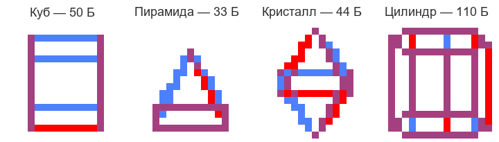
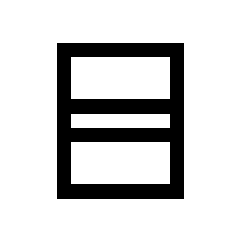
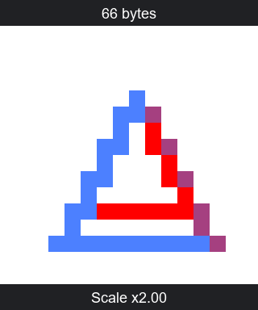

# 3DGraphics — спецификация и ASM API

**3DGraphics** — библиотека трёхмерной графики для Computer v2. Она преобразует вершины модели, строит перспективную проекцию, рисует цветные линии и заполненные треугольники на дисплее **16×16**.

Геометрия хранится отдельно от вычислительной части. Приложение задаёт модель, углы поворота и масштаб, вызывает подпрограммы API и выводит готовый кадр.

## Демонстрации

Память программы указана для полного образа: код, данные, буферы и выравнивание банков. **1 КБ = 1024 байта.**

### Каркас и заливка полного API

Верхний ряд GIF показывает цветные контуры, нижний — заполненные поверхности. В обоих рядах используются одинаковые углы и масштаб. Полигональные программы включают отсечение обратных граней и рисуют передние треугольники от дальних к ближним.


| Модель | Каркас | Заливка |
|---|---|---|
| Куб | [Исходник](build/cube/graphics3d.asm) · [Дискета](build/cube/graphics3d.diskette.txt)<br>**16 640 байт (>1 КБ)** | [Исходник](build/cube_polygons/graphics3d.asm) · [Дискета](build/cube_polygons/graphics3d.diskette.txt)<br>**16 640 байт (>1 КБ)** |
| Пирамида | [Исходник](build/pyramid/graphics3d.asm) · [Дискета](build/pyramid/graphics3d.diskette.txt)<br>**16 640 байт (>1 КБ)** | [Исходник](build/pyramid_polygons/graphics3d.asm) · [Дискета](build/pyramid_polygons/graphics3d.diskette.txt)<br>**16 640 байт (>1 КБ)** |
| Кристалл | [Исходник](build/crystal/graphics3d.asm) · [Дискета](build/crystal/graphics3d.diskette.txt)<br>**16 640 байт (>1 КБ)** | [Исходник](build/crystal_polygons/graphics3d.asm) · [Дискета](build/crystal_polygons/graphics3d.diskette.txt)<br>**16 640 байт (>1 КБ)** |
| Цилиндр | [Исходник](build/cylinder/graphics3d.asm) · [Дискета](build/cylinder/graphics3d.diskette.txt)<br>**16 768 байт (>1 КБ)** | [Исходник](build/cylinder_polygons/graphics3d.asm) · [Дискета](build/cylinder_polygons/graphics3d.diskette.txt)<br>**16 896 байт (>1 КБ)** |

Дискеты содержат готовые образы программ в формате Computer v2.

### Компактные каркасные программы

Все модели используют общий движок, одинаково крутятся и меняются в размере.



| Модель | Исходный код | Дискета | Память программы |
|---|---|---|---:|
| Куб | [ASM](compact/models/cube/graphics3d.asm) | [Дискета](compact/models/cube/graphics3d.diskette.txt) | 946 байт |
| Пирамида | [ASM](compact/models/pyramid/graphics3d.asm) | [Дискета](compact/models/pyramid/graphics3d.diskette.txt) | 929 байт |
| Кристалл | [ASM](compact/models/crystal/graphics3d.asm) | [Дискета](compact/models/crystal/graphics3d.diskette.txt) | 940 байт |
| Цилиндр | [ASM](compact/models/cylinder/graphics3d.asm) | [Дискета](compact/models/cylinder/graphics3d.diskette.txt) | 1006 байт |

### Куб Cube16

[Куб Cube16](compact/cube16.asm) выводит монохромный каркас из двенадцати рёбер. Восемь вершин вычисляются по знакам координат, заданным битами индекса вершины. Модель вращается вокруг Y с постоянным наклоном и постоянным масштабом.

Оборот содержит **32 угловых положения**. Кадр строится в 32-байтовом буфере `0x60…0x7F`, затем переносится на монохромный дисплей `0x40…0x5F`; режим включается значением `0x10` в порту `0x3E`. GIF показывает один оборот за **3,2 секунды**.

[Дискета Cube16](compact/cube16.diskette.txt). Память программы — **1022 байта**.



### Пирамида из OBJ

[Исходная модель OBJ](models/pyramid.obj) содержит пять вершин и пять граней. Основание получает красный цвет; боковые грани последовательно получают синий, фиолетовый, красный и синий.

Программа показывает цветные контуры. Вращение вокруг Y/X/Z и пульсация масштаба используют общий 256-кадровый цикл полного API.

[Исходник ASM](build/pyramid_obj/graphics3d.asm) · [Дискета](build/pyramid_obj/graphics3d.diskette.txt). Память программы — **16 640 байт (>1 КБ)**.



### Геометрия и цвета

**Куб.** Восемь вершин, двенадцать геометрических рёбер, шесть квадратных граней. Грани, перпендикулярные Z, красные; перпендикулярные Y — синие; перпендикулярные X — фиолетовые. Для заливки каждая грань разбивается на два треугольника, всего **12 треугольников**. [Описание модели](models/cube.json).

**Пирамида.** Квадратное основание и одна вершина над его центром: пять вершин, восемь геометрических рёбер, пять граней. Основание фиолетовое, боковые треугольники чередуют красный и синий. Заливка содержит **6 треугольников**: четыре боковых и два в основании. [Описание модели](models/pyramid.json).

**Кристалл.** Две квадратные пирамиды соединены основаниями. Четыре вершины образуют средний пояс, ещё две — верхнюю и нижнюю вершины. Фигура имеет шесть вершин, двенадцать геометрических рёбер и **8 треугольных граней**. Цвета верхних граней по кругу — 1, 2, 3, 1; нижних — 2, 3, 1, 2. [Описание модели](models/crystal.json).

**Цилиндр.** Два девятиугольных кольца соединены девятью боковыми четырёхугольниками: восемнадцать вершин, двадцать семь геометрических рёбер, одиннадцать граней. Боковые грани чередуют красный и синий, основания фиолетовые. Заливка содержит **32 треугольника**: восемнадцать боковых и по семь в каждом основании. [Описание модели](models/cylinder.json).

### Данные моделей

Над фигурами в общих GIF указан **объём геометрии модели**: заголовок, координаты, индексы и цвета.

| Модель | Компактный каркас | Каркас полного API | Заливка полного API |
|---|---:|---:|---:|
| Куб | 50 байт | 99 байт | 75 байт |
| Пирамида | 33 байта | 66 байт | 42 байта |
| Кристалл | 44 байта | 93 байта | 53 байта |
| Цилиндр | 110 байт | 219 байт | 185 байт |

Каркас полного API хранит цветные периметры граней: у куба это 24 записи рёбер по три байта. Полигональный куб хранит 12 записей треугольников по четыре байта. Вместе с заголовком и восемью вершинами эти данные занимают соответственно **99 и 75 байт**. Компактный каркас объединяет общие рёбра и хранит каждое ребро двумя байтами.

### Файлы библиотеки и моделей

- [Общий ASM компактного движка](compact/engine.asm)
- [Каталог исходных моделей](models/)
- [Исходник API с расположением подпрограмм по банкам](build/cube_polygons/graphics3d.asm)

### Разделы документации API

- [Экран и цвет](#экран-и-цвет)
- [Модель в памяти](#модель-в-памяти)
- [Вызовы из ASM](#вызовы-из-asm)
- [Преобразование и отрисовка](#преобразование-и-отрисовка)
- [Описание моделей в JSON и OBJ](#описание-моделей-в-json-и-obj)
- [Компактный каркасный движок](#компактный-каркасный-движок)
- [Анимация](#анимация)

## Документация API

### Экран и цвет

Начало экранных координат находится в левом верхнем углу: **X растёт вправо, Y — вниз**. Координаты пикселей — 0…15 по каждой оси. Центр проекции — `(8, 8)`.

| `color` | Цвет | Красный слой | Синий слой |
|---:|---|---:|---:|
| 0 | Белый | 0 | 0 |
| 1 | Красный | 1 | 0 |
| 2 | Синий | 0 | 1 |
| 3 | Фиолетовый | 1 | 1 |

Цветной кадр состоит из **двух битовых слоёв по 32 байта**. Каждая строка слоя занимает два байта; старший бит соответствует левому пикселю группы из восьми пикселей.

- `0x40…0x5F` — красный слой дисплея.
- `0x60…0x7F` — синий слой дисплея.
- `0x3E` — порт режима дисплея; значение `0x30` включает цветной режим.
- `0x3F` — порт выбора банка памяти.

Полный API строит кадр в отдельном банке `BUFFER_BASE`. `gfx_pixel` записывает новый цвет в оба слоя этого буфера. `gfx_present` копирует 64 готовых байта в память дисплея.

### Модель в памяти

`gfx_draw_mesh` получает указатель на последовательность байтов модели через `ptr_bank` и `ptr_addr`. В готовых демонстрациях данные начинаются с адреса **128** банка `MODEL_BASE`.

#### Заголовок и записи

| Часть | Запись | Размер |
|---|---|---:|
| Заголовок | `V, E, T`: число вершин, рёбер и треугольников | 3 байта |
| Вершины | `X, Y, Z` для каждой вершины | `3 × V` байт |
| Рёбра | `a, b, color` для каждого ребра | `3 × E` байт |
| Треугольники | `a, b, c, color` для каждого треугольника | `4 × T` байт |

Порядок данных: **заголовок → вершины → рёбра → треугольники**. Индексы вершин начинаются с нуля. Координаты хранятся как знаковые байты в дополнительном коде; например, `252` означает `−4`. Индексы, счётчики и цвета — беззнаковые байты.

Объём данных модели:

```text
S = 3 + 3V + 3E + 4T
```

Каркасная модель задаёт рёбра и `T=0`. Полигональная модель задаёт треугольники; в демонстрациях с заливкой `E=0`. Одна модель также может содержать оба вида примитивов: API сначала рисует рёбра, затем треугольники.

#### Пример данных в ASM

Три вершины, три цветных ребра и один красный треугольник:

```asm
model_data  db 3,3,1
model_v0    db 252,252,0     ; Вершина 0: (-4,-4,0)
model_v1    db 4,252,0       ; Вершина 1: ( 4,-4,0)
model_v2    db 0,4,0         ; Вершина 2: ( 0, 4,0)
model_edge0 db 0,1,1         ; Красное ребро 0 → 1
model_edge1 db 1,2,2         ; Синее ребро 1 → 2
model_edge2 db 2,0,3         ; Фиолетовое ребро 2 → 0
model_tri0  db 0,2,1,1       ; Красный треугольник, обход наружу
```

Каждая строка данных начинается с имени блока и директивы `db`; записи размещаются подряд. При размещении данных задайте `ptr_bank` равным банку `model_data`, а `ptr_addr` — адресу этой метки. Секция модели может продолжаться в следующих банках: API переносит указатель чтения автоматически.

Экранные вершины размещаются начиная с `VERTEX_BASE`, по четыре байта на вершину: `x, y, visible, depth`. Рабочие записи треугольников размещаются начиная с `TRI_BUFFER_BASE`, по пять байтов: `сумма глубин, цвет, a, b, c`. Для своей геометрии разместите эти области объёмом `4V` и `5T` байт и установите соответствующие константы банков. Каждый банк занимает 128 байт; секции дополняются нулевыми `db` до начала следующего банка.

### Вызовы из ASM

Готовые исходники содержат библиотеку, общие переменные, данные модели и приложение под метками `main`, `frame_start`, `frame_scale`, `frame_draw`, `frame_advance`. В качестве основы можно использовать программы куба с каркасом или заливкой из списка демонстраций.

Аргументы передаются через общие переменные и регистр **A**. Регистры **C/D** используются для перехода между банками. Вызов сохраняет банк и адрес продолжения в паре `retN_bank / retN_addr`, где N — слот возврата подпрограммы.

#### Справочник подпрограмм

| Подпрограмма | Вход | Результат | Слот N | Банк |
|---|---|---|---:|---:|
| `gfx_begin` | — | Очищен буфер кадра | 0 | `BUFFER_BASE` |
| `gfx_present` | — | Кадр скопирован на дисплей | 0 | `BUFFER_BASE` |
| `gfx_draw_mesh` | `ptr_bank/ptr_addr`, `yaw/pitch/roll`, масштаб, `STATE_CULL` | Модель нарисована в буфере | 0 | 41 |
| `gfx_set_scale` | A: масштаб Q5 | Масштаб записан в `STATE_SCALE` | 1 | 48 |
| `gfx_scale_vertex` | `wx/wy/wz`: XYZ, `STATE_SCALE` | Масштабированные XYZ в `wx/wy/wz` | 1 | 45 |
| `gfx_rotate_pair` | `ru/rv`, `angle` | Повернутая пара в `ru/rv` | 2 | 9 |
| `gfx_project_vertex` | `wx/wy/wz`: XYZ, `yaw/pitch/roll` | `wx/wy`: экранная точка, `wz`: видимость, `depth`: глубина | 1 | 10 |
| `gfx_get_vertex` | A: индекс преобразованной вершины | `wx/wy/wz/depth` из буфера вершин | 1 | 14 |
| `gfx_pixel` | `wx/wy`: экранная точка, `color` | Записан пиксель | 2 | 15 |
| `gfx_line` | `x0/y0`, `x1/y1`, `color` | Нарисован отрезок | 1 | 17 |
| `gfx_triangle` | `x0/y0`, `x1/y1`, `dx/dy`: третья вершина, `color` | Заполнен треугольник | 1 | 38 |

Номера банков в таблице соответствуют готовым демонстрациям. В ASM перед каждой секцией указан комментарий `Банк памяти #N`; адреса входа заданы метками подпрограмм. `BUFFER_BASE`, `MODEL_BASE`, `VERTEX_BASE`, `TRI_BUFFER_BASE` и `STATE_BANK` объявлены в начале каждого исходника.

Рабочие координаты и временные переменные изменяются при вызовах. Перед следующим примитивом установите его аргументы. `depth` и `angle` используют одну рабочую ячейку: значение глубины считывается сразу после `gfx_project_vertex` или `gfx_get_vertex`.

#### Углы и масштаб

- `yaw` — поворот вокруг Y.
- `pitch` — поворот вокруг X.
- `roll` — поворот вокруг Z.
- Угол `0…31` соответствует `0…348,75°`; один шаг равен **11,25°**.
- `STATE_SCALE` хранит масштаб в Q5: **32 = ×1, 48 = ×1,5, 64 = ×2**.

Пример установки масштаба ×1,5 с полным вызовом подпрограммы:

```asm
ldi a, 48                  ; Передать коэффициент через A
ld c, 0x3F                 ; Сохранить текущий банк
st c, ret1_bank
ldi d, scale_ready         ; Сохранить адрес продолжения
st d, ret1_addr
ldi c, 48                  ; Банк gfx_set_scale
ldi d, gfx_set_scale
jmp set_bank

scale_ready:
                           ; Следующие инструкции приложения
```

`set_bank` находится в общей памяти и выполняет `st c, 0x3F`, затем `jmp d`. Подпрограмма возвращается через тот же переход, используя сохранённые `retN_bank` и `retN_addr`.

#### Построение кадра

Последовательность кадра: **очистить буфер → установить параметры → нарисовать модель → вывести буфер**. Углы и масштаб демонстрации вычисляются в `frame_start` и `frame_scale`; `frame_draw` использует уже подготовленные значения.

Ниже приведён код для замены секции `frame_draw` в готовом исходнике. Цветной режим включается в `main`.

```asm
frame_draw:
    ; Очистить кадр: слот 0, банк BUFFER_BASE
    ld c, 0x3F
    st c, ret0_bank
    ldi d, draw_after_begin
    st d, ret0_addr
    ldi c, BUFFER_BASE
    ldi d, gfx_begin
    jmp set_bank

draw_after_begin:
    ; Передать указатель на модель
    ldi a, MODEL_BASE
    st a, ptr_bank
    ldi a, 128
    st a, ptr_addr

    ; Нарисовать модель: слот 0, банк 41
    ld c, 0x3F
    st c, ret0_bank
    ldi d, draw_after_mesh
    st d, ret0_addr
    ldi c, 41
    ldi d, gfx_draw_mesh
    jmp set_bank

draw_after_mesh:
    ; Вывести готовый кадр: слот 0, банк BUFFER_BASE
    ld c, 0x3F
    st c, ret0_bank
    ldi d, draw_after_present
    st d, ret0_addr
    ldi c, BUFFER_BASE
    ldi d, gfx_present
    jmp set_bank

draw_after_present:
    ldi c, 5
    ldi d, frame_advance
    jmp set_bank
```

Для нескольких моделей повторите установку указателя и вызов `gfx_draw_mesh` между `gfx_begin` и `gfx_present`. Каждой модели можно передать собственные углы и масштаб.

#### Рисование примитивов

`gfx_pixel`, `gfx_line` и `gfx_triangle` принимают **экранные координаты**. Они позволяют дополнять кадр отдельными точками, отрезками и треугольниками.

Пример синего треугольника с вершинами `(2,2)`, `(13,3)`, `(7,14)`:

```asm
ldi a, 2
st a, color
st a, x0
st a, y0
ldi a, 13
st a, x1
ldi a, 3
st a, y1
ldi a, 7
st a, dx
ldi a, 14
st a, dy

ld c, 0x3F
st c, ret1_bank
ldi d, triangle_ready
st d, ret1_addr
ldi c, 38
ldi d, gfx_triangle
jmp set_bank

triangle_ready:
                           ; Следующие инструкции приложения
```

#### Отсечение обратных граней

В банке `STATE_BANK` по адресу `STATE_CULL` хранится режим:

- **0** — обработка обеих сторон треугольников.
- **1** — обработка передних треугольников.

Для включения отсечения запишите 1 через общую подпрограмму `write_byte`:

```asm
ld d, 0x3F
st d, io_ret_bank
ldi c, STATE_BANK
ldi b, STATE_CULL
ldi a, 1
ldi d, cull_ready
jmp write_byte

cull_ready:
                           ; Следующие инструкции приложения
```

Этот флаг применяется в `gfx_draw_mesh`. Прямой вызов `gfx_triangle` заполняет треугольник при обоих порядках обхода вершин.

### Преобразование и отрисовка

`gfx_draw_mesh` выполняет следующие действия для каждого кадра.

1. Читает заголовок и XYZ модели.
2. Масштабирует каждую координату: `floor(coordinate × STATE_SCALE / 32)`.
3. Поворачивает вершину последовательно вокруг **Y, X и Z**.
4. Вычисляет глубину камеры и перспективную проекцию.
5. Сохраняет экранные вершины, затем рисует рёбра.
6. Формирует рабочие записи треугольников, выбирает их по глубине и заполняет поверхности.

#### Вращение и проекция

`gfx_rotate_pair` преобразует пару координат `u, v` при угле θ:

```text
u' = round(u × cos θ) + round(v × sin θ)
v' = round(v × cos θ) − round(u × sin θ)
```

Вращение Y использует пару `X/Z`, вращение X — `Y/Z`, вращение Z — `X/Y`. Числовые таблицы хранят округлённые произведения координат на коэффициенты синуса и косинуса.

После вращения глубина камеры и экранные координаты вычисляются так:

```text
Zcamera = Z + 32
screenX = 8 + round(16 × X / Zcamera)
screenY = 8 + round(−16 × Y / Zcamera)
```

Глубина 8…63 получает признак `visible=1`. Для остальных значений устанавливается `visible=0`; связанные с такой вершиной примитивы пропускаются. Запись результата содержит `screenX, screenY, visible, Zcamera`.

#### Линии и поверхности

`gfx_line` использует алгоритм Брезенхэма и рисует ребро **толщиной один пиксель**. `gfx_pixel` записывает точки, попадающие в область дисплея.

`gfx_triangle` вычисляет 16-битные определители для трёх рёбер и обходит пиксели дисплея. Знаки определителей определяют принадлежность точки треугольнику; граница включается в заливку. При переходе к соседнему пикселю значения обновляются сложением приращений. Треугольник с нулевой площадью пропускается.

Для сортировки `gfx_draw_mesh` использует **сумму глубин трёх вершин**. На каждом шаге выбирается оставшийся треугольник с наибольшей суммой: поверхности рисуются **от дальних к ближним**. При одинаковой глубине сохраняется порядок записей модели.

При `STATE_CULL=1` дополнительно проверяется экранная площадь:

```text
A = (x1 − x0) × (y2 − y0) − (y1 − y0) × (x2 − x0)
```

Рисуются треугольники с `A>0`. В полигональных демонстрациях порядок вершин ориентирован наружу от центра фигуры.

### Описание моделей в JSON и OBJ

Исходные описания геометрии находятся в каталоге `models/`. Их вершины задаются в координатах объекта; центр и общий размер определяются при подготовке данных модели.

#### JSON

```json
{
  "name": "panel",
  "radius": 14,
  "render": "wireframe",
  "vertices": [[-1,-1,0], [1,-1,0], [1,1,0], [-1,1,0]],
  "faces": [[0,1,2,3,2]]
}
```

| Поле | Значение |
|---|---|
| `name` | Имя модели |
| `vertices` | Массив троек `[X,Y,Z]` |
| `edges` | Массив `[a,b,color]`; запись `[a,b]` получает цвет 3 |
| `triangles` | Массив `[a,b,c,color]` |
| `faces` | Массив контуров `[v0,v1,…,vn,color]` |
| `render` | `wireframe` — контуры; `polygons` — заполненные треугольники |
| `radius` | Целевой радиус модели при масштабе ×2 |

В `faces` последнее число задаёт цвет, остальные — индексы вершин по периметру. Пример описывает синий четырёхугольник.

В режиме `wireframe` каждый контур разворачивается в последовательность цветных рёбер. Общая граница двух граней получает запись для каждого контура; цвет на совпадающих пикселях задаёт последнее нарисованное ребро. Дополнительные рёбра из `edges`, лежащие отдельно от границ граней, также включаются в модель.

В режиме `polygons` используются явные `triangles` или веерная триангуляция выпуклых `faces`:

```text
(v0,v1,v2), (v0,v2,v3), …, (v0,vn−1,vn)
```

Каждый полученный треугольник сохраняет цвет своей грани. При подготовке полигональных демонстраций устанавливаются `E=0` и `STATE_CULL=1`.

Центр модели — середина её габаритов по каждой оси. Координаты смещаются относительно этого центра, равномерно масштабируются и округляются до целых. В полном API базовый радиус до округления равен `radius/2`. Демонстрации используют целевой радиус **14**: масштаб ×1 соответствует базовой геометрии, ×2 удваивает её XYZ.

#### OBJ

OBJ задаёт геометрию строками:

- `v X Y Z` — вершина.
- `l a b …` — последовательность соединённых рёбер.
- `f a b c …` — замкнутый контур грани.

Положительные индексы OBJ начинаются с 1; отрицательные отсчитываются от последней объявленной вершины. В записи `v/vt/vn` используется индекс позиции вершины. Граням по порядку присваиваются цвета **1, 2, 3**, затем последовательность повторяется.

Модель `models/pyramid.obj` описывает квадратное основание и четыре боковых треугольника. Её программа `build/pyramid_obj/graphics3d.asm` использует общий API и цикл анимации полного API.

### Компактный каркасный движок

`compact/engine.asm` содержит общий движок цветных рёбер. Программы куба, пирамиды, кристалла и цилиндра используют одинаковую вычислительную часть; геометрия находится в секции `model`.

#### Формат данных

| Часть | Запись | Размер |
|---|---|---:|
| Заголовок | `V, E` | 2 байта |
| Вершины | `X₂, Y₂, Z₂` | `3 × V` байт |
| Рёбра | `a \| (color << 6), b` | `2 × E` байт |

Координаты записываются **в половинах единицы**: `X₂=10` означает `X=5`, `X₂=255` означает `X=−0,5`. Первый индекс ребра занимает младшие шесть битов первого байта, цвет — старшие два бита.

Красное ребро 0→1 кодируется как `64,1`, синее — `128,1`, фиолетовое — `192,1`. Цвет 0 пропускает ребро.

Пример треугольного каркаса:

```asm
model       db 3,3
model_v0    db 248,248,0     ; (-4,-4,0) в половинах единицы
model_v1    db 8,248,0       ; ( 4,-4,0)
model_v2    db 0,8,0         ; ( 0, 4,0)
model_edge0 db 64,1          ; Красное ребро 0 → 1
model_edge1 db 129,2         ; Синее ребро 1 → 2
model_edge2 db 194,0         ; Фиолетовое ребро 2 → 0
```

Для замены фигуры измените данные после метки `model` в готовой программе. Блок геометрии начинается по физическому смещению **896**; вычислительная часть расположена перед ним.

Объём компактной записи модели:

```text
S = 2 + 3V + 2E
```

При подготовке модели геометрически совпадающие рёбра объединяются; цвет общей границы задаёт последняя грань. Подбирается единый размер фигуры для всех углов вращения при масштабе ×2.

#### Проекция и кадр

Движок вращает модель вокруг **Y** и использует ортографическую проекцию с постоянным наклоном. Концы каждого ребра преобразуются перед рисованием.

Обозначения: `C=round(8 cos θ)`, `S=round(8 sin θ)`, `P=scale`, коэффициент размера `k=P/64`.

```text
screenX = 8 + floor((X₂ × C + Z₂ × S) × P / 2048)
screenY = 8 + floor((floor((Z₂ × C − X₂ × S) / 32) − Y₂) × P / 256)
```

Рёбра рисуются Брезенхэмом толщиной один пиксель. Сначала строится красный слой, затем синий; пересечения слоёв дают фиолетовый цвет.

Кадр проходит четыре стадии:

1. `frame_start` записывает 0 в `0x3E`, очищает 64 байта LCD RAM и начинает построение кадра.
2. CPU рисует рёбра обоих слоёв, пока дисплей сохраняет предыдущий рисунок.
3. `frame_ready` записывает `0x30` в `0x3E`; `frame_publish` перечитывает и повторно записывает все 64 готовых байта.
4. `frame_presented` завершает вывод и обновляет угол и фазу масштаба.

### Анимация

#### Демонстрации полного API

Каркасные и полигональные программы используют общий цикл **256 кадров**. Номер кадра `n` меняется от 0 до 255 и затем возвращается к нулю.

```text
yaw   = floor(n / 4) mod 32
pitch = floor(n / 2) mod 32
roll  = floor(3n / 4) mod 32

scale = 32 + floor(abs(n − 128) / 4)
k     = scale / 32
```

За один цикл модель совершает **два оборота вокруг Y, четыре вокруг X и шесть вокруг Z**. Размер линейно уменьшается от **×2 до ×1**, затем увеличивается до **×2**. Коэффициент хранится с шагом **1/32** и применяется к XYZ до вращения и проекции.

| Кадр | Масштаб |
|---:|---:|
| 0 | ×2 |
| 64 | ×1,5 |
| 128 | ×1 |
| 192 | ×1,5 |
| 256, начало следующего цикла | ×2 |

Кадры 0 и 128 имеют одинаковый ракурс. Перспектива вычисляется после изменения XYZ, поэтому размер на экране также зависит от глубины повернутых вершин.

#### Компактные каркасные демонстрации

Угол меняется на один шаг каждый кадр:

```text
phase = n mod 32
theta = phase × 11,25°

P = 64 + floor(abs(n − 128) / 2)
k = P / 64
```

Цикл масштаба занимает **256 кадров**, за которые модель делает **восемь оборотов вокруг Y**. Пульсация начинается с ×2, достигает ×1 в середине цикла и возвращается к ×2. Шаг коэффициента — **1/64**; округление до пикселей выполняется при проекции.

GIF каркасных и полигональных демонстраций используют временную сетку **100 мс на кадр** и полный цикл **25,6 секунды**. Совпадающие соседние изображения объединяются с сохранением суммарной длительности.
