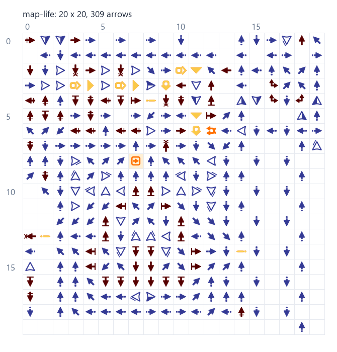

# Ячейка «Жизни» из Logic Arrows

[Разбор логики и оптимизация протокола сапёра](ANALYSIS.md): импульсный счётчик,
проверка правила «Жизни» и компактный четырёхбитный прототип.

Схема извлечена из [публичной карты Game of Life](https://logic-arrows.io/map-life),
версия карты **195**. Исходная карта содержит **82 855 стрелок**.
Считывание выполнено из сохранения сайта, без распознавания изображения.

## Результат

| Файл | Содержимое |
|---|---|
| [life-cell.map.json](build/life-cell.map.json) | Одна игровая ячейка: прямоугольник **20×20**, **309 стрелок**; модель ArrowsHDL `schema=1` |
| [life-cell.save.txt](build/life-cell.save.txt) | Та же ячейка в формате сохранения сайта Base64 v0, для импорта |
| [life-cell.arrowasm](build/life-cell.arrowasm) | Читаемый список всех стрелок: тип, координаты, направление, отражение |
| [life-cell.connections.json](build/life-cell.connections.json) | **27 внешних связей** выбранного фрагмента с остальной картой |
| [life-repeat.map.json](build/life-repeat.map.json) | Полный период **40×20**, **662 стрелки**, две игровые ячейки |
| [life-repeat.save.txt](build/life-repeat.save.txt) | Полный период в формате сохранения сайта |
| [extraction.report.json](build/extraction.report.json) | Координаты, версия, хеш исходника и результаты проверки |



**Границы выбранной ячейки в исходной карте:** `110 ≤ x < 130`, `76 ≤ y < 96`.
При экспорте начало перенесено в `(0, 0)`, типы, направления и отражения
стрелок сохранены без изменений. Внутри — одна направленная кнопка,
два latch, три flipflop и окружающая логика/разводка.

Это выбранный прямоугольный фрагмент повторяющегося поля. Он сохраняет
все стрелки внутри границ, но **для работы требует внешних сигналов и связей
с соседями**, перечисленных в `life-cell.connections.json`. Отрицательные
координаты и координаты за пределами 20×20 в этом файле обозначают внешние
контакты относительно начала фрагмента. Функциональная симуляция «Жизни»
в рамках извлечения не выполнялась.

## Как считывать эффективно

1. Получить карту одним запросом: **POST**
   `https://logic-arrows.io/api/mapguest`, тело `{"id":"life"}`,
   заголовок `Content-Type: application/json`. Этот маршрут найден в
   [клиентском коде сайта](https://logic-arrows.io/bundle.js?v=1_4).
2. Взять поле `data` из JSON-ответа. Это полное сохранение карты в Base64.
3. Декодировать его существующим `ArrowsHDL/src/arrowasm.py`: формат v0
   хранит чанки 16×16, типы стрелок, позиции и флаги поворота/отражения.
4. Найти повторение сравнением блоков по координатам, включая пустые места,
   и вырезать выбранный прямоугольник. Сместить его начало в `(0, 0)`.
5. Записать JSON для анализа и Base64 для импорта; проверить обратное чтение.

Так один сетевой запрос даёт точные данные всей карты. Затем извлечение
делается локально; увеличение, прокрутка и ручная запись стрелок не нужны.
Гостевой API — внутренний маршрут сайта; если он изменится, потребуется
снова проверить клиентский код. Локальный снимок позволяет повторять
извлечение без сети.

**Особенность этой карты:** соседние игровые ячейки имеют разную,
частично зеркальную разводку. Поэтому шаг точного повторения схемы —
**40 по горизонтали и 20 по вертикали**, хотя выбранная игровая ячейка
занимает 20×20. Для тиражирования исходного поля следует брать
`life-repeat`, а не просто копировать `life-cell` каждые 20 клеток.

## Повторное извлечение

Из корня репозитория, Python 3 и Pillow:

```powershell
python map-life/extract.py
```

Первая команда использует сохранённый исходник. Чтобы скачать текущую
версию публичной карты и пересоздать файлы:

```powershell
python map-life/extract.py --refresh
```

Скрипт использует существующие модули и спрайты из `ArrowsHDL`.
Исходный API-ответ находится в [reference/mapguest.json](reference/mapguest.json),
полное сохранение — в [reference/original.save.txt](reference/original.save.txt).

## Проверка качества

- Найдены **104 точные копии** выбранного блока 40×20 в проверенных позициях поля.
- Подтверждены минимальные положительные сдвиги выбранного блока:
  **40 по X**, **20 по Y**; проверяются типы, повороты, отражения и пустоты.
- Одна ячейка также совпадает с фрагментами при сдвигах `(40, 0)` и `(0, 20)`.
- Обратное чтение **Base64, JSON и ArrowASM** восстанавливает все стрелки.
- Предпросмотр построен из экспортированных данных и визуально проверен.

Неповторяющиеся позиции сохранены в отчёте отдельно: края поля и изменённые
фрагменты не выдаются за идентичные копии.
