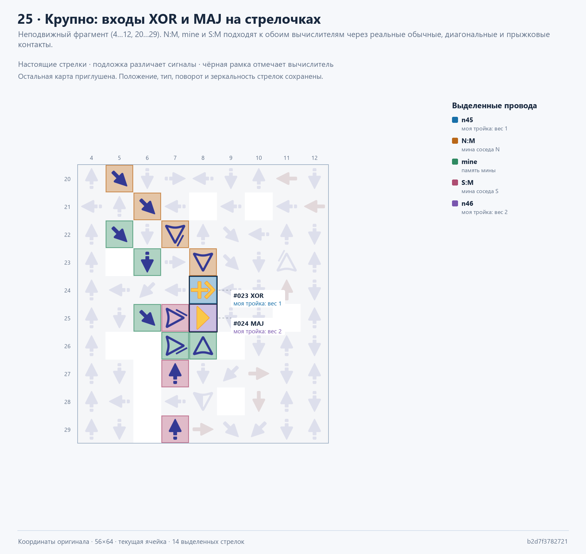

# Сапёр v1

Текущая ячейка — **56×64, 2 164 стрелки, 105 элементов графа**.
Она заменяет 92×92: площадь уменьшена **в 2,36 раза**, число стрелок — **в 2,37 раза**.
Сам модуль помещается в 64×64; **шаг сетки с проводкой — 56×70**.
С учётом межстрочного канала площадь на повторяемую клетку сокращена **в 2,16 раза**.
Полная стыковка с шагом не более 64 по обеим осям ещё не достигнута; минимальный размер не доказан.

| Показатель | Прежняя версия | Текущая |
|---|---:|---:|
| Ячейка | 92×92 | **56×64** |
| Площадь ячейки | 8 464 | **3 584** |
| Стрелки в ячейке | 5 122 | **2 164** |
| Элементы графа | 174 | **105** |
| Позиции памяти | 12 | **4** |
| Стрелки всего поля 10×10 | 513 569 | **233 969** |
| Габариты поля с контроллером | 1 040×1 068 | **684×842** |
| Подготовка, такты | 13 406 | **14 199** |

Площадь всей карты с контроллером уменьшена **в 1,93 раза**, число стрелок — **в 2,20 раза**.
Соседние столбцы стыкуются непосредственно; между строками оставлен канал шириной 6 клеток.
Этот канал и внешний контроллер учтены в размерах всей карты.

Панель **31×17**: число слева, **кнопка 5×5 по центру**, мина **8×8 справа**.
Мина содержит **31 красный разветвитель и 4 синих диагональных стрелки**.
Закрытая клетка пустая; открытая безопасная показывает 0–8. Поражение раскрывает все мины.

Последний проход в общем компиляторе удалил **260 стрелок (10,7%)** из версии
2 424. Сборщик кнопки выбрал верхний выход: путь от `button0` до разрешения
запроса стал **7 вместо 47 тактов**, до логики открытия — **4 вместо 44**.
Путь вычисленного сигнала мины до входа дисплея — **4 такта**.
Направления ворот проверяются после разводки вместе с мешающими цепями;
контакты импульсных шаблонов остаются закреплёнными. Размер в этом проходе
не изменился. [Отчёт с настоящими путями и SHA-256](build/routing.optimization.json).

## Сохранения и доказательства

- [Основное поле 10×10](build/minesweeper-10x10.save.txt).
- [Поле 5×5](build/minesweeper-5x5.save.txt), [поле 3×3](build/minesweeper-3x3.save.txt), [ячейка](build/cell.save.txt).
- [Физическая проверка](build/quality.json), [игровые автотесты](build/autotests.json).
- [Все сочетания соседей и кнопки](build/cell.verification.json).
- [Холодные одновременные нажатия](build/minesweeper-10x10.first-click-matrix.json).
- [Поздние нажатия во время подготовки](build/minesweeper-10x10.first-click-timing.json).
- [Измеренная задержка](build/minesweeper-10x10.latency.json), [сравнение](build/preparation.comparison.json).
- [Граф вычислений](build/cell.logic.json), [координаты всех портов и элементов](build/cell.layout.json).
- [Описание логики](CELL_LOGIC.md), [разбор map-life](../map-life/ANALYSIS.md).

Сохранения повторно импортированы из Base64 в общий симулятор **GraphDLC, профиль 01232bd**.
Все отчёты привязаны к SHA-256 карты. Проверка в текущей браузерной игре отдельно не выполнена.

## Визуальный разбор

PDF, PNG и атлас ниже показывают **архивную версию с 2 424 стрелками**
(`b2d7f3782721…`), до оптимизации выхода кнопки и направлений ворот.
Новые изображения в этом проходе не создавались.

[PDF: все 25 листов с закладками](output/pdf/minesweeper-cell-arrow-paths.pdf).

[25 изображений настоящей разводки на стрелочках](build/visualizations/arrow-paths/README.md):
кнопка и генерация, обмен с соседями, подсчёт, открытие, каскад, сканы и вывод.
Стрелки стоят на исходных координатах; цветная подложка выделяет конкретные провода.
Подписи привязаны к настоящим вычислителям. Входящие и исходящие соседские цепи,
три скана и семь сегментов показаны отдельно; входы XOR/MAJ дополнительно увеличены.

[Атлас всех портов](build/visualizations/current-cell/04-physical-atlas.png),
[справочник 105 элементов](build/visualizations/current-cell/05-gate-catalog.png).



## Что сокращено в логике

- **Четыре состояния:** request, selected, opened и mine. Семь TFF сегментов
  заменены непрерывными сигналами; отдельный импульсный захват каждого сегмента удалён.
- **Декодер только для 0–8:** шесть сегментов не используют старший бит,
  поскольку рисунки 0 и 8 отличаются только средней перекладиной.
  Одна функция реализована нативным большинством трёх входов.
- **Соседство без диагональных каналов:** S/Z объединяются в вертикальные тройки
  до передачи в соседний столбец; M передаёт два бита суммы тройки.
  Три частичных числа объединяются восемью воротами с отложенным переносом.
- **Один последовательный скан:** prefixReq/Loss/Sat проходят всё поле в порядке строк.
  Удалены row/carry/total-шины, present и локальная память распространения busy.
- **Общий контроллер:** определяет победу/поражение, выдаёт шесть сигналов по столбцам
  и заранее закрывает захват запросов перед выбором первого хода.
- **Стенки №25 удалены:** они не передают сигнал. Вся площадь каждого модуля
  зарезервирована, поэтому внешняя трассировка не заполняет освободившиеся места.

Самые ранние компактные варианты без блокировки запросов не приняты:
поздний клик мог выбрать две стартовые клетки. Исправление и отдельная физическая
регрессия включены в основную версию. Безопасные варианты 56×60 с проверенной
логикой пока не прошли трассировку; это не доказательство нижнего предела.

## Время подготовки

Три общих счётчика: **8 192 / 512 / 1 024 такта**, всего **117 стрелок и 0 DELAY**.
Границы по фактическому графу: **6 877 / 470 / 554 такта**, с запасом 256.
Они учитывают закрытие захвата запросов, выбор, защиту соседства и стабилизацию вывода.

Всё поле 10×10 готово через **14 199 тактов** после центрального клика
при seed `123456789`, первом ходе №55 и 30 000 тактах до клика.
Первоначальная версия требовала **206 685 тактов**: ускорение **14,56×**.
Относительно прежних 92×92 подготовка на **5,9% медленнее**:
последовательный скан занимает меньше места, но дольше передаёт запрос.
Это измеренный компромисс, а не заявленное ускорение 15×.

## Общий компилятор

Размещение, выбор контактов, оптимизация графа, трассировка и Rust-симулятор
находятся в **ArrowsHDL**. Игровой код задаёт правила, панель, порты и их временной контракт.
Отдельной копии компилятора в проекте нет.

| Общий модуль | Назначение |
|---|---|
| [netlist_optimization.py](../ArrowsHDL/src/netlist_optimization.py) | Удаление недостижимых вычислений, OR/NOR-свёртка, сложение частичных чисел, вывод уровней |
| [pin_planning.py](../ArrowsHDL/src/pin_planning.py) | До 11 входных контактов через обычные, диагональные и прыжковые стрелки |
| [negotiated_routing.py](../ArrowsHDL/src/negotiated_routing.py) | Перестройка конфликтов с историей перегрузок |
| [route_optimization.py](../ArrowsHDL/src/route_optimization.py) | Четыре направления выхода ворот, сокращение цепей, выбор выхода сборщика |
| [fixed_wiring.py](../ArrowsHDL/src/fixed_wiring.py) | Соединения вокруг неподвижных блоков и пустых зарезервированных областей |
| [grid_wiring.py](../ArrowsHDL/src/grid_wiring.py) | Прямоугольная сетка модулей, скан, межстрочные каналы и общий ввод |
| [native_rules.py](../ArrowsHDL/src/native_rules.py) | Правила типов стрелок, зависимости и удаление пассивных стенок |
| [timing.py](../ArrowsHDL/src/timing.py) | Физические границы задержек и распространения уровней |

Переход с импульсного вывода на уровни требует соответствующей замены приёмников;
для TFF эта замена неверна. Выбор адаптивных контактов разрешён для эвристических
позиций, а контакты закреплённых нативных шаблонов остаются строгими.

## Сборка и автотесты

Поиск меньшей площади **без автотестов и симуляции**:

```powershell
python minesweeper-v1/compile_max_compact.py --budget 32 --timeout 90
```

Общая эвристика находится в [compact_search.py](../ArrowsHDL/src/compact_search.py),
адаптер проекта — [compile_max_compact.py](compile_max_compact.py).
Результат и журнал вариантов записываются в
`build/experiments/maximum-compactness/`. Проверенные основные сохранения
этой командой не заменяются. Варианты с меньшим контуром заново размещают
вычислительные блоки и порты и проходят обязательную проверку соединений
внутри компилятора. Полноценная игровая проверка этой командой не запускается.

Из корня репозитория:

```powershell
python minesweeper-v1/build_compact.py
python minesweeper-v1/build_compact.py --verify-and-publish
python -m unittest discover -s minesweeper-v1/tests -v
python -m unittest discover -s ArrowsHDL/tests -p test_reusable_backend.py -v
python -m unittest discover -s ArrowsHDL/tests -p test_netlist_optimization.py -v
python -m unittest discover -s ArrowsHDL/tests -p test_native_rules.py -v
python -m unittest discover -s ArrowsHDL/tests -p test_route_optimization.py -v
```

Первая команда компилирует 56×64 с seed размещения 67 и собирает поля в
`build/releases/compact-56x64/`. Вторая выполняет перебор ячейки, по два seed
для трёх размеров поля, 15 холодных случаев, 15 поздних нажатий, проверку границ
и измерение задержки, затем обновляет основные сохранения. Предыдущие сохранения
архивируются в `build/experiments/`. Проверенная текущая сборка также сохранена в
`build/releases/routing-56x64/`; версия до этого прохода — в
`build/releases/serial-guard-56x64/`. Нужны Python и Rust/Cargo для первоначальной сборки CLI.

Для повторной сборки полей из уже готовой ячейки:

```powershell
python minesweeper-v1/build_compact.py --cell-source cell --destination experiments/rebuild-compact
```

## Игра и стыковка

1. Импортировать `.save.txt` в [Logic Arrows](https://logic-arrows.io/).
2. Нажать любую стрелку центральной кнопки нужной клетки.
3. Выбранный первый ход и его существующие восемь соседей защищены от мин.
   Остальные клетки получают мину с вероятностью 1/4 через два независимых RANDOM.
4. Открытый безопасный ноль раскрывает соседей, включая диагонали.
5. Открытая мина вызывает поражение; открытие всех безопасных клеток — победу.
   Оба результата запрещают дальнейшие открытия. Для новой партии загрузить карту заново.

Флагов и фиксированного числа мин в v1 нет. Несколько запросов, принятых до
закрытия захвата, разрешаются в порядке строк слева направо. После закрытия
новые запросы подготовки не принимаются; после ready кнопка открывает клетку.

Каждая копия занимает **56×64**. Сдвиг столбца — **56**, строки — **70** с каналом 6.
Контракт: **23 внешних входа и 23 внешних выхода**, без угловых каналов.
Кнопка — внутренний вход; семь сырых сегментов, show и мина — внутренние выходы.
Контроллер расположен снаружи поля; одиночной ячейке нужны управляющие сигналы.
Размер поля меняет физические задержки, поэтому его таймеры пересобираются.
