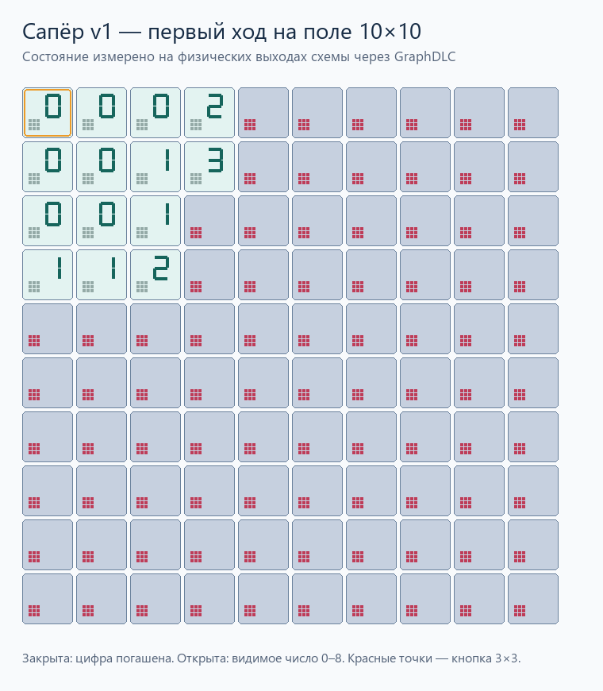
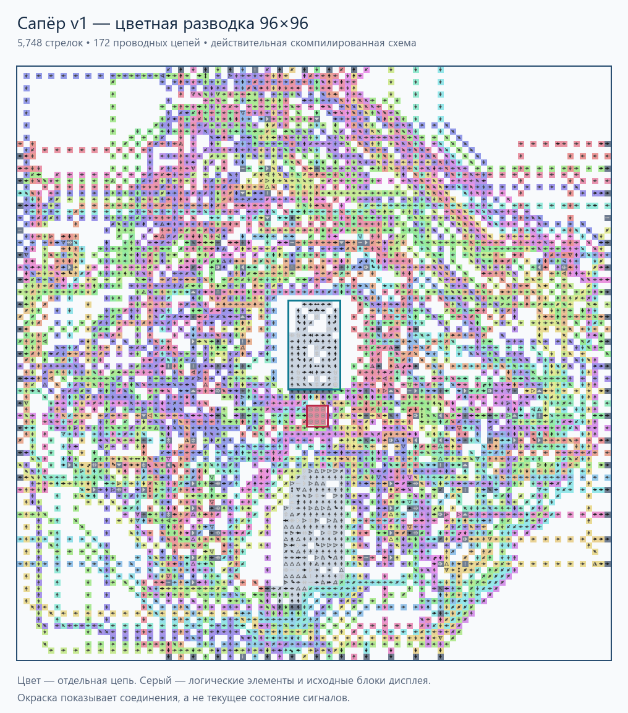

# Сапёр v1 — модульная схема из стрелок

**Поле 10×10**, одинаковые ячейки **96×96**, без внешних проводов между ячейками.
Центральная область уменьшена до **12×22**; дисплей и кнопка **3×3** находятся в центре. Закрытая клетка не показывает
число; открытая безопасная показывает **0–8**, включая видимый ноль.

- [Сохранение поля для игры](build/minesweeper-10x10.save.txt).
- [Самостоятельный модуль](build/cell.save.txt), [его физическая схема](build/cell.preview.png).
- [Полная схема поля](build/minesweeper-10x10.preview.png).
- [Проверка 256 комбинаций соседей](build/cell.verification.json).
- [Проверка игры 10×10](build/minesweeper-10x10.verification.json).
- [Оба случайных поля и первые ходы](build/minesweeper-10x10.seeds.verification.json), [критерии качества](build/quality.json).
- [Небольшое поле 3×3](build/minesweeper-3x3.save.txt), [проверка углового первого хода](build/minesweeper-3x3.verification.json).



## Поле 5×5

[Готовое сохранение 5×5](build/minesweeper-5x5.save.txt): **25 одинаковых ячеек 96×96**,
игровая сетка **480×480**, всего **173 203 стрелки** вместе с внешним контроллером.
Контакты стыкуются непосредственно; между модулями не добавлены провода.
Задержка между стадиями подготовки — **17 342 такта**.

- [Цветная схема игрового поля](build/minesweeper-5x5.nets.preview.png).
- [Полная физическая схема с контроллером](build/minesweeper-5x5.preview.png).
- [Первый ход, измеренный в симуляторе](build/minesweeper-5x5.demo.png).
- [Проверки двух генераций, центра и угла](build/minesweeper-5x5.seeds.verification.json),
  [проверка размеров и 25 копий](build/minesweeper-5x5.quality.json).

Сборка: `snap_board.py --size 5`; проверка: `snap_verify.py --size 5`.
При изменении размера поля контроллер задержек пересобирается автоматически.

## Управление

1. Импортировать содержимое `.save.txt` в [Logic Arrows](https://logic-arrows.io/).
2. Нажать любую из девяти стрелок кнопки под дисплеем нужной клетки.
3. Первый ход запускает единственную генерацию. Выбранная клетка и её
   существующие восемь соседей гарантированно без мин.
4. После подготовки открытая клетка с **0** раскрывает соседей, включая
   диагональных. Клетки с числами раскрываются, но останавливают каскад.
5. Открытая мина показывает крест; поражение останавливает игру.
   Раскрытие всех безопасных клеток даёт победу и тоже останавливает игру.
6. Для новой партии повторно загрузить сохранение.

Повторное нажатие не закрывает клетку. При нескольких первых запросах,
успевших запомниться до прихода общего запрета, выбирается первый в порядке
строк слева направо. Флагов, фиксированного числа мин и внешнего распределителя
мин в **v1 нет**.

**Подготовка медленная:** это физическая схема с длинными линиями и запасом
по задержкам. Между стадиями выбора, генерации и разрешения открытия заложено
**65 780 тактов**. Во время подготовки дисплеи остаются выключенными.
Для экспериментов удобнее поле 3×3 и повышенная скорость симуляции.

## Устройство и стыковка



[Просмотр с выделением отдельных цепей и масштабированием](build/cell.nets.viewer.html).
Цвет обозначает проводную цепь, а не состояние сигнала. Серым обозначены
логические элементы и исходные блоки дисплея. В новой ячейке **172 цепи**.
Их принадлежность восстановлена по физическим связям и точным позициям
логических элементов компилятора и сверена с непосредственными данными
трассировщика для этой же ячейки.

В модуле **5 748 стрелок**, в полном поле с контроллером и задержками
**677 886 стрелок**. Размеры считаются по сетке физических стрелок.
BCD используется **внутри** для декодирования числа, отдельного индикатора BCD нет.

Компоновка разделена на локальные блоки: западные три соседние мины,
восточные три, север/юг и итоговый сумматор. Подсчёт сокращён с **22 до 16**
элементов. Управление семью сегментами собрано рядом с декодером в две группы;
для них продублированы простые НЕ/И, память мины и открытия не дублируется.
Вместо каскадов двухвходовых ИЛИ используются нативные ИЛИ с максимум тремя
входами. Направления выходов внутренних элементов подбираются по их связям.

По сравнению с предыдущей ячейкой 112×112 площадь уменьшилась на **26,5%**,
число стрелок — на **20,1%**. Задержка между стадиями подготовки снизилась
со 111 228 до 65 780 тактов; всё поле уменьшилось с 892 608 до 677 886 стрелок.
Предыдущие сохранения и отчёты сохранены локально в `build/previous-112/`;
в репозиторий входят актуальные экспорты.
**64×64 пока не собрано:** в текущей сетке размещения не хватает свободных
мест для элементов. Это ограничение текущей компоновки, а не доказательство
невозможности такого размера.

Все копии идентичны и не содержат координат. Сдвигать соседнюю копию ровно
на **96 клеток** по горизонтали или вертикали, сохраняя ориентацию.
Выход на одном краю попадает непосредственно во вход противоположного края.
Идентичные копии можно переставлять между любыми позициями прямоугольного поля.
Произвольный поворот модуля не поддерживается.

Контроллер и три линии задержек размещены **снаружи поля**, сверху и слева;
готовое сохранение уже содержит их. Самостоятельный модуль требует подключения
управляющих сигналов — одна изолированная ячейка сама не запускает всю игру.
Изменение размера поля требует пересборки контроллера задержек.

| Группа контактов | Назначение |
|---|---|
| `M`, `Z`, `S` на четырёх сторонах | Мина, каскад от открытого нуля, выбор первого хода |
| `NM/NZ/NS`, `SM/SZ/SS` на боках | Ретрансляция северных/южных соседей для диагоналей |
| `present` | Наличие соседа; свободный край означает отсутствие |
| `busy` | Общая блокировка повторного первоначального запроса |
| `prefixReq/Loss/Sat`, `rowReq/Loss/Sat` | Сбор запросов, поражения и условия победы вдоль строки |
| `carryReq/Loss/Sat`, `totalReq/Loss/Sat` | Передача результатов между строками и к контроллеру |
| `choose`, `sample`, `ready`, `stop` | Выбор первого хода, запись мин, разрешение игры, остановка |

Точные координаты входов и выходов приведены в [cell.layout.json](build/cell.layout.json).
**Между соседними модулями добавлено 0 стрелок**; проверены все четыре стороны
и отсутствие выходов через неназванные участки рамки.

## Логика клетки

- **Мина:** нативный Т-триггер №19. Последовательная пара случайных стрелок
  №20 пропускает единственный импульс с вероятностью **1/4**, кроме защищённой
  области первого хода. Число мин случайное, заданного количества нет.
- **Раскрытие:** память №18 хранит факт открытия. Открытие от соседей разрешено
  только безопасной клетке. Нажатие может открыть мину и вызвать поражение.
- **Число:** сумматор считает восемь соседних битов мины. Для диапазона 0–8
  двоичный результат уже является корректным BCD с весами **1, 2, 4, 8**.
- **Дисплей:** используется [предоставленная пользователем схема](display.reference.save.txt).
  Её видимая часть находится в центре, декодер — в нижней части рамки.
  Семь сигналов проходят разрешение `открыта И нет мины` и детекторы изменений,
  затем обновляют родные Т-триггеры сегментов. Закрытая клетка остаётся пустой.
- **Каскад:** `Z = открыта И нет мины И число = 0`. Числовая граница
  открывается, но не выдаёт следующий каскадный сигнал.

## Исходники и сборка

| Файл | Роль |
|---|---|
| [logic.py](logic.py) | Построение логического графа и нативной памяти |
| [snap.py](snap.py) | Ячейка, закреплённые контакты, размещение и трассировка рамки |
| [frame_routing.py](frame_routing.py) | Поиск обходов с учётом повторных конфликтов |
| [placement_backend.py](placement_backend.py) | Локальная версия размещения и маршрутизации с явными контактами |
| [display.py](display.py) | Проверка предоставленного семисегментного дисплея |
| [snap_board.py](snap_board.py) | Копирование модулей, контроллер и задержки |
| [external_routing.py](external_routing.py) | Три внешних провода от задержек к контроллеру |
| [snap_verify.py](snap_verify.py) | Проверка физических сохранений через GraphDLC |
| [reference_model.py](reference_model.py) | Независимая модель правил для сравнения результатов |
| [runner.py](runner.py) | Локальная обёртка штатного GraphDLC с лимитом 2 млн узлов/тактов |
| [render.py](render.py) | Предпросмотр схем и измеренных сегментов дисплеев |
| [wire_colors.py](wire_colors.py) | Цветные цепи и просмотр с выделением проводов |
| [quality.py](quality.py) | Сверка сохранений, стыков, 100 копий и отчётов симуляции |

```powershell
ArrowsHDL/.venv/Scripts/python.exe minesweeper-v1/snap.py --side 96 --seed 67 --or-inputs 3 --orient-gates --tight-panel --route-order full --strategy all
ArrowsHDL/.venv/Scripts/python.exe minesweeper-v1/snap_board.py --size 10
ArrowsHDL/.venv/Scripts/python.exe minesweeper-v1/snap_verify.py --size 10 --two-seeds
ArrowsHDL/.venv/Scripts/python.exe minesweeper-v1/render.py --size 10
ArrowsHDL/.venv/Scripts/python.exe minesweeper-v1/wire_colors.py cell
ArrowsHDL/.venv/Scripts/python.exe minesweeper-v1/quality.py
```

Нужны зависимости существующего проекта ArrowsHDL: Python/Pillow, Node.js,
и Rust/Cargo для первоначальной сборки локального проверяющего CLI.
Маршрутизатор и исходник CLI находятся внутри проекта; незакоммиченные правки
общего компилятора для сборки и проверки сапёра не требуются.
Размеры меньше текущего можно исследовать с отдельным именем через `--stem cell-trial`;
неуспешная трассировка не заменяет проверенное сохранение.
Параметры `--packed-counters`, `--logic-decoder` и `--block-zones` относятся
к экспериментальным вариантам и не используются в готовой сборке 96×96.

## Проверки

Сохранения повторно читаются из Base64. Проверяющий код наблюдает **реальные
Т-триггеры сегментов и игровую память**, затем сравнивает их с независимой моделью.
Физическая схема не вычисляется этой моделью и не содержит заготовленных игровых состояний.

- Ячейка: все **256** масок соседних мин в прямом и обратном порядке,
  **512** переходов, **7 168** проверенных значений.
- Поле 10×10: **1 202** измеряемых выхода; генерация, защита первого хода,
  числа, пустые закрытые дисплеи, видимый ноль, диагональный каскад,
  поражение/победа и запрет ходов после каждого исхода.
- Дополнительно проверен первый ход в углу на 3×3 и 10×10.
- Отчёты проверок привязаны к SHA-256 соответствующего сохранения.
- Движок проверки — поставляемый с ArrowsHDL **GraphDLC**, профиль `01232bd`.
  Проверка в браузерной версии игры отдельно не выполнена.

Ориентир модульной компоновки: [пример «Жизни»](https://logic-arrows.io/map-life).
