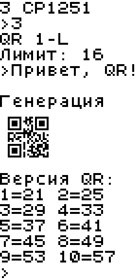

# QR Terminal v2 для Computer v2

Генератор QR **версий 1–10 (21×21–57×57)** с выбором коррекции **L/M/Q/H** и режима ввода. После каждого QR программа снова показывает список версий. Образ вместе с таблицами и рабочей памятью занимает **18 485 из 32 768 байт**; свободно **14 283 байта**.

**Готовая дискета:** [qr_terminal_v2.diskette.txt](qr_terminal_v2.diskette.txt).  
**Исходник ASM:** [qr_terminal_v2.asm](qr_terminal_v2.asm).  
**Двоичный образ:** [qr_terminal_v2.bin](qr_terminal_v2.bin).

## Запуск

В LogicArrows загрузите дискету в **Computer v2 с 32 КБ памяти**.

На обычном компьютере используйте [общий эмулятор](../emulator/README.md):

```sh
python emulator/run.py qr-terminal-v2/qr_terminal_v2.asm --terminal-size 12x18 --hide-display
```

Терминал **12×18 символов** показывает целиком самый большой QR и следующий список выбора. Программа передаёт изображение последовательно через графический порт; размеры истории, переносы и полоски разрыва терминала не входят в расчёт пикселей.

## Управление

1. Выберите **версию 1–10** из списка размеров. Для версии 10 введите две цифры `10`.
2. Выберите коррекцию: **1 — L (~7%), 2 — M (~15%), 3 — Q (~25%), 4 — H (~30%)**.
3. Выберите режим: **1 — цифры, 2 — QR-алфавит, 3 — CP1251**.
4. Каждый выбор подтвердите **Enter**. Перед вводом программа показывает выбранный QR и точный **лимит символов**.
5. Введите сообщение и нажмите **Enter**. После генерации и вывода снова появляется список версий.

**Backspace** удаляет последнюю цифру выбора или последний байт сообщения. Буфер изменяется независимо от границы переноса; визуальное стирание выполняет терминал. **Esc** во время выбора или ввода очищает терминал, сбрасывает ввод и возвращает к выбору версии. Пустое сообщение, недопустимые символы и ввод сверх лимита игнорируются.

## Режимы и фильтры

| Вариант | Допустимые символы | Кодирование |
|---|---|---|
| **1 — цифры** | `0–9` | Numeric: до трёх цифр в десяти битах |
| **2 — QR-алфавит** | `0–9`, `A–Z`, пробел и `$%*+-./:` | Alphanumeric: до двух символов в одиннадцати битах |
| **3 — CP1251** | Печатные байты CP1251; регистр сохраняется | Byte с **ECI 22**; один символ — один байт |

В QR-алфавите принимается латиница **верхнего регистра**. В CP1251 управляющие коды, DEL (`0x7F`) и неопределённый байт `0x98` отсекаются. Версия и коррекция задают объём данных, а режим — фильтр и число бит на символ. Поэтому лимит рассчитывается для всей выбранной комбинации.

## Максимальная длина ввода

Таблицы показывают число символов в одном сообщении. В байтовом режиме учтены **12 бит заголовка ECI 22**, поэтому его лимит отличается от обычной таблицы Binary. Например, **1-L** принимает 41 цифру, 25 символов QR-алфавита или 16 символов CP1251.

### Цифры

| Версия | Размер | L | M | Q | H |
|---|---|---:|---:|---:|---:|
| 1 | 21×21 | 41 | 34 | 27 | 17 |
| 2 | 25×25 | 77 | 63 | 48 | 34 |
| 3 | 29×29 | 127 | 101 | 77 | 58 |
| 4 | 33×33 | 187 | 149 | 111 | 82 |
| 5 | 37×37 | 255 | 202 | 144 | 106 |
| 6 | 41×41 | 322 | 255 | 178 | 139 |
| 7 | 45×45 | 370 | 293 | 207 | 154 |
| 8 | 49×49 | 461 | 365 | 259 | 202 |
| 9 | 53×53 | 552 | 432 | 312 | 235 |
| 10 | 57×57 | 652 | 513 | 364 | 288 |

### QR-алфавит

| Версия | Размер | L | M | Q | H |
|---|---|---:|---:|---:|---:|
| 1 | 21×21 | 25 | 20 | 16 | 10 |
| 2 | 25×25 | 47 | 38 | 29 | 20 |
| 3 | 29×29 | 77 | 61 | 47 | 35 |
| 4 | 33×33 | 114 | 90 | 67 | 50 |
| 5 | 37×37 | 154 | 122 | 87 | 64 |
| 6 | 41×41 | 195 | 154 | 108 | 84 |
| 7 | 45×45 | 224 | 178 | 125 | 93 |
| 8 | 49×49 | 279 | 221 | 157 | 122 |
| 9 | 53×53 | 335 | 262 | 189 | 143 |
| 10 | 57×57 | 395 | 311 | 221 | 174 |

### Текст CP1251 с ECI 22

| Версия | Размер | L | M | Q | H |
|---|---|---:|---:|---:|---:|
| 1 | 21×21 | 16 | 13 | 10 | 6 |
| 2 | 25×25 | 31 | 25 | 19 | 13 |
| 3 | 29×29 | 52 | 41 | 31 | 23 |
| 4 | 33×33 | 77 | 61 | 45 | 33 |
| 5 | 37×37 | 105 | 83 | 59 | 43 |
| 6 | 41×41 | 133 | 105 | 73 | 57 |
| 7 | 45×45 | 153 | 121 | 85 | 63 |
| 8 | 49×49 | 191 | 151 | 107 | 83 |
| 9 | 53×53 | 229 | 179 | 129 | 97 |
| 10 | 57×57 | 270 | 212 | 150 | 118 |

## Генерация и память

- CPU упаковывает заголовок и сообщение, добавляет завершение и заполнители, вычисляет **Reed–Solomon для каждого блока** и перемежает блоки.
- Поддержаны поисковые метки, синхронизация, метки выравнивания, формат L/M/Q/H и информация версии для **7–10**.
- Используется **фиксированная маска 0**, как в первой версии.
- Вокруг QR выводится белое поле **четыре модуля**. Последний графический символ 6×8 дополняется белыми пикселями. Поправок на разрывы терминала нет.
- После вывода буферы сообщения, данных, ECC и потока обнуляются. Матрица остаётся доступной до следующей генерации.

| Часть образа | Байт |
|---|---:|
| Код CPU, COMMON и заполнение банков | 3 840 |
| Таблицы и выделенная RAM | 11 008 |
| Скомпилированная логика меню и QR | 3 637 |
| **Итого / лимит** | **18 485 / 32 768** |

Рабочие области, стеки и матрица включены в этот размер. Вычисления сообщения выполняются в ASM на Computer v2. Python и Node.js нужны для сборки и проверки.

## Исходники и сборка

| Файл | Назначение |
|---|---|
| [program.py](program.py) | Меню, фильтры, кодирование, блоки ECC и служебные области QR; ограниченный целочисленный синтаксис для компилятора |
| [native.py](native.py) | Машинные циклы упаковки битов, Reed–Solomon, размещения, маски и графического вывода |
| [compiler.py](compiler.py), [runtime.py](runtime.py) | Компиляция логики в исполняемый на CPU 16-битный стековый код и его ASM-операции |
| [parameters.py](parameters.py) | Таблицы версий, блоков, полиномов, заголовков и ёмкости |
| [build.py](build.py) | Распределение по банкам, создание ASM и сборка образа с дискетой |
| [layout.json](layout.json) | Адреса, размеры и все 120 лимитов |
| [tools/compiler/](tools/compiler/) | Официальный ассемблер и построитель дискеты; профиль памяти — 32 КБ |

Для сборки нужны **Python 3.11+** и **Node.js 22+**:

```sh
python qr-terminal-v2/build.py
```

[Первая версия для 1 КБ](../qr-terminal/README.md) размещена в отдельном проекте.

## Проверка

```sh
python qr-terminal-v2/verify.py
python qr-terminal-v2/demo.py
```

[Проверено 120 комбинаций](verification.json): каждое сочетание версии, коррекции и режима на максимальной длине, отклонение лишних и недопустимых символов, Backspace, Esc, пустой ввод, очистка памяти и повторный цикл. **Все матрицы и графические байты совпали** с независимой библиотекой [Project Nayuki](https://github.com/nayuki/QR-Code-generator), находящейся только в инструментах проверки.

[Запуск в обычном эмуляторе](native-verification.json) отдельно подтвердил совпадение ASM-образов двух компиляторов, матриц и вывода **1-L** и **10-H**. Максимум использованного стека — **14 байт**, стека возвратов — **8 байт**, при выделенных 128 байтах на каждый.

Таблицы стандарта сверены с [DENSO WAVE: версии 1–10](https://www.qrcode.com/en/about/versionPage/versionPage1_10.html). Таблицы ECC и эталонный генератор используются по [MIT-лицензии Project Nayuki](LICENSE.nayuki.txt); официальный компилятор сохранён со своей [лицензией](tools/compiler/LICENSE).

## Демонстрации

Снимки получены из обычного эмулятора после генерации: под QR уже показан следующий список выбора.

**1-L, CP1251, «Привет, QR!»**



**10-H, CP1251, «Привет, QR Terminal v2!»**


